# Post-May-12 filing stack (CGC-25-631801)

**Case:** *Rosario v. Abdelhalim et al.*, CGC-25-631801  
**Court:** Superior Court of California, County of San Francisco, **Dept. 301**  
**Judge:** Hon. **Christine Van Aken**  
**Order under attack:** **May 12, 2026** order granting defendants' anti-SLAPP special motion to strike the First Amended Complaint  

**Source order (public mirror on this site):** [10210043.pdf](../../02-CASE-CGC-25-631801/court-orders/2026-05-12-anti-slapp-grant-order/10210043.pdf) · [Minutes parse (structured)](../../02-CASE-CGC-25-631801/court-orders/2026-05-12-anti-slapp-grant-order/10210043-PARSED.md)

> **SCAFFOLD STATUS (June 11, 2026 public mirror):** Sub-packets **01**, **03**, **04**, and **05** ship **placeholder / skeleton PDFs** produced by the authoring workspace build pipeline. They are **not** represented as filed unless you independently confirm a filing on the court portal. Sub-packet **02** is a **pointer** to the built reconsideration materials (May 11 preservation wave plus May 13 rebuild PDFs).
>
> **Day Zero (portal May 28, 2026):** No notice of entry on live ROA for May 12 or May 15 rulings; no filed anti-SLAPP proposed order observed. See [801 ROA audit](../../02-CASE-CGC-25-631801/docket-state/ROA-AUDIT-2026-05-28.md) and [801 docket-state](../../02-CASE-CGC-25-631801/docket-state/STATE-2026-05-28.md).

[← Appellate lane index](../INDEX.md) · [← Site root](../../README.md)

---

## Cross-filing procedural map

```mermaid
gantt
    title Post-May-12-2026 filing cadence (Day 0 = service of notice of entry)
    dateFormat X
    axisFormat Day %s
    section Day_5
    01 Objections to proposed order (CRC 3.1312(a))           :obj,  0, 5
    section Day_10
    02 Reconsideration (CCP 1008(a))                          :rec, 0, 10
    section Day_15
    03 Notice of intention - new trial (CCP 657, 659)         :nt,  0, 15
    04 Notice of intention - vacate (CCP 663, 663a)           :vac, 0, 15
    section Day_60plus
    05 Notice of appeal (CCP 904.1(a)(13); CRC 8.108 tolled)  :app, 0, 60
```

### Deadline table (Day 0 = service of notice of entry)

| Sub-packet | Authority | Window | Notes |
|------------|-----------|--------|-------|
| **01-OBJECTIONS-PROPOSED-ORDER** | CRC 3.1312(a) | **Day +5 court days** | Objections to defense-drafted proposed order. |
| **02-RECONSIDERATION** *(pointer)* | CCP 1008(a) | **Day +10** | PDFs: May 11 lane + [May 13 rebuild](../EQUITY-PRESERVATION-LANE/post-order-recon-may-13/README.md). |
| **03-NEW-TRIAL** | CCP 657, 659, 659a, 660 | **Day +15** | Notice of intention is a separate prior filing. Triggers CRC 8.108(b) tolling. |
| **04-VACATE-663** | CCP 663, 663a | **Day +15** | No new evidence on the 663 record. Triggers CRC 8.108(c) tolling. |
| **05-NOTICE-OF-APPEAL** | CCP 904.1(a)(13); CRC 8.100, 8.104, 8.108, 8.121, 8.137 | **Day +60** (extended by tolling) | **Jurisdictional.** Pre-elects agreed/settled statement under CRC 8.137 (May 12 minutes: Reporter N/A). |

**Concrete dates:** depend on the actual notice-of-entry date. The authoring repository ships `801-APPEAL/scripts/compute-deadlines.sh` for that calculation; this public mirror does not ship that script.

---

## Status matrix

| Sub-packet | Authority | Deadline rule | Skeleton PDF on site | Substantive draft | Filed |
|------------|-----------|---------------|----------------------|-------------------|-------|
| 01-OBJECTIONS-PROPOSED-ORDER | CRC 3.1312(a) | Day +5 | YES | NO | NO |
| 02-RECONSIDERATION (pointer) | CCP 1008(a) | Day +10 | YES (May 11 + May 13 mirrors) | YES (recon packet) | verify portal |
| 03-NEW-TRIAL | CCP 657, 659 | Day +15 | YES | NO | NO |
| 04-VACATE-663 | CCP 663, 663a | Day +15 | YES | NO | NO |
| 05-NOTICE-OF-APPEAL | CCP 904.1(a)(13); CRC 8.108 | Day +60 | YES | NO | NO |

---

## Tolling note (CRC 8.108)

The **60-day** notice of appeal window (CRC 8.104) may be **extended** by timely post-trial motions, including motions for new trial (CCP 657, 659), motion to vacate (CCP 663, 663a), and motion for reconsideration (CRC 8.108(e)), among others listed in CRC 8.108.

---

## Packet index (this folder)

| # | Sub-packet | README | Consolidated PDF | Source archive PDF |
|---|------------|--------|------------------|-------------------|
| 1 | Objections to proposed order | [01-OBJECTIONS-PROPOSED-ORDER/](01-OBJECTIONS-PROPOSED-ORDER/README.md) | [OBJ-801-PACKET.pdf](01-OBJECTIONS-PROPOSED-ORDER/OBJ-801-PACKET.pdf) | [OBJ-801-SOURCE-ARCHIVE.pdf](01-OBJECTIONS-PROPOSED-ORDER/OBJ-801-SOURCE-ARCHIVE.pdf) |
| 2 | Reconsideration (pointer) | [02-RECONSIDERATION/](02-RECONSIDERATION/README.md) | (see pointer) | (see pointer) |
| 3 | New trial | [03-NEW-TRIAL/](03-NEW-TRIAL/README.md) | [NT-801-PACKET.pdf](03-NEW-TRIAL/NT-801-PACKET.pdf) | [NT-801-SOURCE-ARCHIVE.pdf](03-NEW-TRIAL/NT-801-SOURCE-ARCHIVE.pdf) |
| 4 | Vacate (663) | [04-VACATE-663/](04-VACATE-663/README.md) | [VAC-801-PACKET.pdf](04-VACATE-663/VAC-801-PACKET.pdf) | [VAC-801-SOURCE-ARCHIVE.pdf](04-VACATE-663/VAC-801-SOURCE-ARCHIVE.pdf) |
| 5 | Notice of appeal | [05-NOTICE-OF-APPEAL/](05-NOTICE-OF-APPEAL/README.md) | [APP-801-PACKET.pdf](05-NOTICE-OF-APPEAL/APP-801-PACKET.pdf) | [APP-801-SOURCE-ARCHIVE.pdf](05-NOTICE-OF-APPEAL/APP-801-SOURCE-ARCHIVE.pdf) |

---

## Cross-references (minute order anchors)

Anchors refer to line ranges in [10210043.pdf](../../02-CASE-CGC-25-631801/court-orders/2026-05-12-anti-slapp-grant-order/10210043.pdf) as summarized in [10210043-PARSED.md](../../02-CASE-CGC-25-631801/court-orders/2026-05-12-anti-slapp-grant-order/10210043-PARSED.md).

| Anchor | Lines | Used by |
|--------|-------|---------|
| Prong-one analysis | 38-78 | 01, 02, 03 (657(7)), 04 (III.A), 05 |
| Prong-two analysis | 81-117 | 01, 02, 03 (657(7)), 04 (III.B), 05 |
| Civil Code § 47(b) privilege | 118-131 | 01, 02, 04 (III.C), 05 |
| Disposition / scope | 132-135 | 01, 03, 04 (III.D), 05 |
| Proposed-order directive (CRC 3.1312) | 143-144 | 01 |

Nothing on this page is legal advice.
