# Defense Response Logic: Cases CGC-25-631801 & CGC-25-631802

## Prepared for Defense Counsel

*Rosario v. Abdelhalim et al.* (CGC-25-631801)
*Rosario v. CSAA Insurance Exchange* (CGC-25-631802)

---

## Purpose

This document maps every available response path to Plaintiff's pending discovery. It is provided so that defense counsel may appreciate the full architecture of the discovery before responding. Each decision point -- admit, deny, claim inability to respond, assert privilege, offer a middle-ground qualification, or evade -- has been traced to its terminal legal consequence. The threshold procedural defenses (Statute of Limitations, intrinsic/extrinsic classification, *Moradi-Shalal* preemption, the "opinion" defense) are addressed first. As the diagrams illustrate, the structure is closed: there is no response combination that avoids establishing the elements of the pending causes of action.

---

## Preliminary Note: The Procedural Exits Are Foreclosed

Before reaching the discovery architecture, defense counsel will consider four threshold strategies to avoid the merits entirely. Each is addressed below.

### A. Statute of Limitations (631802)

CSAA's strongest procedural argument is that the three-year fraud statute (CCP 338(d)) bars the claim. The complaint anticipates this. Plaintiff does not pin the discovery of the fraud to the May 2021 receipt of the 911 tape. The complaint pleads discovery on **April 16, 2025** -- the date defense counsel admitted under oath that the evidence had been "provided by Dolan" all along, revealing the depth of the concealment -- and further relies on an internal vendor retrieval record (Exhibit D) showing post-denial activity inconsistent with the "concluded" representation.

Under the **Delayed Discovery Rule** (*Fox v. Ethicon Endo-Surgery, Inc.* (2005) 35 Cal.4th 797), a complaint that specifically pleads the time, manner, and circumstances of discovery must be accepted as true at the demurrer stage. The complaint also invokes **Fraudulent Concealment** as an independent tolling doctrine. CSAA may demur, but the pleading standard forces the SOL issue to survive as a triable issue of fact. The discovery architecture detailed below operates within that factual phase.

### B. Intrinsic vs. Extrinsic Fraud Classification (631801)

Courts strongly prefer categorizing lies about evidence as "intrinsic" fraud -- the kind a party should have exposed at trial. The complaint directly addresses this by relying on *Kulchar v. Kulchar* (1969) 1 Cal.3d 467 and *Aldrich v. San Francisco Superior Court* (1983) 141 Cal.App.3d 297.

The critical distinction: this was not a witness lying to a jury. This was an **officer of the court** lying **directly to the judge**, stating that the 911 audio was "news to me" and "not produced in discovery." Those false statements caused the trial judge to issue procedural rulings -- denying continuances, excluding the supplemental police report -- that structurally prevented Plaintiff from exhibiting his case. When fraud corrupts the judge's procedural management of the trial (rather than merely misleading the jury's factual evaluation), it crosses the line into **extrinsic fraud**. The pleadings are built on this distinction, and it is the basis for the independent action in equity.

### C. *Moradi-Shalal* Preemption (631802)

CSAA will argue that the UCL claim is a disguised Insurance Code violation barred by *Moradi-Shalal v. Fireman's Fund Ins. Companies* (1988) 46 Cal.3d 287. The complaint relies on the California Supreme Court's express carve-out in ***Zhang v. Superior Court* (2013) 57 Cal.4th 364**, which holds that *Moradi-Shalal* does not bar common-law fraud claims arising from claims handling. The complaint repeatedly pleads common-law deceit under Civil Code 1709/1710 and does not assert a private right of action under Insurance Code 790.03. The statutory anchor for the UCL "unlawful" prong uses the Insurance Code violations as predicate conduct, not as an independent cause of action -- a structure *Zhang* expressly permits.

### D. The "Opinion" Defense (631802)

CSAA will argue that "concluded" is a statement of opinion, not actionable fact. The complaint frames "we concluded our investigation" as an **objective representation of existing or past fact regarding process and diligence** -- not a subjective opinion about liability. A reasonable claimant reading that letter understands it to mean that CSAA actually obtained and reviewed relevant evidence before making its determination. Whether that understanding is reasonable is a factual dispute that survives demurrer and forces CSAA into discovery to explain what its "investigation" actually consisted of -- which is precisely where the discovery trap begins.

---

**Each of these four threshold defenses terminates at the same place: the factual phase.** The procedural exits either fail on the pleadings or convert into triable issues of fact. Once in the factual phase, the following discovery architecture applies.

---

## PART I: Case No. CGC-25-631801

### Independent Action in Equity to Set Aside Judgment for Extrinsic Fraud

Plaintiff must prove four elements. The discovery is designed so that each element is established regardless of whether defendants admit or deny. The architecture is interlocking: a denial on one element triggers evidence that proves a different element.

---

### I-A. The Master Logic

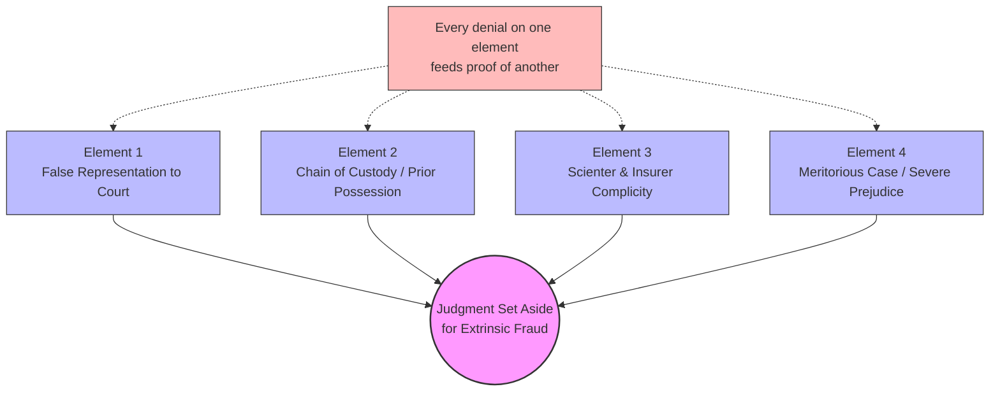

**Structural principle:** The discovery is sequenced so that defending on Element 1 concedes Element 2, defending on Element 2 creates inter-defendant conflict that proves Element 3, and defending on Element 4 requires contradicting authenticated trial testimony.

**A note on the three response paths.** Under CCP 2033.220, a responding party has exactly three options for each Request for Admission: (a) Admit; (b) Deny; or (c) state that, after reasonable inquiry, it is unable to admit or deny. The diagrams below map all three. The third path is not a safe harbor. Under CCP 2033.280, if the responding party fails to serve timely responses, or if the court determines the "unable to admit or deny" response was not the product of a genuinely reasonable inquiry, the matter is **deemed admitted** on motion. The RFAs in both cases are deliberately drafted to ask about facts within the responding party's personal knowledge (their own court statements, their own files, their own letter), making it functionally impossible to claim a good-faith inability to confirm or deny.

---

### I-B. Element 1: The Court Record Cannot Be Denied

**Relevant RFAs:** 3-6, 21, 43-45, 52-56, 60

These RFAs quote verbatim from certified court transcripts:

- "News to me" (Feb. 18, 2025)
- "Defendant has no idea where this 911 call log or audio recording came from" (MIL No. 17, Jan. 17, 2025)
- "Not anything that we received as part of the subpoena" (Apr. 16, 2025)
- "Sure. They were provided by Dolan. He has had them for whatever, sure." (Apr. 16, 2025, RT 7, p. 214, ll. 13-15)

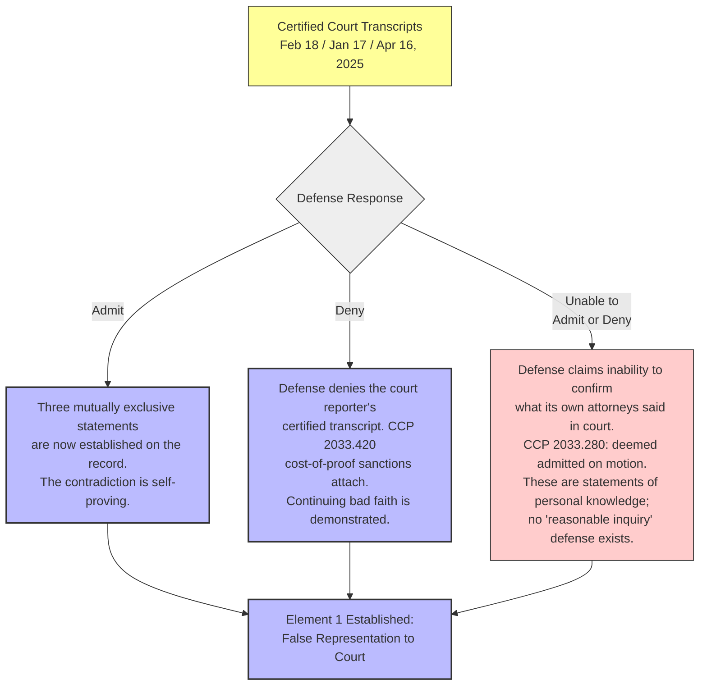

**Consequence:** There is no safe response. Admitting locks in contradictory statements made on the record. Denying requires the position that the court reporter fabricated the transcript -- a position that is itself evidence of continuing bad faith. Claiming inability to admit or deny what defense counsel's own attorneys said on the record fails the "reasonable inquiry" standard under CCP 2033.220(c), because the statements are within the responding party's personal knowledge. A Motion to Deem Admitted under CCP 2033.280 follows, and the matter is established by court order.

---

### I-C. Element 2: The File Transfer Cannot Be Escaped

**Relevant RFAs:** 1-2, 7-10, 16, 24, 29-30, 39, 46-48

These RFAs establish the physical chain: discovery materials served in August-September 2022, held by Carbone Smith & Koyama, transferred to PSA on May 4, 2023. PSA held the file for 23 months before claiming the evidence was unknown.

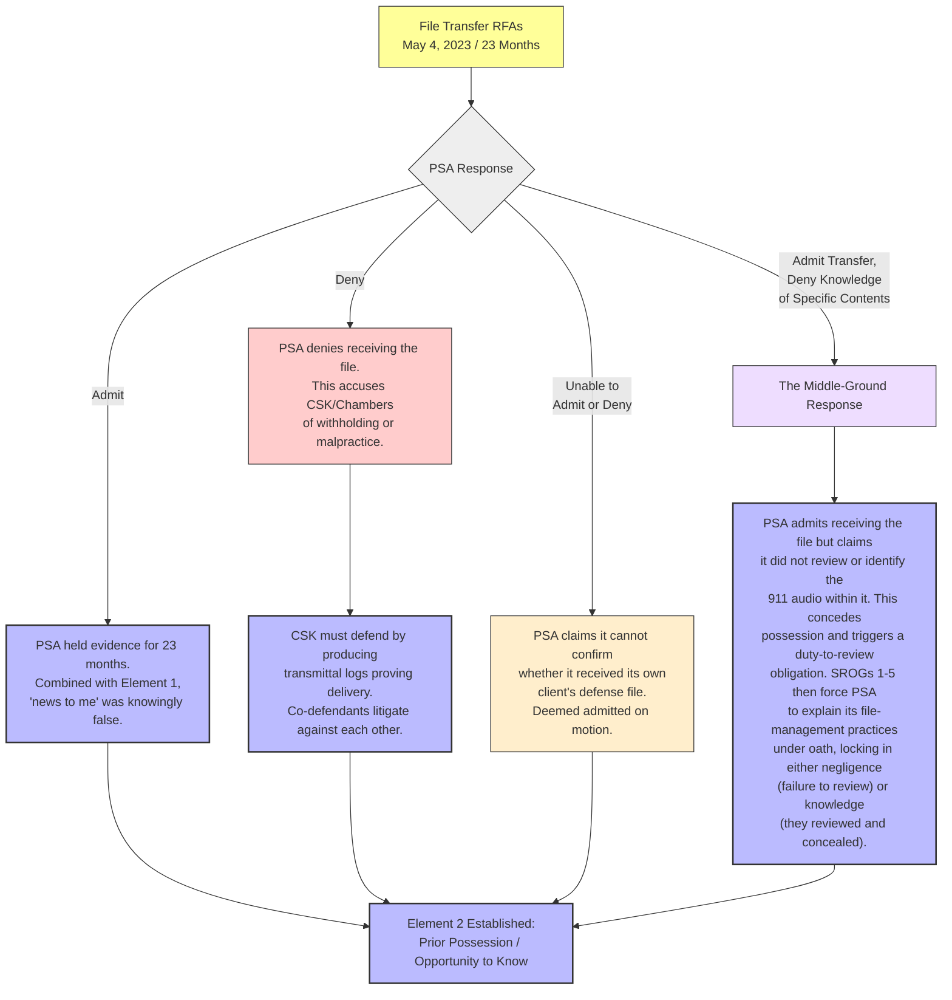

**Consequence:** There are now four mapped responses, and all terminate at Element 2:

1. **Admit** -- PSA confesses to 23 months of possession before claiming ignorance.
2. **Deny** -- PSA accuses CSK of withholding the file; CSK's self-defense proves the transfer.
3. **Unable to admit or deny** -- PSA claims it cannot confirm receipt of its own client file. Deemed admitted on motion under CCP 2033.280.
4. **Admit transfer, deny knowledge of contents** -- This is the most sophisticated response. PSA concedes physical custody but claims it never identified the 911 audio within the transferred materials. This concession is fatal in a different way: it establishes that PSA held the evidence and either (a) failed to review its own file for 23 months while making affirmative representations to the court about the evidence's provenance, or (b) reviewed the file, found the audio, and concealed it. SROGs 1-5 force PSA to describe its file-management and review practices under oath, locking in one of these two conclusions.

---

### I-D. Element 3: The Insurer Is Bound Either Way

**Relevant RFAs:** 11-13, 31-34, 49-50, 59

These RFAs target CSAA's funding, knowledge, and authority over the defense.

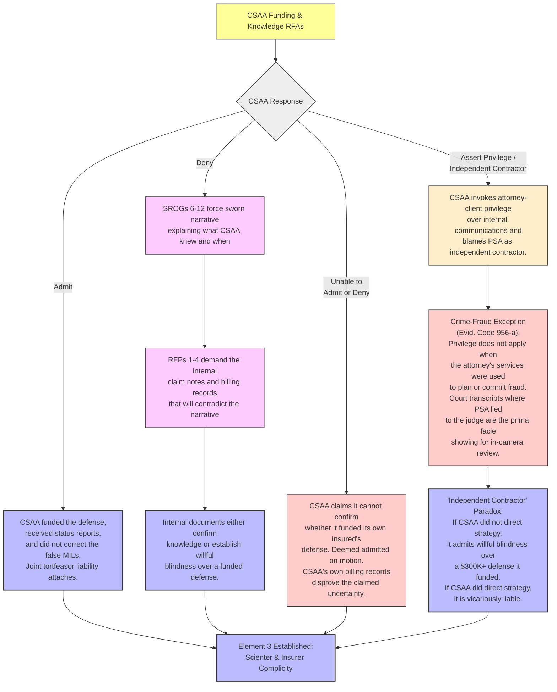

**Consequence:** There are four response paths, and all terminate at Element 3:

1. **Admit funding and oversight** -- The connection to trial counsel's fraud is direct. Joint tortfeasor liability attaches.
2. **Deny knowledge** -- SROGs 6-12 force a sworn narrative of what CSAA knew and when. RFPs 1-4 demand the internal claim notes and billing records. Those documents either confirm knowledge (proving scienter) or show that CSAA spent over $300,000 funding a defense it never monitored (proving willful blindness).
3. **Unable to admit or deny** -- CSAA cannot plausibly claim it does not know whether it funded its own insured's defense. Deemed admitted on motion.
4. **Assert privilege / independent contractor** -- CSAA invokes attorney-client privilege over internal communications and blames PSA as an independent contractor it did not control. The privilege wall is pierced by the **Crime-Fraud Exception (Evidence Code 956(a))**: attorney-client privilege does not apply when the attorney's services were used to plan or commit a fraud. The certified court transcripts in which PSA made false statements to the judge provide the prima facie showing required for an in-camera review. Even the threat of judicial review of CSAA's internal emails creates extreme exposure. The "independent contractor" shield faces the **Funded, Directed, and Controlled paradox**: if CSAA did not direct PSA's courtroom conduct, CSAA admits willful blindness over a defense it funded in excess of $300,000; if CSAA did direct the conduct, it is vicariously liable for the fraud.

---

### I-E. Element 4: The Audio Cannot Be Unheard

**Relevant RFAs:** 14, 26-27, 35-37, 51

These RFAs address the substance of the concealed evidence: the 911 audio in which Abdelhalim says "I just hit him... barely hitting anything," his trial authentication ("Yes. That is my voice."), his contradictory trial testimony ("no contact"), and the 9-3 verdict.

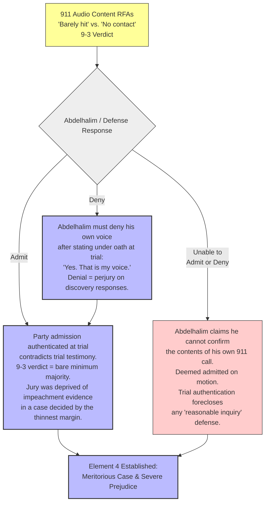

**Consequence:** The audio is authenticated by the defendant's own trial testimony ("Yes. That is my voice."). A denial requires Abdelhalim to contradict himself under oath for a second time. Claiming inability to confirm the contents of his own phone call fails under CCP 2033.220(c) given the trial authentication.

**On the 9-3 verdict and prejudice:** Defense counsel will argue that a 9-3 verdict demonstrates the strength of the defense case, not its weakness -- that nine jurors were persuaded *even with the evidence presented*. This argument inverts the standard. The relevant question under California equity jurisprudence is not whether the existing evidence was strong, but whether the concealed evidence was of a character that **it is reasonably probable a different result would have been reached** had it been available. (*In re Marriage of Stevenot* (1984) 154 Cal.App.3d 1051, 1071.) The concealed evidence was the defendant's own admission of contact ("I barely hit him"), directly contradicting his trial testimony of "no contact." The 9-3 split -- the bare minimum civil majority -- demonstrates that the jury was closely divided. The concealed evidence was not cumulative or marginal; it was the single most devastating impeachment tool available: a party's own contemporaneous admission contradicting his sworn testimony. In a verdict decided by the thinnest possible margin, it is more than reasonably probable that this evidence would have changed at least one juror's vote.

---

### I-F. The Interlocking Trap: Cross-Element Dependencies

The following diagram shows how a defensive posture on any single element feeds the proof chain for the remaining elements.

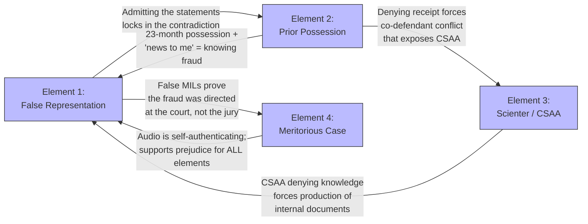

**Summary:** The elements do not stand alone. Each denial cascades into evidentiary gain on a different element. The discovery is designed as a closed system where every exit is an entrance to another proof chain.

---

## PART II: Case No. CGC-25-631802

### Fraud, Deceit (Civ. Code 1709-1710) and UCL (B&P Code 17200)

Plaintiff must prove: (1) CSAA misrepresented the status of its investigation; (2) CSAA had notice of available evidence but failed to investigate; (3) CSAA's conduct violated the Insurance Code (statutory anchor for UCL); (4) the insured's own admission proves liability was reasonably clear.

---

### II-A. The Master Logic

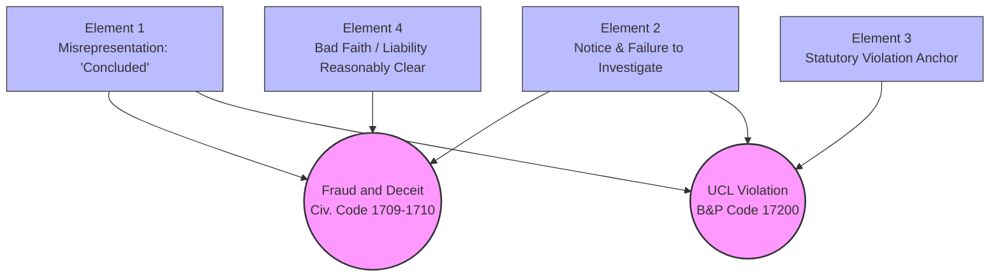

---

### II-B. Element 1: The Denial Letter Speaks for Itself

**Relevant RFAs:** 1-5, 12, 14, 26-32, 45-46, 58, 61-63, 65-67, 69-71, 75, 77, 80, 83-84, 86

These RFAs ask CSAA to admit what its own denial letter says and what its investigation had *not* obtained as of February 25, 2021:

- No 911 audio
- No body-worn camera footage
- No CAD records
- No medical records
- No accident reconstruction expert
- No recorded statement from the insured
- No contact with Plaintiff
- The only source was the insured's own account

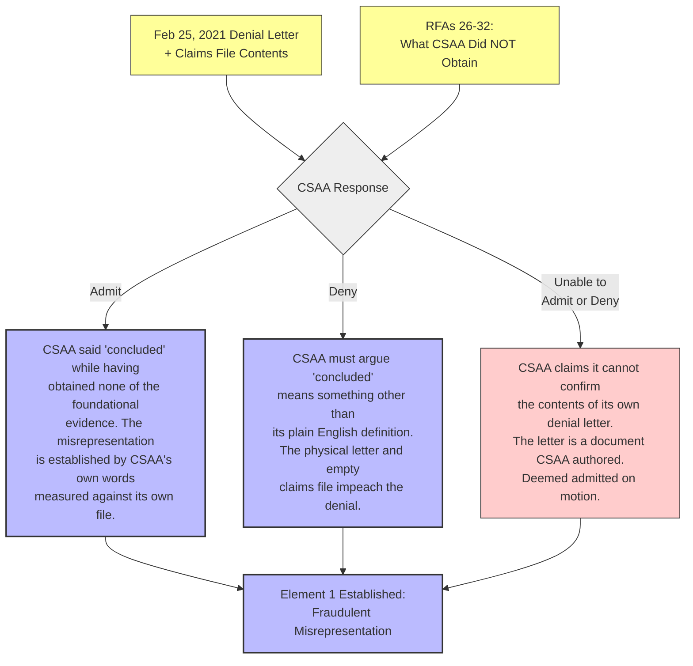

**Consequence:** The denial letter is a physical document that says what it says. The claims file either contains documentation of an investigation or it does not. CSAA cannot rewrite its own letter, retroactively populate its own file, or claim inability to confirm the contents of a letter it authored and sent. All three response paths terminate at Element 1.

---

### II-C. Element 2: The Police Report Was the Roadmap

**Relevant RFAs:** 6-11, 13, 15-18, 20-23, 33-36, 41-44, 47-48, 64, 73-74, 78, 82, 85, 87, 90, 99, 101, 103-104, 108

These RFAs establish that CSAA possessed a police report referencing a CAD number, knew law enforcement responded, and took zero steps to pull the corresponding records.

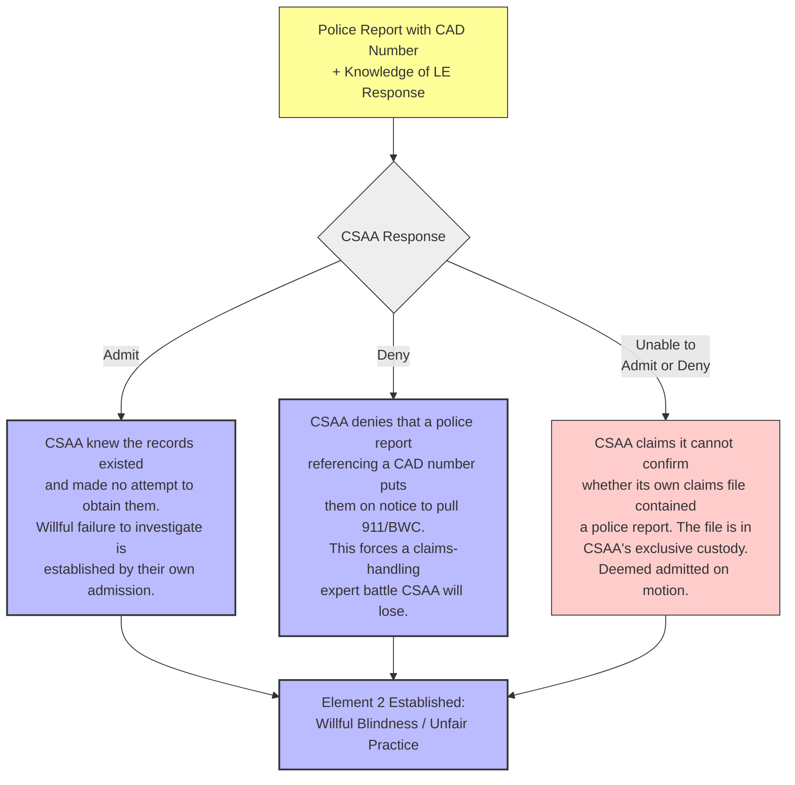

**Consequence:** If CSAA admits it had the police report and knew law enforcement responded, the failure to pull the 911 audio and body-worn camera is established as willful. If CSAA denies the standard, Plaintiff introduces claims-handling experts to testify that every competent insurer pulls these records as a matter of course -- a standard CSAA's own claims manual will confirm. Claiming inability to admit or deny whether its own claims file contained a police report fails on its face: the file is in CSAA's exclusive possession and custody. All three paths establish Element 2.

---

### II-D. Element 3: The Factual Predicates Lock the Statutory Violation

**Relevant RFAs:** 88-110

These RFAs map the factual admissions from Elements 1 and 2 directly onto the California Insurance Code and Fair Claims Settlement Practices Regulations.

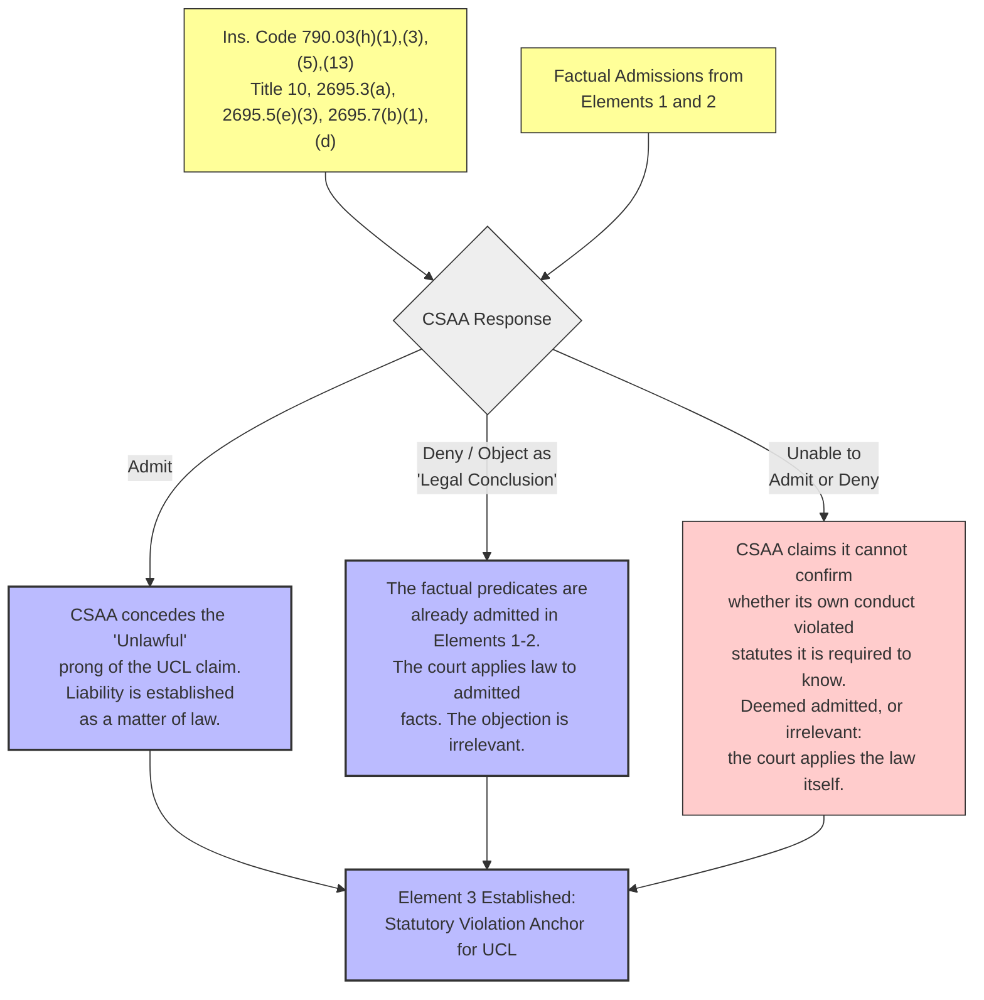

**Consequence:** CSAA will almost certainly object to these RFAs as calling for legal conclusions, or claim inability to admit or deny. Neither response matters. The strategy does not depend on CSAA admitting the legal conclusion. It depends on CSAA having already admitted the *factual predicates* in Elements 1 and 2 -- that they did not pull the records, that they said "concluded," that they had no foundational evidence at the time of denial. Once those facts are locked in, the court applies the law. Element 3 follows as a matter of judicial reasoning, not party admission. CSAA's response to the statutory RFAs is procedurally irrelevant to the outcome.

---

### II-E. Element 4: The Audio Proves Liability Was Clear

**Relevant RFAs:** 19, 24-25, 37, 49, 53-57, 76

These RFAs focus on the content of the ignored evidence: Abdelhalim's 911 statement ("I barely hit him"), the eyewitness body-worn camera statement ("The man in the van hit the guy"), and Plaintiff's counsel obtaining the audio in less than three months through a routine public records request.

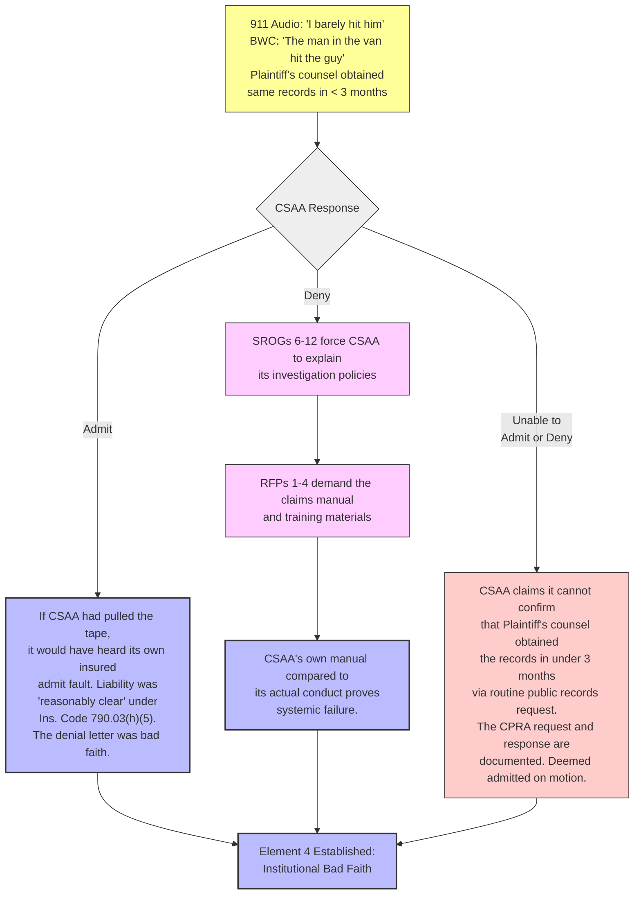

**Consequence:** The evidence CSAA chose not to obtain was available through a routine California Public Records Act request and contained the insured's own admission of contact. Plaintiff's counsel obtained it in under three months. CSAA's failure to do the same before issuing a denial is either admitted (establishing bad faith), denied (triggering production of the claims manual, which will establish that CSAA's actual conduct violates its own written procedures), or met with a claim of inability to confirm (which fails because the CPRA request and response are documented public records). All three paths establish Element 4.

---

## PART III: The Combined Effect Across Both Cases

The two cases are designed to operate as a pincer. Defenses raised in one case create admissions in the other.

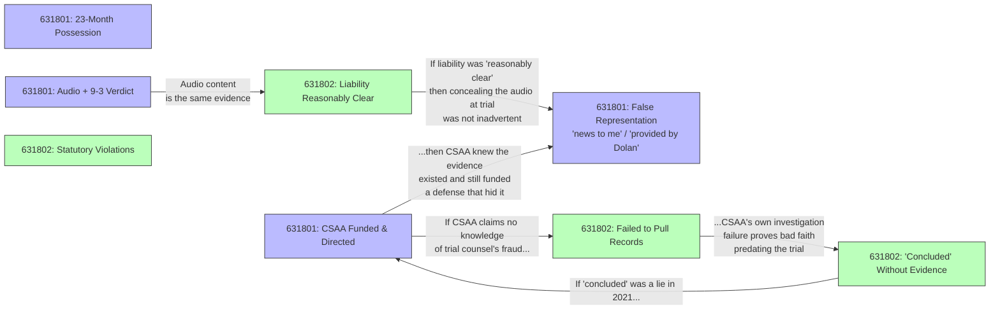

**Key dependencies across cases:**

1. If CSAA denies knowledge of trial counsel's fraud (631801 Element 3), it still faces liability for its own investigation failure (631802 Elements 1-2). CSAA cannot escape both cases simultaneously.

2. The 911 audio is the central evidence in both cases. In 631802, it proves liability was clear and the denial was bad faith. In 631801, it proves the jury was deprived of devastating impeachment evidence in a 9-3 verdict. CSAA cannot minimize the audio's importance in one case without conceding its importance in the other.

3. If CSAA argues the investigation was actually adequate (defending 631802 Element 1), it must explain how an adequate investigation missed the insured's own admission of fault -- which circles back to proving the admission existed and was material (631801 Element 4 and 631802 Element 4).

### III-B. The Severance Question

Defense counsel may seek to sever the two cases or stay one pending resolution of the other to prevent the cross-case feedback loops described above. This motion faces two obstacles:

First, the cases are already designated as related by Plaintiff under California Rules of Court, Rule 3.300. The same central facts (the 911 audio, the denial letter, the trial misconduct) are at issue in both cases. A court considering severance weighs judicial economy and the risk of inconsistent verdicts. Severing cases that share the same core evidence and overlapping defendants creates exactly the inconsistency risk that related-case designation is designed to prevent.

Second, even if the cases are severed, discovery responses are not case-specific. An admission made by CSAA in 631802 discovery is a party admission admissible under Evidence Code 1220 in 631801, and vice versa. Severance separates the trials; it does not create separate evidentiary universes. The cross-case dependency is not a function of case consolidation -- it is a function of the party admissions doctrine.

---

## PART IV: The Evasive Discovery Trap

There is a fifth response category beyond Admit, Deny, and Unable to Admit or Deny: **evasion**. Defense counsel may respond with objection-laden, hybrid responses ("Objection. Vague, ambiguous, calls for legal conclusion. Without waiving said objections, responding party states...") that neither admit nor deny in a clean, usable form.

This response pattern is anticipated and has its own consequence chain.

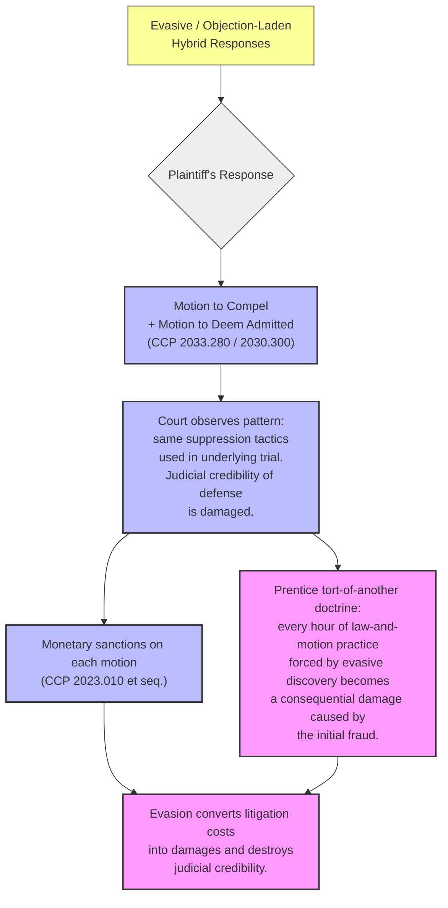

**The Prentice doctrine (***Prentice v. North American Title Guaranty Corp.*** (1963) 59 Cal.2d 618):** When a party is forced into litigation by the tortious conduct of another, the attorney's fees and costs incurred in that forced litigation are recoverable as consequential damages from the original tortfeasor. Here, the original tort is the fraud (both the courtroom fraud in 631801 and the claims-handling fraud in 631802). Every motion to compel, every discovery dispute, every sanctions hearing that Plaintiff is forced to litigate because of evasive responses to straightforward factual questions becomes a consequential damage item traceable to the underlying fraud.

**The judicial optics are equally damaging.** When CSAA stonewalls discovery in a case about CSAA stonewalling evidence, the judge sees the same pattern repeating. Evasion does not delay the outcome; it accelerates the court's willingness to impose sanctions, deem matters admitted, and draw adverse inferences.

---

## PART V: Summary of Response Paths

| Defense Response | Immediate Consequence | Cascading Consequence |
|---|---|---|
| **631801 -- Element 1 (Court Statements)** | | |
| Admit | False representation established | Combined with possession = knowing fraud |
| Deny | Impeached by certified transcripts; CCP 2033.420 sanctions | Continuing bad faith supports scienter |
| Unable to admit or deny | Deemed admitted on motion; statements are personal knowledge | Same as Admit |
| **631801 -- Element 2 (File Transfer)** | | |
| Admit | 23-month possession established | "News to me" becomes provably false |
| Deny | Accuses co-defendant CSK of malpractice | CSK self-defense proves the transfer |
| Unable to admit or deny | PSA cannot claim ignorance of receiving its own client file; deemed admitted | Same as Admit |
| Admit transfer, deny knowledge of contents | Concedes physical custody; triggers duty-to-review analysis | SROGs lock in either negligence (failure to review) or knowledge (reviewed and concealed) |
| **631801 -- Element 3 (CSAA Complicity)** | | |
| Admit funding/oversight | Bound to trial counsel's fraud | Joint tortfeasor liability |
| Deny knowledge | Willful blindness over funded defense | Internal documents contradict the denial |
| Unable to admit or deny | Cannot plausibly claim ignorance of own funding decisions; deemed admitted | Same as Admit |
| Assert privilege / independent contractor | Crime-Fraud Exception (Evid. Code 956(a)) pierces privilege; court transcripts are prima facie showing | Funded/Directed/Controlled paradox: no direction = willful blindness; direction = vicarious liability |
| **631801 -- Element 4 (Audio / Prejudice)** | | |
| Admit | Party admission + "no contact" = impeachment evidence withheld | 9-3 verdict (bare minimum majority) proves prejudice under *In re Marriage of Stevenot* |
| Deny | Contradicts own trial testimony ("Yes. That is my voice.") | Requires second perjury |
| Unable to admit or deny | Trial authentication forecloses reasonable-inquiry defense; deemed admitted | Same as Admit |
| Argue 9-3 shows strong defense | Inverts the standard; question is whether concealed evidence would have changed result | Single most devastating impeachment tool (own admission vs. sworn testimony) in a minimum-margin verdict |
| **631802 -- Element 1 (Denial Letter)** | | |
| Admit "concluded" | Investigation was incomplete by CSAA's own file | Misrepresentation element met |
| Deny "concluded" | Physical letter impeaches; "concluded" reinterpretation is untenable | Forces discovery into what "investigation" consisted of |
| Unable to admit or deny | Cannot disclaim knowledge of own authored letter; deemed admitted | Same as Admit |
| Argue "concluded" is opinion | Pleadings frame it as objective representation of process; factual dispute survives demurrer | Discovery forces CSAA to define what investigation occurred -- establishing the gap |
| **631802 -- Element 2 (Notice / Failure to Investigate)** | | |
| Admit notice of LE | Failure to pull records is willful | Standard of care violated |
| Deny notice of LE | Expert testimony establishes standard | Claims manual contradicts denial |
| Unable to admit or deny | Claims file is in CSAA's exclusive custody; deemed admitted | Same as Admit |
| **631802 -- Element 3 (Statutory Anchor)** | | |
| Admit statutory duties | UCL unlawful prong conceded | Liability as matter of law |
| Deny / object as legal conclusion | Factual predicates already locked in from Elements 1-2 | Court applies law to admitted facts; objection is irrelevant |
| Unable to admit or deny | CSAA is required to know its own regulatory obligations; deemed admitted or irrelevant | Same outcome: court applies law |
| **631802 -- Element 4 (Audio / Bad Faith)** | | |
| Admit audio is material | Failure to obtain = bad faith | Crosses to 631801 prejudice element |
| Minimize audio importance | Must explain why it "concluded" without it | Contradicts "reasonably clear" standard |
| Deny / unable to confirm CPRA timeline | CPRA request and response are documented public records; deemed admitted | Same as Admit |
| **Cross-Category** | | |
| Evasive / objection-laden hybrid responses | Motions to Compel + Motions to Deem Admitted | Prentice doctrine converts litigation costs into consequential damages; judicial optics reinforce pattern of suppression |
| Seek severance of 631801 and 631802 | Related-case designation and judicial economy weigh against | Party admissions (Evid. Code 1220) cross cases regardless of severance |
| Demur on SOL (631802) | Delayed Discovery Rule pleaded to April 16, 2025; survives demurrer as triable fact issue | Case proceeds to discovery phase where architecture applies |
| Argue intrinsic fraud (631801) | Fraud directed at the judge (not jury) = extrinsic under *Kulchar* / *Aldrich* | Procedural rulings caused by the fraud prevented exhibition of case |
| Assert *Moradi-Shalal* preemption (631802) | *Zhang v. Superior Court* carve-out applies; common-law fraud pleaded under Civ. Code 1709/1710 | UCL statutory anchor uses Insurance Code as predicate conduct, not independent cause of action |

---

## Conclusion

This document has mapped every available response path across five categories:

1. **Admit** -- advances the corresponding element directly.
2. **Deny** -- triggers impeachment by certified transcripts, authenticated audio, physical documents, or inter-defendant conflict that independently establishes the element.
3. **Unable to admit or deny** -- fails the reasonable-inquiry standard on facts within the responding party's personal knowledge; deemed admitted on motion under CCP 2033.280.
4. **Middle-ground / hybrid responses** -- concede enough to establish the element through a different legal theory (duty to review, willful blindness, duty of care).
5. **Evasion** -- converts litigation costs into consequential damages under the Prentice doctrine and reinforces the judicial narrative of continuing suppression.

The four threshold procedural defenses (Statute of Limitations, intrinsic/extrinsic classification, *Moradi-Shalal* preemption, and the "opinion" defense) are addressed by the pleading architecture and terminate at the factual phase where this discovery architecture operates.

The two cases function as a cross-case pincer: defenses raised in one case create admissions in the other, and party admissions under Evidence Code 1220 cross case boundaries regardless of whether the cases are formally consolidated.

There is no combination of responses -- across any category, in either case -- that avoids establishing all required elements for both causes of action.
