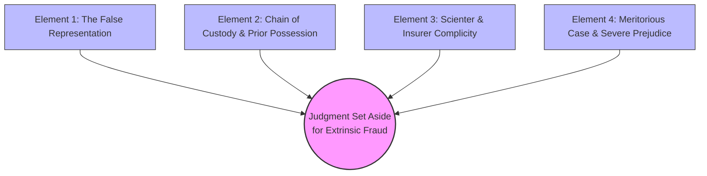
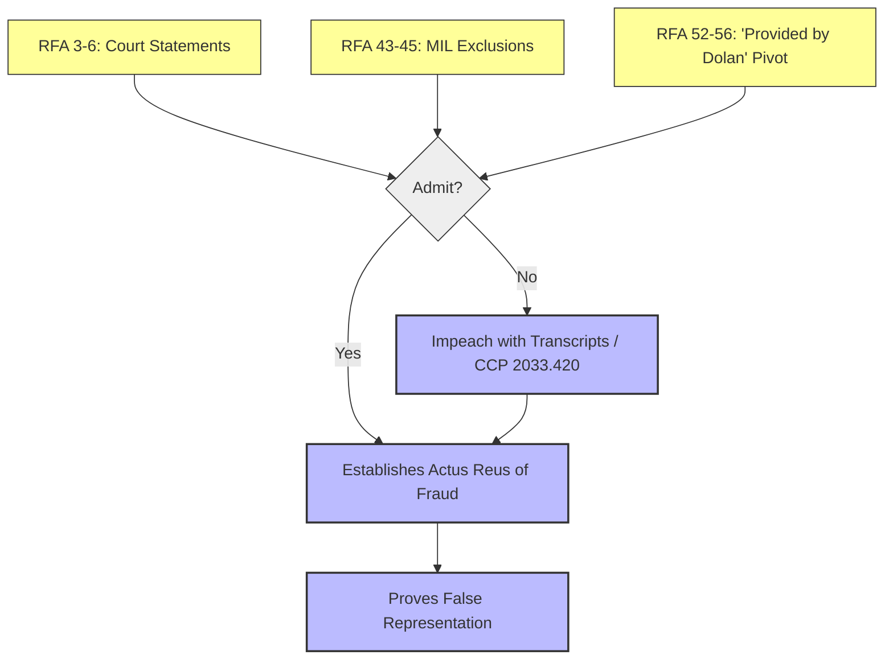
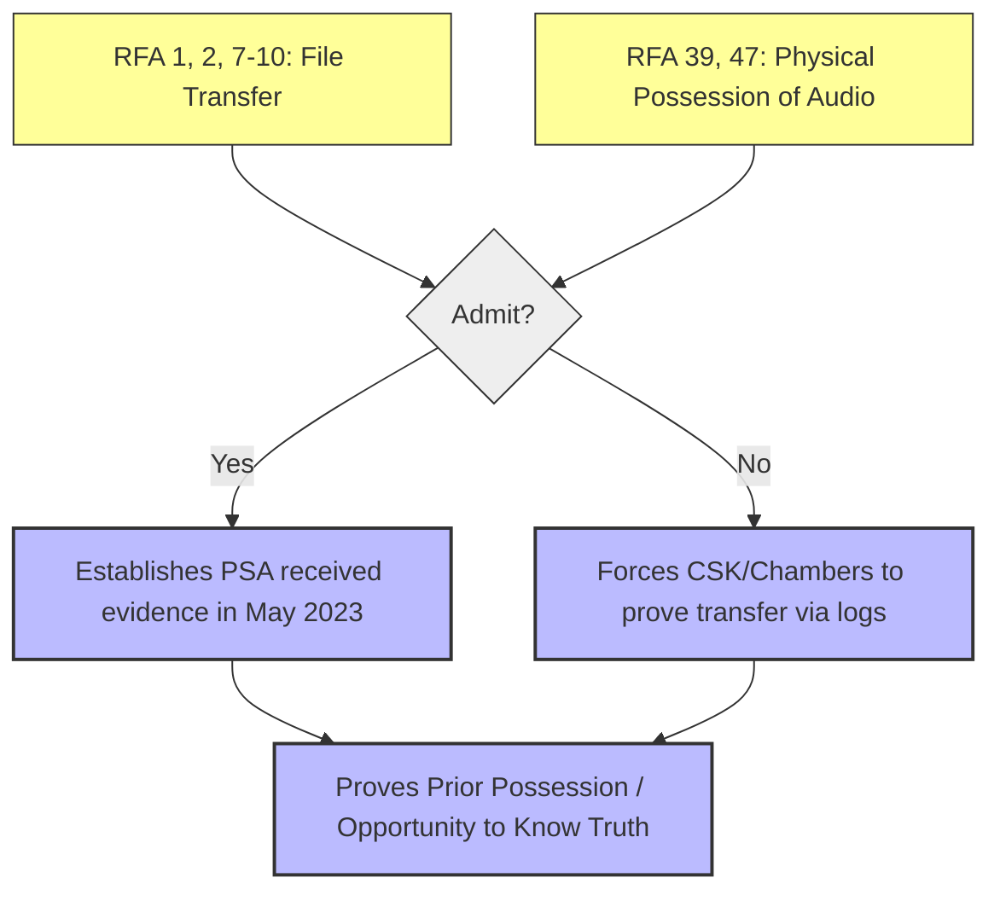
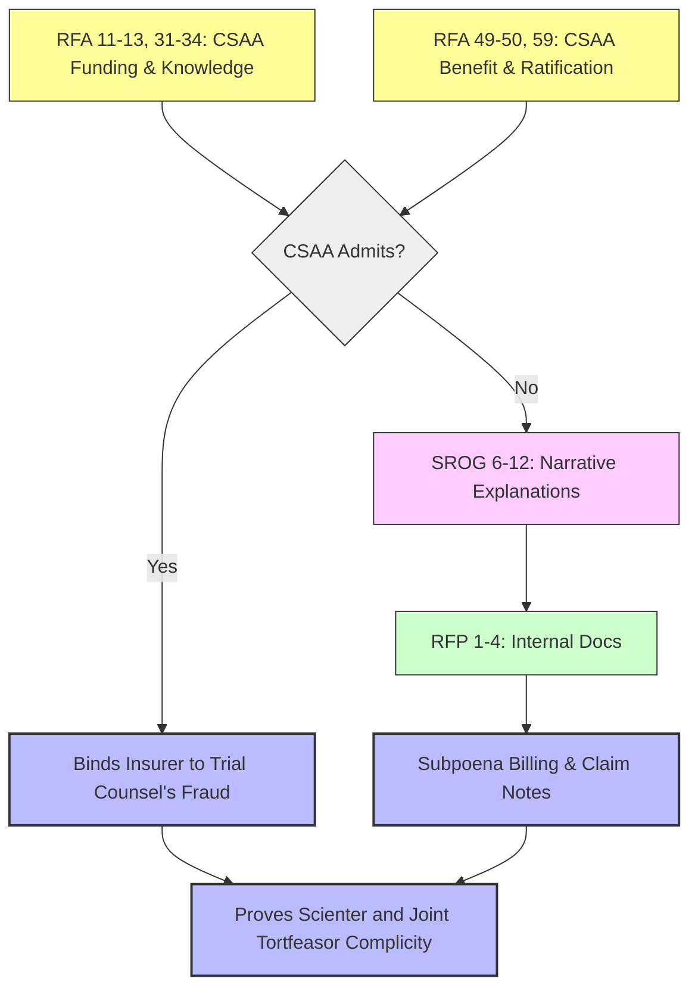
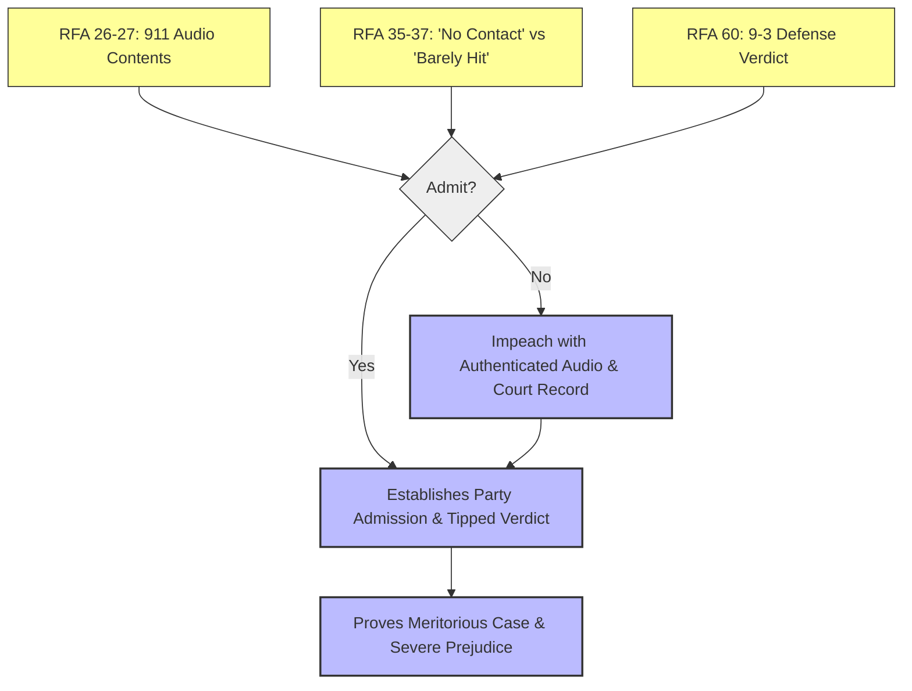

# Discovery Logic & Dependency Mapping: Case No. CGC-25-631801
## Cause of Action: Independent Action in Equity to Set Aside Judgment for Extrinsic Fraud

This document visualizes the logical paths for every propounded discovery request, tracing them from the individual question (Node) to the necessary legal element (Path) required to support the cause of action.

---

## I. Logic Diagrams

### 1. Overall Cause of Action Map

### 2. Element 1: The False Representation & Reversal

### 3. Element 2: Chain of Custody & Opportunity to Know

### 4. Element 3: Scienter & Insurer Complicity

### 5. Element 4: Meritorious Case & Outcome Prejudice

---

## II. Exhaustive Index of Discovery Questions & Conditions

### Requests for Admission

#### RFA 1
- **Text:** Admit that Phillips, Spallas & Angstadt LLP (``PSA'') received the defense file in textit{Rosario v. Abdelhalim}, Case No. CGC-21-594102, from Carbone Smith & Koyama (formerly Chambers) on or about May 4, 2023.
- **Dependencies:** Relying on transmittal index/logs from former counsel Carbone Smith & Koyama.
- **Implications:**
  - *Admit:* Cements the exact date PSA assumed custody of the defense file containing the audio.
  - *Deny:* Triggers a conflict between PSA and CSK; CSK will have to prove they sent the file.
- **Tag:** `[NODE: RFA-1] -> [Element 2: Chain of Custody & Opportunity to Know]`

#### RFA 2
- **Text:** Admit that the defense file received from Carbone Smith & Koyama contained materials that had been served by Plaintiff's counsel during discovery in CGC-21-594102, including materials served in August and September 2022.
- **Dependencies:** Relying on transmittal index/logs from former counsel Carbone Smith & Koyama.
- **Implications:**
  - *Admit:* Cements the exact date PSA assumed custody of the defense file containing the audio.
  - *Deny:* Triggers a conflict between PSA and CSK; CSK will have to prove they sent the file.
- **Tag:** `[NODE: RFA-2] -> [Element 2: Chain of Custody & Opportunity to Know]`

#### RFA 3
- **Text:** Admit that Priya D. Navaratnasingham stated in open court on February 18, 2025, in the matter of textit{Rosario v. Abdelhalim}, CGC-21-594102, that the 911 call evidence was ``news to me.''
- **Dependencies:** Relies on court transcripts (Feb 18, 2025; Jan 17, 2025 MILs; Apr 16, 2025) for verbatim statements.
- **Implications:**
  - *Admit:* Confirms the exact misrepresentations made to the court, fulfilling the actus reus of extrinsic fraud.
  - *Deny:* Easily impeached with certified court transcripts, leading to CCP 2033.420 sanctions.
- **Tag:** `[NODE: RFA-3] -> [Element 1: The False Representation to Court]`

#### RFA 4
- **Text:** Admit that Motion in Limine No. 17, signed by Priya D. Navaratnasingham and filed January 17, 2025, stated: ``Defendant has no idea where this 911 call log or audio recording came from.''
- **Dependencies:** Relies on court transcripts (Feb 18, 2025; Jan 17, 2025 MILs; Apr 16, 2025) for verbatim statements.
- **Implications:**
  - *Admit:* Confirms the exact misrepresentations made to the court, fulfilling the actus reus of extrinsic fraud.
  - *Deny:* Easily impeached with certified court transcripts, leading to CCP 2033.420 sanctions.
- **Tag:** `[NODE: RFA-4] -> [Element 1: The False Representation to Court]`

#### RFA 5
- **Text:** Admit that Alberto Reyna stated at trial on April 16, 2025, in textit{Rosario v. Abdelhalim}, CGC-21-594102, that the supplemental police report was ``not anything that we received as part of the subpoena.''
- **Dependencies:** Prior discovery responses / foundational timelines.
- **Implications:**
  - *Admit:* Provides baseline admission of fact.
  - *Deny:* Forces Form Interrogatory 17.1 (requires all facts/witnesses/documents for denial).
- **Tag:** `[NODE: RFA-5] -> [PATH: General Factual Predicate]`

#### RFA 6
- **Text:** Admit that Alberto Reyna stated at trial on April 16, 2025, that he was ``not sure what recording'' Plaintiff was referring to regarding the 911 call.
- **Dependencies:** Prior discovery responses / foundational timelines.
- **Implications:**
  - *Admit:* Provides baseline admission of fact.
  - *Deny:* Forces Form Interrogatory 17.1 (requires all facts/witnesses/documents for denial).
- **Tag:** `[NODE: RFA-6] -> [PATH: General Factual Predicate]`

#### RFA 7
- **Text:** Admit that defense counsel in textit{Rosario v. Abdelhalim}, CGC-21-594102, had possession of the defense file from August 2022 through May 4, 2023.
- **Dependencies:** Relying on transmittal index/logs from former counsel Carbone Smith & Koyama.
- **Implications:**
  - *Admit:* Cements the exact date PSA assumed custody of the defense file containing the audio.
  - *Deny:* Triggers a conflict between PSA and CSK; CSK will have to prove they sent the file.
- **Tag:** `[NODE: RFA-7] -> [Element 2: Chain of Custody & Opportunity to Know]`

#### RFA 8
- **Text:** Admit that during that period, Plaintiff's counsel served discovery materials on defense counsel, including a 911 audio recording and body-worn camera footage.
- **Dependencies:** Prior discovery responses / foundational timelines.
- **Implications:**
  - *Admit:* Provides baseline admission of fact.
  - *Deny:* Forces Form Interrogatory 17.1 (requires all facts/witnesses/documents for denial).
- **Tag:** `[NODE: RFA-8] -> [PATH: General Factual Predicate]`

#### RFA 9
- **Text:** Admit that the defense file was transferred to Phillips, Spallas & Angstadt LLP on or about May 4, 2023.
- **Dependencies:** Relying on transmittal index/logs from former counsel Carbone Smith & Koyama.
- **Implications:**
  - *Admit:* Cements the exact date PSA assumed custody of the defense file containing the audio.
  - *Deny:* Triggers a conflict between PSA and CSK; CSK will have to prove they sent the file.
- **Tag:** `[NODE: RFA-9] -> [Element 2: Chain of Custody & Opportunity to Know]`

#### RFA 10
- **Text:** Admit that no written inventory or production history log was provided to Phillips, Spallas & Angstadt LLP with the transferred defense file.
- **Dependencies:** Relying on transmittal index/logs from former counsel Carbone Smith & Koyama.
- **Implications:**
  - *Admit:* Cements the exact date PSA assumed custody of the defense file containing the audio.
  - *Deny:* Triggers a conflict between PSA and CSK; CSK will have to prove they sent the file.
- **Tag:** `[NODE: RFA-10] -> [Element 2: Chain of Custody & Opportunity to Know]`

#### RFA 11
- **Text:** Admit that CSAA Insurance Exchange funded the defense of textit{Rosario v. Abdelhalim}, CGC-21-594102, through retained defense counsel.
- **Dependencies:** Depends on the agency/insurer-retained counsel relationship and funding agreements.
- **Implications:**
  - *Admit:* Binds the insurer (CSAA) to the fraud committed by trial counsel, unlocking joint tortfeasor liability.
  - *Deny:* Forces Plaintiff to subpoena billing records, claim notes, and status reports to pierce the veil.
- **Tag:** `[NODE: RFA-11] -> [Element 3: Scienter & Insurer Complicity]`

#### RFA 12
- **Text:** Admit that CSAA Insurance Exchange directed or controlled aspects of the defense strategy in CGC-21-594102.
- **Dependencies:** Prior discovery responses / foundational timelines.
- **Implications:**
  - *Admit:* Provides baseline admission of fact.
  - *Deny:* Forces Form Interrogatory 17.1 (requires all facts/witnesses/documents for denial).
- **Tag:** `[NODE: RFA-12] -> [PATH: General Factual Predicate]`

#### RFA 13
- **Text:** Admit that CSAA Insurance Exchange issued a denial letter dated February 25, 2021, stating that its investigation was ``concluded.''
- **Dependencies:** Prior discovery responses / foundational timelines.
- **Implications:**
  - *Admit:* Provides baseline admission of fact.
  - *Deny:* Forces Form Interrogatory 17.1 (requires all facts/witnesses/documents for denial).
- **Tag:** `[NODE: RFA-13] -> [PATH: General Factual Predicate]`

#### RFA 14
- **Text:** Admit that the voice on the 911 recording played at trial on April 17, 2025, in textit{Rosario v. Abdelhalim}, CGC-21-594102, is your voice, and that you stated at trial: ``Yes. That is my voice.''
- **Dependencies:** Relies on Abdelhalim's April 17, 2025 trial testimony and the authenticated 911 audio file.
- **Implications:**
  - *Admit:* Establishes that the concealed evidence contained a highly prejudicial party admission, proving the 'meritorious case' element.
  - *Deny:* Impeached by his own trial admission. Forces him to perjure himself again.
- **Tag:** `[NODE: RFA-14] -> [Element 4: Meritorious Case & Severe Prejudice]`

#### RFA 15
- **Text:** Admit that you are the beneficiary of the judgment entered April 25, 2025, in textit{Rosario v. Abdelhalim}, CGC-21-594102.
- **Dependencies:** Prior discovery responses / foundational timelines.
- **Implications:**
  - *Admit:* Provides baseline admission of fact.
  - *Deny:* Forces Form Interrogatory 17.1 (requires all facts/witnesses/documents for denial).
- **Tag:** `[NODE: RFA-15] -> [PATH: General Factual Predicate]`

#### RFA 16
- **Text:** Admit that PSA held the defense file in CGC-21-594102 continuously from May 4, 2023 through the conclusion of trial on April 25, 2025, a period of approximately 23 months.
- **Dependencies:** Relying on transmittal index/logs from former counsel Carbone Smith & Koyama.
- **Implications:**
  - *Admit:* Cements the exact date PSA assumed custody of the defense file containing the audio.
  - *Deny:* Triggers a conflict between PSA and CSK; CSK will have to prove they sent the file.
- **Tag:** `[NODE: RFA-16] -> [Element 2: Chain of Custody & Opportunity to Know]`

#### RFA 17
- **Text:** Admit that Alberto Reyna requested ``all documents, records stored in any format'' regarding the collision on February 26, 2024.
- **Dependencies:** Prior discovery responses / foundational timelines.
- **Implications:**
  - *Admit:* Provides baseline admission of fact.
  - *Deny:* Forces Form Interrogatory 17.1 (requires all facts/witnesses/documents for denial).
- **Tag:** `[NODE: RFA-17] -> [PATH: General Factual Predicate]`

#### RFA 18
- **Text:** Admit that CAD log numbers and identifiers were provided to Alberto Reyna on or about September 9, 2024.
- **Dependencies:** Prior discovery responses / foundational timelines.
- **Implications:**
  - *Admit:* Provides baseline admission of fact.
  - *Deny:* Forces Form Interrogatory 17.1 (requires all facts/witnesses/documents for denial).
- **Tag:** `[NODE: RFA-18] -> [PATH: General Factual Predicate]`

#### RFA 19
- **Text:** Admit that on February 18, 2025, J. Jessup, Esq. testified under oath that the 911 audio recording, body-worn camera footage, and CAD log had been served on defense counsel during discovery in August--September 2022.
- **Dependencies:** Prior discovery responses / foundational timelines.
- **Implications:**
  - *Admit:* Provides baseline admission of fact.
  - *Deny:* Forces Form Interrogatory 17.1 (requires all facts/witnesses/documents for denial).
- **Tag:** `[NODE: RFA-19] -> [PATH: General Factual Predicate]`

#### RFA 20
- **Text:** Admit that Defendant Navaratnasingham was present in the courtroom on February 18, 2025, when J. Jessup testified that the materials had been served on defense counsel during discovery.
- **Dependencies:** Prior discovery responses / foundational timelines.
- **Implications:**
  - *Admit:* Provides baseline admission of fact.
  - *Deny:* Forces Form Interrogatory 17.1 (requires all facts/witnesses/documents for denial).
- **Tag:** `[NODE: RFA-20] -> [PATH: General Factual Predicate]`

#### RFA 21
- **Text:** Admit that after the February 18, 2025 hearing, neither Navaratnasingham nor Reyna withdrew, corrected, or amended the representations in MIL Nos. 6 and 17 that the 911 audio and related materials ``were not produced in discovery'' and were of ``unknown provenance.''
- **Dependencies:** Relies on court transcripts (Feb 18, 2025; Jan 17, 2025 MILs; Apr 16, 2025) for verbatim statements.
- **Implications:**
  - *Admit:* Confirms the exact misrepresentations made to the court, fulfilling the actus reus of extrinsic fraud.
  - *Deny:* Easily impeached with certified court transcripts, leading to CCP 2033.420 sanctions.
- **Tag:** `[NODE: RFA-21] -> [Element 1: The False Representation to Court]`

#### RFA 22
- **Text:** Admit that on April 16, 2025, the Court excluded the supplemental police report after defense counsel represented it was ``not anything that we received as part of the subpoena.''
- **Dependencies:** Prior discovery responses / foundational timelines.
- **Implications:**
  - *Admit:* Provides baseline admission of fact.
  - *Deny:* Forces Form Interrogatory 17.1 (requires all facts/witnesses/documents for denial).
- **Tag:** `[NODE: RFA-22] -> [PATH: General Factual Predicate]`

#### RFA 23
- **Text:** Admit that on April 16, 2025, the Court deferred admission of the 911 call recording after defense counsel stated he was ``not sure what recording'' Plaintiff was referring to.
- **Dependencies:** Prior discovery responses / foundational timelines.
- **Implications:**
  - *Admit:* Provides baseline admission of fact.
  - *Deny:* Forces Form Interrogatory 17.1 (requires all facts/witnesses/documents for denial).
- **Tag:** `[NODE: RFA-23] -> [PATH: General Factual Predicate]`

#### RFA 24
- **Text:** Admit that on February 18, 2025, the Court accepted Navaratnasingham's ``news to me'' representation without conducting a verification inquiry regarding defense-side possession or production history.
- **Dependencies:** Relying on transmittal index/logs from former counsel Carbone Smith & Koyama.
- **Implications:**
  - *Admit:* Cements the exact date PSA assumed custody of the defense file containing the audio.
  - *Deny:* Triggers a conflict between PSA and CSK; CSK will have to prove they sent the file.
- **Tag:** `[NODE: RFA-24] -> [Element 2: Chain of Custody & Opportunity to Know]`

#### RFA 25
- **Text:** Admit that at no point during the February--April 2025 proceedings did PSA, Navaratnasingham, or Reyna request or agree to a continuance to allow verification of the production history.
- **Dependencies:** Prior discovery responses / foundational timelines.
- **Implications:**
  - *Admit:* Provides baseline admission of fact.
  - *Deny:* Forces Form Interrogatory 17.1 (requires all facts/witnesses/documents for denial).
- **Tag:** `[NODE: RFA-25] -> [PATH: General Factual Predicate]`

#### RFA 26
- **Text:** Admit that the 911 audio recording contains Defendant Abdelhalim's statement, verbatim as described in the official 911 transcript, including: (a) ``He cross from me, and he's barely hitting anything, but I'm calling for him,'' and (b) ``BOOM! I just hit him. HIT HIM. There was barely anything. I'm calling the 911 for him.''
- **Dependencies:** Relies on Abdelhalim's April 17, 2025 trial testimony and the authenticated 911 audio file.
- **Implications:**
  - *Admit:* Establishes that the concealed evidence contained a highly prejudicial party admission, proving the 'meritorious case' element.
  - *Deny:* Impeached by his own trial admission. Forces him to perjure himself again.
- **Tag:** `[NODE: RFA-26] -> [Element 4: Meritorious Case & Severe Prejudice]`

#### RFA 27
- **Text:** Admit that Defendant Abdelhalim authenticated the 911 recording at trial on April 17, 2025, by stating verbatim: ``Yes. That is my voice.''
- **Dependencies:** Relies on Abdelhalim's April 17, 2025 trial testimony and the authenticated 911 audio file.
- **Implications:**
  - *Admit:* Establishes that the concealed evidence contained a highly prejudicial party admission, proving the 'meritorious case' element.
  - *Deny:* Impeached by his own trial admission. Forces him to perjure himself again.
- **Tag:** `[NODE: RFA-27] -> [Element 4: Meritorious Case & Severe Prejudice]`

#### RFA 28
- **Text:** Admit that the 911 audio recording was used during the deposition of Defendant Subhi Abdelhalim on September 30, 2022, while Defendant Chambers was defense counsel of record.
- **Dependencies:** Prior discovery responses / foundational timelines.
- **Implications:**
  - *Admit:* Provides baseline admission of fact.
  - *Deny:* Forces Form Interrogatory 17.1 (requires all facts/witnesses/documents for denial).
- **Tag:** `[NODE: RFA-28] -> [PATH: General Factual Predicate]`

#### RFA 29
- **Text:** Admit that when transferring the defense file to PSA on or about May 4, 2023, neither Chambers nor Carbone Smith & Koyama provided a written transmittal letter, index, or inventory identifying the discovery materials produced by Plaintiff's counsel.
- **Dependencies:** Relying on transmittal index/logs from former counsel Carbone Smith & Koyama.
- **Implications:**
  - *Admit:* Cements the exact date PSA assumed custody of the defense file containing the audio.
  - *Deny:* Triggers a conflict between PSA and CSK; CSK will have to prove they sent the file.
- **Tag:** `[NODE: RFA-29] -> [Element 2: Chain of Custody & Opportunity to Know]`

#### RFA 30
- **Text:** Admit that reasonable professional standards require transferring counsel to inform successor counsel of the discovery production history in a litigated matter.
- **Dependencies:** Relying on transmittal index/logs from former counsel Carbone Smith & Koyama.
- **Implications:**
  - *Admit:* Cements the exact date PSA assumed custody of the defense file containing the audio.
  - *Deny:* Triggers a conflict between PSA and CSK; CSK will have to prove they sent the file.
- **Tag:** `[NODE: RFA-30] -> [Element 2: Chain of Custody & Opportunity to Know]`

#### RFA 31
- **Text:** Admit that CSAA Insurance Exchange received periodic status reports from retained defense counsel in CGC-21-594102 between May 2023 and April 2025.
- **Dependencies:** Prior discovery responses / foundational timelines.
- **Implications:**
  - *Admit:* Provides baseline admission of fact.
  - *Deny:* Forces Form Interrogatory 17.1 (requires all facts/witnesses/documents for denial).
- **Tag:** `[NODE: RFA-31] -> [PATH: General Factual Predicate]`

#### RFA 32
- **Text:** Admit that CSAA Insurance Exchange reviewed, approved, or was informed of the substance of Motions in Limine Nos. 6 and 17 before they were filed on January 17, 2025.
- **Dependencies:** Prior discovery responses / foundational timelines.
- **Implications:**
  - *Admit:* Provides baseline admission of fact.
  - *Deny:* Forces Form Interrogatory 17.1 (requires all facts/witnesses/documents for denial).
- **Tag:** `[NODE: RFA-32] -> [PATH: General Factual Predicate]`

#### RFA 33
- **Text:** Admit that CSAA Insurance Exchange was aware, prior to January 17, 2025, that the 911 audio recording and body-worn camera footage had been produced to defense counsel during discovery in CGC-21-594102.
- **Dependencies:** Depends on the agency/insurer-retained counsel relationship and funding agreements.
- **Implications:**
  - *Admit:* Binds the insurer (CSAA) to the fraud committed by trial counsel, unlocking joint tortfeasor liability.
  - *Deny:* Forces Plaintiff to subpoena billing records, claim notes, and status reports to pierce the veil.
- **Tag:** `[NODE: RFA-33] -> [Element 3: Scienter & Insurer Complicity]`

#### RFA 34
- **Text:** Admit that CSAA Insurance Exchange did not, at any time between January 17, 2025 and April 25, 2025, instruct defense counsel to withdraw or correct the representations in MIL Nos. 6 and 17.
- **Dependencies:** Depends on the agency/insurer-retained counsel relationship and funding agreements.
- **Implications:**
  - *Admit:* Binds the insurer (CSAA) to the fraud committed by trial counsel, unlocking joint tortfeasor liability.
  - *Deny:* Forces Plaintiff to subpoena billing records, claim notes, and status reports to pierce the veil.
- **Tag:** `[NODE: RFA-34] -> [Element 3: Scienter & Insurer Complicity]`

#### RFA 35
- **Text:** Admit that you testified at trial that ``no contact'' occurred between your vehicle and Plaintiff.
- **Dependencies:** Relies on Abdelhalim's April 17, 2025 trial testimony and the authenticated 911 audio file.
- **Implications:**
  - *Admit:* Establishes that the concealed evidence contained a highly prejudicial party admission, proving the 'meritorious case' element.
  - *Deny:* Impeached by his own trial admission. Forces him to perjure himself again.
- **Tag:** `[NODE: RFA-35] -> [Element 4: Meritorious Case & Severe Prejudice]`

#### RFA 36
- **Text:** Admit that the statement ``I barely hit him with anything'' is inconsistent with the position that ``no contact'' occurred.
- **Dependencies:** Relies on court transcripts (Feb 18, 2025; Jan 17, 2025 MILs; Apr 16, 2025) for verbatim statements.
- **Implications:**
  - *Admit:* Confirms the exact misrepresentations made to the court, fulfilling the actus reus of extrinsic fraud.
  - *Deny:* Easily impeached with certified court transcripts, leading to CCP 2033.420 sanctions.
- **Tag:** `[NODE: RFA-36] -> [Element 1: The False Representation to Court]`

#### RFA 37
- **Text:** Admit that the jury returned a 9--3 defense verdict on April 25, 2025.
- **Dependencies:** Court judgment entered April 25, 2025.
- **Implications:**
  - *Admit:* Proves that the fraudulent exclusion of evidence tipped the scale in a minimally acceptable verdict.
  - *Deny:* Public record impeachment.
- **Tag:** `[NODE: RFA-37] -> [Element 4: Outcome Prejudice]`

#### RFA 38
- **Text:** Admit that you authorized CSAA Insurance Exchange and defense counsel to represent you in CGC-21-594102 and that representations made by defense counsel were made on your behalf.
- **Dependencies:** Prior discovery responses / foundational timelines.
- **Implications:**
  - *Admit:* Provides baseline admission of fact.
  - *Deny:* Forces Form Interrogatory 17.1 (requires all facts/witnesses/documents for denial).
- **Tag:** `[NODE: RFA-38] -> [PATH: General Factual Predicate]`

#### RFA 39
- **Text:** Admit that the defense file received from Carbone Smith & Koyama on May 4, 2023, physically contained the 911 audio recording.
- **Dependencies:** Relying on transmittal index/logs from former counsel Carbone Smith & Koyama.
- **Implications:**
  - *Admit:* Cements the exact date PSA assumed custody of the defense file containing the audio.
  - *Deny:* Triggers a conflict between PSA and CSK; CSK will have to prove they sent the file.
- **Tag:** `[NODE: RFA-39] -> [Element 2: Chain of Custody & Opportunity to Know]`

#### RFA 40
- **Text:** Admit that when Alberto Reyna requested ``all documents, records stored in any format'' regarding the collision on February 26, 2024, he intended to obtain 911 call recordings, CAD records, and body-worn camera footage relating to the incident.
- **Dependencies:** Prior discovery responses / foundational timelines.
- **Implications:**
  - *Admit:* Provides baseline admission of fact.
  - *Deny:* Forces Form Interrogatory 17.1 (requires all facts/witnesses/documents for denial).
- **Tag:** `[NODE: RFA-40] -> [PATH: General Factual Predicate]`

#### RFA 41
- **Text:** Admit that the supplemental police report excluded by the Court on April 16, 2025, was derived from the same San Francisco Police Department records that had been produced to defense counsel during discovery in 2022.
- **Dependencies:** Prior discovery responses / foundational timelines.
- **Implications:**
  - *Admit:* Provides baseline admission of fact.
  - *Deny:* Forces Form Interrogatory 17.1 (requires all facts/witnesses/documents for denial).
- **Tag:** `[NODE: RFA-41] -> [PATH: General Factual Predicate]`

#### RFA 42
- **Text:** Admit that prior to January 17, 2025, Priya D. Navaratnasingham or her staff had reviewed or had access to the defense file in CGC-21-594102 for purposes of preparing motions or trial.
- **Dependencies:** Prior discovery responses / foundational timelines.
- **Implications:**
  - *Admit:* Provides baseline admission of fact.
  - *Deny:* Forces Form Interrogatory 17.1 (requires all facts/witnesses/documents for denial).
- **Tag:** `[NODE: RFA-42] -> [PATH: General Factual Predicate]`

#### RFA 43
- **Text:** Admit that Motion in Limine No. 6, filed January 17, 2025, stated that recorded materials, including the 911 call audio, ``were not produced in discovery.''
- **Dependencies:** Relies on court transcripts (Feb 18, 2025; Jan 17, 2025 MILs; Apr 16, 2025) for verbatim statements.
- **Implications:**
  - *Admit:* Confirms the exact misrepresentations made to the court, fulfilling the actus reus of extrinsic fraud.
  - *Deny:* Easily impeached with certified court transcripts, leading to CCP 2033.420 sanctions.
- **Tag:** `[NODE: RFA-43] -> [Element 1: The False Representation to Court]`

#### RFA 44
- **Text:** Admit that Alberto Reyna was present in the courtroom on February 18, 2025, when J. Jessup testified that the 911 audio recording, body-worn camera footage, and CAD log had been served on defense counsel during discovery in August--September 2022.
- **Dependencies:** Prior discovery responses / foundational timelines.
- **Implications:**
  - *Admit:* Provides baseline admission of fact.
  - *Deny:* Forces Form Interrogatory 17.1 (requires all facts/witnesses/documents for denial).
- **Tag:** `[NODE: RFA-44] -> [PATH: General Factual Predicate]`

#### RFA 45
- **Text:** Admit that the Court excluded the supplemental police report on April 16, 2025, because defense counsel represented to the Court that it was ``not anything that we received as part of the subpoena.''
- **Dependencies:** Prior discovery responses / foundational timelines.
- **Implications:**
  - *Admit:* Provides baseline admission of fact.
  - *Deny:* Forces Form Interrogatory 17.1 (requires all facts/witnesses/documents for denial).
- **Tag:** `[NODE: RFA-45] -> [PATH: General Factual Predicate]`

#### RFA 46
- **Text:** Admit that Alberto Reyna had access to the defense file in CGC-21-594102 at all times during his representation of Defendant Abdelhalim from May 4, 2023 through the conclusion of trial on April 25, 2025.
- **Dependencies:** Relying on transmittal index/logs from former counsel Carbone Smith & Koyama.
- **Implications:**
  - *Admit:* Cements the exact date PSA assumed custody of the defense file containing the audio.
  - *Deny:* Triggers a conflict between PSA and CSK; CSK will have to prove they sent the file.
- **Tag:** `[NODE: RFA-46] -> [Element 2: Chain of Custody & Opportunity to Know]`

#### RFA 47
- **Text:** Admit that the 911 audio recording was physically contained in the defense file transferred to Phillips, Spallas & Angstadt LLP on or about May 4, 2023.
- **Dependencies:** Relying on transmittal index/logs from former counsel Carbone Smith & Koyama.
- **Implications:**
  - *Admit:* Cements the exact date PSA assumed custody of the defense file containing the audio.
  - *Deny:* Triggers a conflict between PSA and CSK; CSK will have to prove they sent the file.
- **Tag:** `[NODE: RFA-47] -> [Element 2: Chain of Custody & Opportunity to Know]`

#### RFA 48
- **Text:** Admit that when transferring the defense file to PSA on or about May 4, 2023, neither Chambers nor Carbone Smith & Koyama informed PSA that the 911 audio recording and body-worn camera footage had been produced by Plaintiff's counsel during discovery in CGC-21-594102.
- **Dependencies:** Relying on transmittal index/logs from former counsel Carbone Smith & Koyama.
- **Implications:**
  - *Admit:* Cements the exact date PSA assumed custody of the defense file containing the audio.
  - *Deny:* Triggers a conflict between PSA and CSK; CSK will have to prove they sent the file.
- **Tag:** `[NODE: RFA-48] -> [Element 2: Chain of Custody & Opportunity to Know]`

#### RFA 49
- **Text:** Admit that CSAA Insurance Exchange had the authority to instruct retained defense counsel to withdraw or correct the representations in Motions in Limine Nos. 6 and 17 at any time after January 17, 2025.
- **Dependencies:** Depends on the agency/insurer-retained counsel relationship and funding agreements.
- **Implications:**
  - *Admit:* Binds the insurer (CSAA) to the fraud committed by trial counsel, unlocking joint tortfeasor liability.
  - *Deny:* Forces Plaintiff to subpoena billing records, claim notes, and status reports to pierce the veil.
- **Tag:** `[NODE: RFA-49] -> [Element 3: Scienter & Insurer Complicity]`

#### RFA 50
- **Text:** Admit that Motions in Limine Nos. 6 and 17 were filed on behalf of CSAA Insurance Exchange's insured, Subhi Abdelhalim, and for CSAA's benefit as the insurer funding the defense.
- **Dependencies:** Depends on the agency/insurer-retained counsel relationship and funding agreements.
- **Implications:**
  - *Admit:* Binds the insurer (CSAA) to the fraud committed by trial counsel, unlocking joint tortfeasor liability.
  - *Deny:* Forces Plaintiff to subpoena billing records, claim notes, and status reports to pierce the veil.
- **Tag:** `[NODE: RFA-50] -> [Element 3: Scienter & Insurer Complicity]`

#### RFA 51
- **Text:** Admit that at the time you authenticated the 911 recording at trial on April 17, 2025, by stating ``Yes. That is my voice,'' you knew the recording contained your statement ``I barely hit him with anything.''
- **Dependencies:** Relies on Abdelhalim's April 17, 2025 trial testimony and the authenticated 911 audio file.
- **Implications:**
  - *Admit:* Establishes that the concealed evidence contained a highly prejudicial party admission, proving the 'meritorious case' element.
  - *Deny:* Impeached by his own trial admission. Forces him to perjure himself again.
- **Tag:** `[NODE: RFA-51] -> [Element 4: Meritorious Case & Severe Prejudice]`

#### RFA 52
- **Text:** Admit that Priya D. Navaratnasingham stated in open court on April 16, 2025, in textit{Rosario v. Abdelhalim}, CGC-21-594102: ``Sure. They were provided by Dolan. He has had them for whatever, sure.'' (RT 7, p. 214, ll. 13--15.)
- **Dependencies:** Relies on court transcripts (Feb 18, 2025; Jan 17, 2025 MILs; Apr 16, 2025) for verbatim statements.
- **Implications:**
  - *Admit:* Confirms the exact misrepresentations made to the court, fulfilling the actus reus of extrinsic fraud.
  - *Deny:* Easily impeached with certified court transcripts, leading to CCP 2033.420 sanctions.
- **Tag:** `[NODE: RFA-52] -> [Element 1: The False Representation to Court]`

#### RFA 53
- **Text:** Admit that ``provided by Dolan'' in the April 16, 2025 statement refers to body-worn camera footage that had been produced in discovery in CGC-21-594102.
- **Dependencies:** Relies on court transcripts (Feb 18, 2025; Jan 17, 2025 MILs; Apr 16, 2025) for verbatim statements.
- **Implications:**
  - *Admit:* Confirms the exact misrepresentations made to the court, fulfilling the actus reus of extrinsic fraud.
  - *Deny:* Easily impeached with certified court transcripts, leading to CCP 2033.420 sanctions.
- **Tag:** `[NODE: RFA-53] -> [Element 1: The False Representation to Court]`

#### RFA 54
- **Text:** Admit that the body-worn camera footage, 911 audio recording, and CAD log were served together in the same production during discovery in CGC-21-594102.
- **Dependencies:** Prior discovery responses / foundational timelines.
- **Implications:**
  - *Admit:* Provides baseline admission of fact.
  - *Deny:* Forces Form Interrogatory 17.1 (requires all facts/witnesses/documents for denial).
- **Tag:** `[NODE: RFA-54] -> [PATH: General Factual Predicate]`

#### RFA 55
- **Text:** Admit that Navaratnasingham's April 16, 2025 statement that the materials were ``provided by Dolan'' is inconsistent with her February 18, 2025 statement that the 911 call evidence was ``news to me.''
- **Dependencies:** Relies on court transcripts (Feb 18, 2025; Jan 17, 2025 MILs; Apr 16, 2025) for verbatim statements.
- **Implications:**
  - *Admit:* Confirms the exact misrepresentations made to the court, fulfilling the actus reus of extrinsic fraud.
  - *Deny:* Easily impeached with certified court transcripts, leading to CCP 2033.420 sanctions.
- **Tag:** `[NODE: RFA-55] -> [Element 1: The False Representation to Court]`

#### RFA 56
- **Text:** Admit that Navaratnasingham's April 16, 2025 statement that the materials were ``provided by Dolan'' is inconsistent with Motion in Limine No. 17, which stated that ``Defendant has no idea where this 911 call log or audio recording came from.''
- **Dependencies:** Relies on court transcripts (Feb 18, 2025; Jan 17, 2025 MILs; Apr 16, 2025) for verbatim statements.
- **Implications:**
  - *Admit:* Confirms the exact misrepresentations made to the court, fulfilling the actus reus of extrinsic fraud.
  - *Deny:* Easily impeached with certified court transcripts, leading to CCP 2033.420 sanctions.
- **Tag:** `[NODE: RFA-56] -> [Element 1: The False Representation to Court]`

#### RFA 57
- **Text:** Admit that the body-worn camera footage from Officer Thompson's interview of the eyewitness (Dustin Rosemond) at the scene of the February 4, 2021 collision contains the eyewitness stating, verbatim as read to the jury during Plaintiff's closing argument on April 22, 2025 (RT 10, p. 39, ll. 21--23; RT 10, p. 59, ll. 3--4): ``The man in the van hit the guy'' and ``That man in the van hit the guy who was laying on the ground.''
- **Dependencies:** Prior discovery responses / foundational timelines.
- **Implications:**
  - *Admit:* Provides baseline admission of fact.
  - *Deny:* Forces Form Interrogatory 17.1 (requires all facts/witnesses/documents for denial).
- **Tag:** `[NODE: RFA-57] -> [PATH: General Factual Predicate]`

#### RFA 57
- **Text:** Admit that on April 16, 2025, Navaratnasingham described curating approximately five body-worn camera videos into a compilation of approximately 8 to 9 minutes for presentation to the jury.
- **Dependencies:** Prior discovery responses / foundational timelines.
- **Implications:**
  - *Admit:* Provides baseline admission of fact.
  - *Deny:* Forces Form Interrogatory 17.1 (requires all facts/witnesses/documents for denial).
- **Tag:** `[NODE: RFA-57] -> [PATH: General Factual Predicate]`

#### RFA 58
- **Text:** Admit that after April 16, 2025, neither Navaratnasingham nor Reyna withdrew, corrected, or amended the prior representations in MIL Nos. 6 and 17 or the February 18 and April 16 statements regarding the provenance of the 911 audio, body-worn camera footage, and CAD materials.
- **Dependencies:** Prior discovery responses / foundational timelines.
- **Implications:**
  - *Admit:* Provides baseline admission of fact.
  - *Deny:* Forces Form Interrogatory 17.1 (requires all facts/witnesses/documents for denial).
- **Tag:** `[NODE: RFA-58] -> [PATH: General Factual Predicate]`

#### RFA 59
- **Text:** Admit that CSAA Insurance Exchange benefited from the verdict entered April 25, 2025, in textit{Rosario v. Abdelhalim}, CGC-21-594102, which was procured in reliance on the false representations regarding the provenance of the 911 audio, body-worn camera footage, and CAD materials.
- **Dependencies:** Depends on the agency/insurer-retained counsel relationship and funding agreements.
- **Implications:**
  - *Admit:* Binds the insurer (CSAA) to the fraud committed by trial counsel, unlocking joint tortfeasor liability.
  - *Deny:* Forces Plaintiff to subpoena billing records, claim notes, and status reports to pierce the veil.
- **Tag:** `[NODE: RFA-59] -> [Element 3: Scienter & Insurer Complicity]`

#### RFA 60
- **Text:** Admit that the verdict in textit{Rosario v. Abdelhalim}, CGC-21-594102, was entered on April 25, 2025, nine days after Navaratnasingham's April 16, 2025 admission that the materials were ``provided by Dolan.''
- **Dependencies:** Relies on court transcripts (Feb 18, 2025; Jan 17, 2025 MILs; Apr 16, 2025) for verbatim statements.
- **Implications:**
  - *Admit:* Confirms the exact misrepresentations made to the court, fulfilling the actus reus of extrinsic fraud.
  - *Deny:* Easily impeached with certified court transcripts, leading to CCP 2033.420 sanctions.
- **Tag:** `[NODE: RFA-60] -> [Element 1: The False Representation to Court]`

### Special Interrogatories

#### SROG 1
- **Text:** Identify all dates on which you, or anyone acting on your behalf, requested, subpoenaed, or otherwise sought the 911 logs, audio recordings, CAD logs, and/or body-worn camera footage pertaining to the February 4, 2021 collision.
- **Dependencies:** Triggered by any denial of RFAs regarding the timeline, court statements, or evidence possession.
- **Implications:** Forces narrative explanation; prevents shifting defense at trial.
- **Tag:** `[NODE: SROG-1] -> [Element 3: Scienter & Narrative Lock-in]`

#### SROG 2
- **Text:** If you contend that you did not possess the 911 audio recording and body-worn camera footage for at least 20 months prior to January 17, 2025, state all facts, identify all witnesses, and describe all documents that support your contention.
- **Dependencies:** Triggered by any denial of RFAs regarding the timeline, court statements, or evidence possession.
- **Implications:** Forces narrative explanation; prevents shifting defense at trial.
- **Tag:** `[NODE: SROG-2] -> [Element 3: Scienter & Narrative Lock-in]`

#### SROG 3
- **Text:** Explain in detail how you reconcile your receipt of the 911 logs, videos, and body-worn camera footage from Carbone, Smith & Koyama on or about May 4, 2023, with the representation made to the Court on February 18, 2025, that the 911 call was ``news to me.''
- **Dependencies:** Relying on transmittal index/logs from former counsel Carbone Smith & Koyama.
- **Implications:** Forces narrative explanation; prevents shifting defense at trial.
- **Tag:** `[NODE: SROG-3] -> [Element 2: Chain of Custody & Opportunity to Know]`

#### SROG 4
- **Text:** Describe the specific steps you took to verify the provenance of the 911 audio and body-worn camera footage before filing Motion in Limine No. 17, which stated: ``Defendant has no idea where this 911 call log or audio recording came from.''
- **Dependencies:** Relies on court transcripts (Feb 18, 2025; Jan 17, 2025 MILs; Apr 16, 2025) for verbatim statements.
- **Implications:** Forces narrative explanation; prevents shifting defense at trial.
- **Tag:** `[NODE: SROG-4] -> [Element 1: The False Representation to Court]`

#### SROG 5
- **Text:** State all facts supporting your decision not to inform the trial court that the body-worn camera footage was ``provided by Dolan'' until April 16, 2025, despite filing motions in limine in January 2025 claiming the materials were of ``unknown provenance.''
- **Dependencies:** Relies on court transcripts (Feb 18, 2025; Jan 17, 2025 MILs; Apr 16, 2025) for verbatim statements.
- **Implications:** Forces narrative explanation; prevents shifting defense at trial.
- **Tag:** `[NODE: SROG-5] -> [Element 1: The False Representation to Court]`

#### SROG 6
- **Text:** If you deny that Phillips, Spallas & Angstadt LLP received the 911 audio recording, CAD logs, and body-worn camera footage in the defense file transferred from Carbone Smith & Koyama on or about May 4, 2023, explain in detail all facts supporting that denial, including what was contained in the defense file and when you first became aware of these materials.
- **Dependencies:** Relying on transmittal index/logs from former counsel Carbone Smith & Koyama.
- **Implications:** Forces narrative explanation; prevents shifting defense at trial.
- **Tag:** `[NODE: SROG-6] -> [Element 2: Chain of Custody & Opportunity to Know]`

#### SROG 7
- **Text:** Explain in detail the factual basis for the representation made by Priya D. Navaratnasingham in open court on February 18, 2025, that the 911 call evidence was ``news to me,'' including all steps taken to verify the provenance of the materials prior to making that statement.
- **Dependencies:** Relies on court transcripts (Feb 18, 2025; Jan 17, 2025 MILs; Apr 16, 2025) for verbatim statements.
- **Implications:** Forces narrative explanation; prevents shifting defense at trial.
- **Tag:** `[NODE: SROG-7] -> [Element 1: The False Representation to Court]`

#### SROG 8
- **Text:** Explain in detail the factual basis for the representation in Motion in Limine No. 17 that ``Defendant has no idea where this 911 call log or audio recording came from,'' including identifying every individual who participated in drafting or approving that representation.
- **Dependencies:** Relies on court transcripts (Feb 18, 2025; Jan 17, 2025 MILs; Apr 16, 2025) for verbatim statements.
- **Implications:** Forces narrative explanation; prevents shifting defense at trial.
- **Tag:** `[NODE: SROG-8] -> [Element 1: The False Representation to Court]`

#### SROG 9
- **Text:** Explain in detail the factual basis for the statement made by Alberto Reyna on April 16, 2025, that the supplemental police report was ``not anything that we received as part of the subpoena,'' including how that representation was reconciled with the prior production of the same records during discovery in August/September 2022.
- **Dependencies:** Triggered by any denial of RFAs regarding the timeline, court statements, or evidence possession.
- **Implications:** Forces narrative explanation; prevents shifting defense at trial.
- **Tag:** `[NODE: SROG-9] -> [Element 3: Scienter & Narrative Lock-in]`

#### SROG 10
- **Text:** Describe all facts and communications explaining how Priya D. Navaratnasingham determined on April 16, 2025, that the body-worn camera footage was ``provided by Dolan,'' and explain why this fact was not disclosed to the Court during the hearings on February 18, 2025, or in the Motions in Limine filed on January 17, 2025.
- **Dependencies:** Relies on court transcripts (Feb 18, 2025; Jan 17, 2025 MILs; Apr 16, 2025) for verbatim statements.
- **Implications:** Forces narrative explanation; prevents shifting defense at trial.
- **Tag:** `[NODE: SROG-10] -> [Element 1: The False Representation to Court]`

#### SROG 11
- **Text:** If you deny that Subhi Abdelhalim stated ``I barely hit him with anything'' (or substantially similar words) on the 911 audio recording, explain in detail your contention regarding what words were actually spoken, and the basis for that contention.
- **Dependencies:** Relies on Abdelhalim's April 17, 2025 trial testimony and the authenticated 911 audio file.
- **Implications:** Forces narrative explanation; prevents shifting defense at trial.
- **Tag:** `[NODE: SROG-11] -> [Element 4: Meritorious Case & Severe Prejudice]`

#### SROG 12
- **Text:** Explain in detail the protocol, procedures, and actual steps taken to transfer the defense file to Phillips, Spallas & Angstadt LLP on or about May 4, 2023, including whether any transmittal log, index, or inventory of discovery productions was provided.
- **Dependencies:** Relying on transmittal index/logs from former counsel Carbone Smith & Koyama.
- **Implications:** Forces narrative explanation; prevents shifting defense at trial.
- **Tag:** `[NODE: SROG-12] -> [Element 2: Chain of Custody & Opportunity to Know]`

### Requests for Production

#### RFP 1
- **Text:** All written communications, including emails and internal memoranda, dated between May 4, 2023, and April 25, 2025, that discuss, reference, or relate to the 911 audio recording, CAD logs, or body-worn camera footage for the February 4, 2021 collision.
- **Dependencies:** Relying on transmittal index/logs from former counsel Carbone Smith & Koyama.
- **Implications:** Secures documentary evidence for impeachment or proving knowledge.
- **Tag:** `[NODE: RFP-1] -> [Element 2: Chain of Custody & Opportunity to Know]`

#### RFP 2
- **Text:** All transmittal letters, indices, and inventories accompanying the transfer of the defense file from Carbone, Smith & Koyama to Phillips, Spallas & Angstadt LLP on or about May 4, 2023.
- **Dependencies:** Relying on transmittal index/logs from former counsel Carbone Smith & Koyama.
- **Implications:** Secures documentary evidence for impeachment or proving knowledge.
- **Tag:** `[NODE: RFP-2] -> [Element 2: Chain of Custody & Opportunity to Know]`

#### RFP 3
- **Text:** All documents, including subpoenas and Public Records Act requests, generated by you or on your behalf at any time prior to January 17, 2025, seeking 911 logs, CAD records, or body-worn camera footage related to the February 4, 2021 collision.
- **Dependencies:** Foundational documents establishing the internal communications behind the false MILs.
- **Implications:** Secures documentary evidence for impeachment or proving knowledge.
- **Tag:** `[NODE: RFP-3] -> [Element 3: Documentary Proof of Scienter]`

#### RFP 4
- **Text:** All documents that support your calculation of damages, attorney's fees, and costs incurred in defending against Plaintiff's claims in CGC-21-594102, which Plaintiff contends were inflated by the fraudulent concealment of the 911 and body-worn camera evidence.
- **Dependencies:** Foundational documents establishing the internal communications behind the false MILs.
- **Implications:** Secures documentary evidence for impeachment or proving knowledge.
- **Tag:** `[NODE: RFP-4] -> [Element 3: Documentary Proof of Scienter]`

