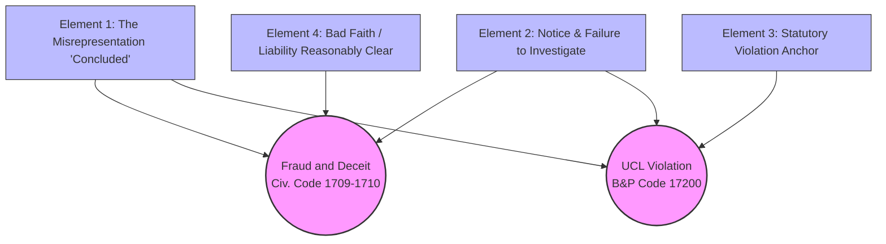
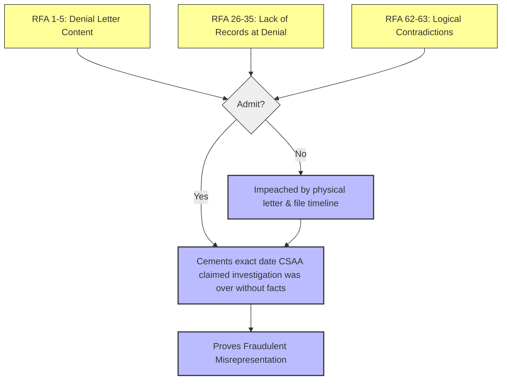
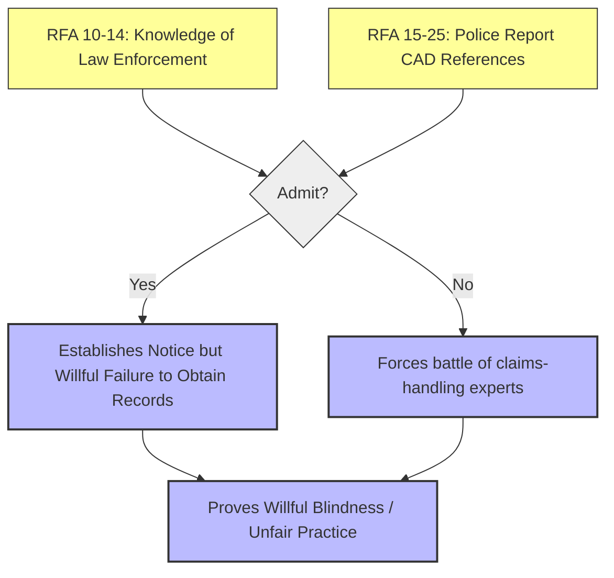
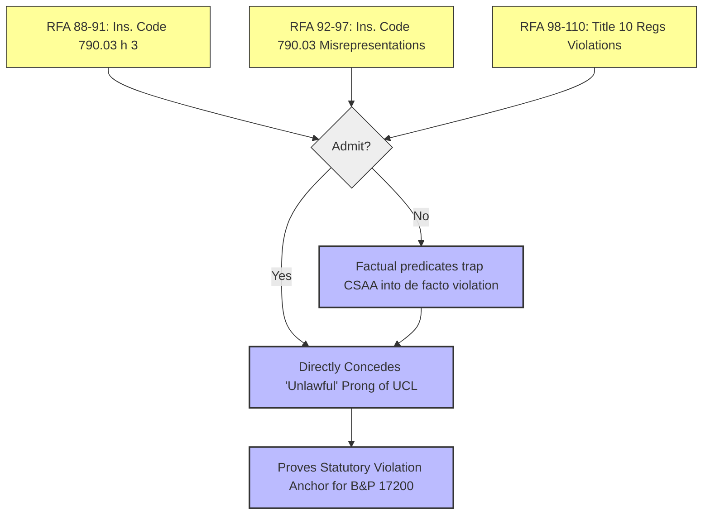
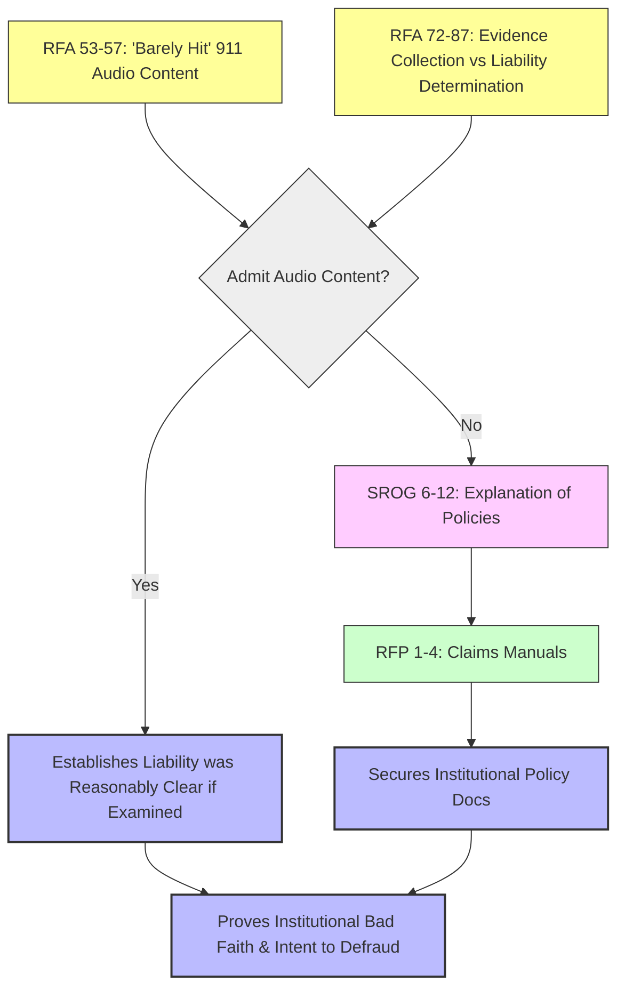

# Discovery Logic & Dependency Mapping: Case No. CGC-25-631802
## Causes of Action: Fraud, Deceit, and Violation of UCL (Bus. & Prof. Code § 17200)

This document visualizes the logical paths for every propounded discovery request, tracing them from the individual question (Node) to the necessary legal element (Path) required to support the cause of action.

---

## I. Logic Diagrams

### 1. Overall Cause of Action Map

### 2. Element 1: The Misrepresentation (Investigation 'Concluded')

### 3. Element 2: Notice of External Evidence & Failure to Investigate

### 4. Element 3: Statutory Violation Anchor (UCL Unlawful Prong)

### 5. Element 4: Bad Faith & Liability Reasonably Clear

---

## II. Exhaustive Index of Discovery Questions & Conditions

### Requests for Admission

#### RFA 1
- **Text:** Admit that CSAA Insurance Exchange issued a denial letter to Plaintiff Franciscus Dylan Rosario dated February 25, 2021, regarding a claim arising from the February 4, 2021 collision involving its insured, Subhi Abdelhalim.
- **Dependencies:** Relies on the February 25, 2021 denial letter document.
- **Implications:**
  - *Admit:* Cements the exact date CSAA claimed its investigation was over and liability was decided.
  - *Deny:* Impeached by the physical letter. Forces CSAA to argue 'concluded' means something else.
- **Tag:** `[NODE: RFA-1] -> [Element 1: The Misrepresentation ('Concluded')]`

#### RFA 2
- **Text:** Admit that the February 25, 2021 denial letter stated, in substance, that CSAA had ``concluded'' its investigation of the claim.
- **Dependencies:** Relies on the February 25, 2021 denial letter document.
- **Implications:**
  - *Admit:* Cements the exact date CSAA claimed its investigation was over and liability was decided.
  - *Deny:* Impeached by the physical letter. Forces CSAA to argue 'concluded' means something else.
- **Tag:** `[NODE: RFA-2] -> [Element 1: The Misrepresentation ('Concluded')]`

#### RFA 3
- **Text:** Admit that the February 25, 2021 denial letter stated, in substance, that CSAA had ``concluded'' that its insured, Subhi Abdelhalim, was ``not liable'' for the February 4, 2021 collision.
- **Dependencies:** Relies on the February 25, 2021 denial letter document.
- **Implications:**
  - *Admit:* Cements the exact date CSAA claimed its investigation was over and liability was decided.
  - *Deny:* Impeached by the physical letter. Forces CSAA to argue 'concluded' means something else.
- **Tag:** `[NODE: RFA-3] -> [Element 1: The Misrepresentation ('Concluded')]`

#### RFA 4
- **Text:** Admit that the February 25, 2021 denial letter was intended to communicate to the claimant that CSAA had completed its investigation and reached a final determination on liability.
- **Dependencies:** Relies on the February 25, 2021 denial letter document.
- **Implications:**
  - *Admit:* Cements the exact date CSAA claimed its investigation was over and liability was decided.
  - *Deny:* Impeached by the physical letter. Forces CSAA to argue 'concluded' means something else.
- **Tag:** `[NODE: RFA-4] -> [Element 1: The Misrepresentation ('Concluded')]`

#### RFA 5
- **Text:** Admit that a reasonable claimant receiving the February 25, 2021 denial letter would understand it to mean that CSAA had obtained and reviewed relevant evidence before determining that its insured was not liable.
- **Dependencies:** Relies on the February 25, 2021 denial letter document.
- **Implications:**
  - *Admit:* Cements the exact date CSAA claimed its investigation was over and liability was decided.
  - *Deny:* Impeached by the physical letter. Forces CSAA to argue 'concluded' means something else.
- **Tag:** `[NODE: RFA-5] -> [Element 1: The Misrepresentation ('Concluded')]`

#### RFA 6
- **Text:** Admit that industry standards for investigating third-party automobile liability claims include obtaining police reports and related law enforcement documentation when law enforcement responded to the incident.
- **Dependencies:** Relies on industry standard practices and California Fair Claims Settlement Practices Regulations.
- **Implications:**
  - *Admit:* Establishes CSAA had notice of law enforcement involvement but willfully failed to obtain the corresponding records.
  - *Deny:* Forces a battle of claims-handling experts regarding standard investigative duties.
- **Tag:** `[NODE: RFA-6] -> [Element 2: Notice & Failure to Investigate]`

#### RFA 7
- **Text:** Admit that when law enforcement responds to a vehicle-pedestrian collision, a reasonable and complete investigation would include obtaining the 911 call recording, body-worn camera footage, and computer-aided dispatch records.
- **Dependencies:** Relies on industry standard practices and California Fair Claims Settlement Practices Regulations.
- **Implications:**
  - *Admit:* Establishes CSAA had notice of law enforcement involvement but willfully failed to obtain the corresponding records.
  - *Deny:* Forces a battle of claims-handling experts regarding standard investigative duties.
- **Tag:** `[NODE: RFA-7] -> [Element 2: Notice & Failure to Investigate]`

#### RFA 8
- **Text:** Admit that a reasonable and complete investigation of a pedestrian-vehicle collision claim would include obtaining and reviewing statements made by the insured driver to 911 operators and/or responding law enforcement officers.
- **Dependencies:** Relies on industry standard practices and California Fair Claims Settlement Practices Regulations.
- **Implications:**
  - *Admit:* Establishes CSAA had notice of law enforcement involvement but willfully failed to obtain the corresponding records.
  - *Deny:* Forces a battle of claims-handling experts regarding standard investigative duties.
- **Tag:** `[NODE: RFA-8] -> [Element 2: Notice & Failure to Investigate]`

#### RFA 9
- **Text:** Admit that CSAA Insurance Exchange's claims-handling procedures require adjusters to obtain police records when law enforcement responded to an incident before issuing a liability determination.
- **Dependencies:** Relies on industry standard practices and California Fair Claims Settlement Practices Regulations.
- **Implications:**
  - *Admit:* Establishes CSAA had notice of law enforcement involvement but willfully failed to obtain the corresponding records.
  - *Deny:* Forces a battle of claims-handling experts regarding standard investigative duties.
- **Tag:** `[NODE: RFA-9] -> [Element 2: Notice & Failure to Investigate]`

#### RFA 10
- **Text:** Admit that as of February 25, 2021, CSAA Insurance Exchange knew or should have known that law enforcement responded to the February 4, 2021 collision.
- **Dependencies:** Relies on industry standard practices and California Fair Claims Settlement Practices Regulations.
- **Implications:**
  - *Admit:* Establishes CSAA had notice of law enforcement involvement but willfully failed to obtain the corresponding records.
  - *Deny:* Forces a battle of claims-handling experts regarding standard investigative duties.
- **Tag:** `[NODE: RFA-10] -> [Element 2: Notice & Failure to Investigate]`

#### RFA 11
- **Text:** Admit that when law enforcement responds to a collision, records including 911 call recordings, body-worn camera footage, and dispatch logs are routinely generated.
- **Dependencies:** Relies on industry standard practices and California Fair Claims Settlement Practices Regulations.
- **Implications:**
  - *Admit:* Establishes CSAA had notice of law enforcement involvement but willfully failed to obtain the corresponding records.
  - *Deny:* Forces a battle of claims-handling experts regarding standard investigative duties.
- **Tag:** `[NODE: RFA-11] -> [Element 2: Notice & Failure to Investigate]`

#### RFA 12
- **Text:** Admit that as of February 25, 2021, CSAA Insurance Exchange knew or should have known that a 911 call had been placed in connection with the February 4, 2021 collision.
- **Dependencies:** Relies on the February 25, 2021 denial letter document.
- **Implications:**
  - *Admit:* Cements the exact date CSAA claimed its investigation was over and liability was decided.
  - *Deny:* Impeached by the physical letter. Forces CSAA to argue 'concluded' means something else.
- **Tag:** `[NODE: RFA-12] -> [Element 1: The Misrepresentation ('Concluded')]`

#### RFA 13
- **Text:** Admit that as of February 25, 2021, CSAA Insurance Exchange knew or should have known that body-worn camera footage existed from law enforcement officers who responded to the February 4, 2021 collision.
- **Dependencies:** Relies on industry standard practices and California Fair Claims Settlement Practices Regulations.
- **Implications:**
  - *Admit:* Establishes CSAA had notice of law enforcement involvement but willfully failed to obtain the corresponding records.
  - *Deny:* Forces a battle of claims-handling experts regarding standard investigative duties.
- **Tag:** `[NODE: RFA-13] -> [Element 2: Notice & Failure to Investigate]`

#### RFA 14
- **Text:** Admit that as of February 25, 2021, CSAA Insurance Exchange knew or should have known that its own insured, Subhi Abdelhalim, may have made statements to the 911 operator, responding officers, or other persons at the scene of the February 4, 2021 collision.
- **Dependencies:** Relies on the February 25, 2021 denial letter document.
- **Implications:**
  - *Admit:* Cements the exact date CSAA claimed its investigation was over and liability was decided.
  - *Deny:* Impeached by the physical letter. Forces CSAA to argue 'concluded' means something else.
- **Tag:** `[NODE: RFA-14] -> [Element 1: The Misrepresentation ('Concluded')]`

#### RFA 15
- **Text:** Admit that a police report was generated by law enforcement in response to the February 4, 2021 collision.
- **Dependencies:** Relies on industry standard practices and California Fair Claims Settlement Practices Regulations.
- **Implications:**
  - *Admit:* Establishes CSAA had notice of law enforcement involvement but willfully failed to obtain the corresponding records.
  - *Deny:* Forces a battle of claims-handling experts regarding standard investigative duties.
- **Tag:** `[NODE: RFA-15] -> [Element 2: Notice & Failure to Investigate]`

#### RFA 16
- **Text:** Admit that the police report relating to the February 4, 2021 collision clearly describes or references a CAD (computer-aided dispatch) number.
- **Dependencies:** Relies on industry standard practices and California Fair Claims Settlement Practices Regulations.
- **Implications:**
  - *Admit:* Establishes CSAA had notice of law enforcement involvement but willfully failed to obtain the corresponding records.
  - *Deny:* Forces a battle of claims-handling experts regarding standard investigative duties.
- **Tag:** `[NODE: RFA-16] -> [Element 2: Notice & Failure to Investigate]`

#### RFA 17
- **Text:** Admit that the police report relating to the February 4, 2021 collision describes that Plaintiff Franciscus Dylan Rosario reported injury in connection with the February 4, 2021 collision.
- **Dependencies:** Relies on industry standard practices and California Fair Claims Settlement Practices Regulations.
- **Implications:**
  - *Admit:* Establishes CSAA had notice of law enforcement involvement but willfully failed to obtain the corresponding records.
  - *Deny:* Forces a battle of claims-handling experts regarding standard investigative duties.
- **Tag:** `[NODE: RFA-17] -> [Element 2: Notice & Failure to Investigate]`

#### RFA 18
- **Text:** Admit that relying exclusively on a police report does not constitute a complete investigation of a third-party bodily injury liability claim when 911 call recordings, body-worn camera footage, and eyewitness statements are available or obtainable.
- **Dependencies:** Relies on industry standard practices and California Fair Claims Settlement Practices Regulations.
- **Implications:**
  - *Admit:* Establishes CSAA had notice of law enforcement involvement but willfully failed to obtain the corresponding records.
  - *Deny:* Forces a battle of claims-handling experts regarding standard investigative duties.
- **Tag:** `[NODE: RFA-18] -> [Element 2: Notice & Failure to Investigate]`

#### RFA 19
- **Text:** Admit that under California law and industry standards, a complete investigation of a vehicle-pedestrian collision claim requires obtaining and reviewing statement evidence from the 911 call, body-worn camera footage, and eyewitness statements, when such materials are available, before concluding the investigation and issuing a liability determination.
- **Dependencies:** Relies on the existence and public availability of these records in early 2021.
- **Implications:**
  - *Admit:* Establishes that highly material evidence (insured's admission) existed and was ignored.
  - *Deny:* Impeached by Plaintiff's subsequent successful PRA request obtaining the same.
- **Tag:** `[NODE: RFA-19] -> [Element 4: Bad Faith / Willful Blindness]`

#### RFA 20
- **Text:** Admit that the police report relating to the February 4, 2021 collision does not acknowledge or include the statement made by Subhi Abdelhalim to the 911 operator that he had hit the pedestrian, including the statements verbatim as described in the official 911 transcript: (a) ``He cross from me, and he's barely hitting anything, but I'm calling for him,'' and (b) ``BOOM! I just hit him. HIT HIM. There was barely anything. I'm calling the 911 for him.''
- **Dependencies:** Relies on industry standard practices and California Fair Claims Settlement Practices Regulations.
- **Implications:**
  - *Admit:* Establishes CSAA had notice of law enforcement involvement but willfully failed to obtain the corresponding records.
  - *Deny:* Forces a battle of claims-handling experts regarding standard investigative duties.
- **Tag:** `[NODE: RFA-20] -> [Element 2: Notice & Failure to Investigate]`

#### RFA 21
- **Text:** Admit that the police report relating to the February 4, 2021 collision does not include or reference the body-worn camera footage of eyewitness statements at the scene of the February 4, 2021 collision.
- **Dependencies:** Relies on industry standard practices and California Fair Claims Settlement Practices Regulations.
- **Implications:**
  - *Admit:* Establishes CSAA had notice of law enforcement involvement but willfully failed to obtain the corresponding records.
  - *Deny:* Forces a battle of claims-handling experts regarding standard investigative duties.
- **Tag:** `[NODE: RFA-21] -> [Element 2: Notice & Failure to Investigate]`

#### RFA 22
- **Text:** Admit that the police report relating to the February 4, 2021 collision does not state that Plaintiff Franciscus Dylan Rosario reported in the 911 call that the driver Subhi Abdelhalim struck him with a van.
- **Dependencies:** Relies on industry standard practices and California Fair Claims Settlement Practices Regulations.
- **Implications:**
  - *Admit:* Establishes CSAA had notice of law enforcement involvement but willfully failed to obtain the corresponding records.
  - *Deny:* Forces a battle of claims-handling experts regarding standard investigative duties.
- **Tag:** `[NODE: RFA-22] -> [Element 2: Notice & Failure to Investigate]`

#### RFA 23
- **Text:** Admit that the police report relating to the February 4, 2021 collision does not include the multiple statements in the body-worn camera footage from Plaintiff Franciscus Dylan Rosario that Subhi Abdelhalim hit him.
- **Dependencies:** Relies on industry standard practices and California Fair Claims Settlement Practices Regulations.
- **Implications:**
  - *Admit:* Establishes CSAA had notice of law enforcement involvement but willfully failed to obtain the corresponding records.
  - *Deny:* Forces a battle of claims-handling experts regarding standard investigative duties.
- **Tag:** `[NODE: RFA-23] -> [Element 2: Notice & Failure to Investigate]`

#### RFA 24
- **Text:** Admit that under California law, the 911 audio recording containing the insured's admission, the body-worn camera footage containing eyewitness statements that the driver hit the pedestrian, and the body-worn camera footage containing Plaintiff's statements that Abdelhalim hit him, constitute evidence that would support a possible finding of liability against the insured.
- **Dependencies:** Relies on the existence and public availability of these records in early 2021.
- **Implications:**
  - *Admit:* Establishes that highly material evidence (insured's admission) existed and was ignored.
  - *Deny:* Impeached by Plaintiff's subsequent successful PRA request obtaining the same.
- **Tag:** `[NODE: RFA-24] -> [Element 4: Bad Faith / Willful Blindness]`

#### RFA 25
- **Text:** Admit that a closed investigation and final liability determination under California law and industry standards requires that such statement evidence (including the 911 party admission, eyewitness body-worn camera statements, and victim statements from body-worn camera footage) be obtained and addressed before concluding that an insured is not liable.
- **Dependencies:** Relies on the existence and public availability of these records in early 2021.
- **Implications:**
  - *Admit:* Establishes that highly material evidence (insured's admission) existed and was ignored.
  - *Deny:* Impeached by Plaintiff's subsequent successful PRA request obtaining the same.
- **Tag:** `[NODE: RFA-25] -> [Element 4: Bad Faith / Willful Blindness]`

#### RFA 26
- **Text:** Admit that as of February 25, 2021, CSAA Insurance Exchange had not contacted the San Francisco Police Department to request records relating to the February 4, 2021 collision.
- **Dependencies:** Relies on the February 25, 2021 denial letter document.
- **Implications:**
  - *Admit:* Cements the exact date CSAA claimed its investigation was over and liability was decided.
  - *Deny:* Impeached by the physical letter. Forces CSAA to argue 'concluded' means something else.
- **Tag:** `[NODE: RFA-26] -> [Element 1: The Misrepresentation ('Concluded')]`

#### RFA 27
- **Text:** Admit that as of February 25, 2021, CSAA Insurance Exchange had not contacted the San Francisco Department of Emergency Management to request records relating to the February 4, 2021 collision.
- **Dependencies:** Relies on the February 25, 2021 denial letter document.
- **Implications:**
  - *Admit:* Cements the exact date CSAA claimed its investigation was over and liability was decided.
  - *Deny:* Impeached by the physical letter. Forces CSAA to argue 'concluded' means something else.
- **Tag:** `[NODE: RFA-27] -> [Element 1: The Misrepresentation ('Concluded')]`

#### RFA 28
- **Text:** Admit that as of February 25, 2021, CSAA Insurance Exchange had not obtained any medical records or documentation regarding injuries sustained by Plaintiff in the February 4, 2021 collision.
- **Dependencies:** Relies on the February 25, 2021 denial letter document.
- **Implications:**
  - *Admit:* Cements the exact date CSAA claimed its investigation was over and liability was decided.
  - *Deny:* Impeached by the physical letter. Forces CSAA to argue 'concluded' means something else.
- **Tag:** `[NODE: RFA-28] -> [Element 1: The Misrepresentation ('Concluded')]`

#### RFA 29
- **Text:** Admit that as of February 25, 2021, CSAA Insurance Exchange had not retained an accident reconstruction expert, biomechanical expert, or any third-party investigator to evaluate the February 4, 2021 collision.
- **Dependencies:** Relies on the February 25, 2021 denial letter document.
- **Implications:**
  - *Admit:* Cements the exact date CSAA claimed its investigation was over and liability was decided.
  - *Deny:* Impeached by the physical letter. Forces CSAA to argue 'concluded' means something else.
- **Tag:** `[NODE: RFA-29] -> [Element 1: The Misrepresentation ('Concluded')]`

#### RFA 30
- **Text:** Admit that as of February 25, 2021, CSAA Insurance Exchange had not interviewed its own insured, Subhi Abdelhalim, under oath or through a recorded statement regarding the circumstances of the February 4, 2021 collision.
- **Dependencies:** Relies on the February 25, 2021 denial letter document.
- **Implications:**
  - *Admit:* Cements the exact date CSAA claimed its investigation was over and liability was decided.
  - *Deny:* Impeached by the physical letter. Forces CSAA to argue 'concluded' means something else.
- **Tag:** `[NODE: RFA-30] -> [Element 1: The Misrepresentation ('Concluded')]`

#### RFA 31
- **Text:** Admit that as of February 25, 2021, CSAA Insurance Exchange had not obtained a copy of Subhi Abdelhalim's driver's license record or driving history.
- **Dependencies:** Relies on the February 25, 2021 denial letter document.
- **Implications:**
  - *Admit:* Cements the exact date CSAA claimed its investigation was over and liability was decided.
  - *Deny:* Impeached by the physical letter. Forces CSAA to argue 'concluded' means something else.
- **Tag:** `[NODE: RFA-31] -> [Element 1: The Misrepresentation ('Concluded')]`

#### RFA 32
- **Text:** Admit that as of February 25, 2021, the only source of information CSAA Insurance Exchange had obtained regarding the circumstances of the February 4, 2021 collision was the account provided by its own insured, Subhi Abdelhalim.
- **Dependencies:** Relies on the February 25, 2021 denial letter document.
- **Implications:**
  - *Admit:* Cements the exact date CSAA claimed its investigation was over and liability was decided.
  - *Deny:* Impeached by the physical letter. Forces CSAA to argue 'concluded' means something else.
- **Tag:** `[NODE: RFA-32] -> [Element 1: The Misrepresentation ('Concluded')]`

#### RFA 33
- **Text:** Admit that as of February 25, 2021, CSAA Insurance Exchange had not obtained the 911 call audio recording generated by law enforcement in response to the February 4, 2021 collision.
- **Dependencies:** Relies on industry standard practices and California Fair Claims Settlement Practices Regulations.
- **Implications:**
  - *Admit:* Establishes CSAA had notice of law enforcement involvement but willfully failed to obtain the corresponding records.
  - *Deny:* Forces a battle of claims-handling experts regarding standard investigative duties.
- **Tag:** `[NODE: RFA-33] -> [Element 2: Notice & Failure to Investigate]`

#### RFA 34
- **Text:** Admit that as of February 25, 2021, CSAA Insurance Exchange had not obtained body-worn camera footage generated by law enforcement officers who responded to the February 4, 2021 collision.
- **Dependencies:** Relies on industry standard practices and California Fair Claims Settlement Practices Regulations.
- **Implications:**
  - *Admit:* Establishes CSAA had notice of law enforcement involvement but willfully failed to obtain the corresponding records.
  - *Deny:* Forces a battle of claims-handling experts regarding standard investigative duties.
- **Tag:** `[NODE: RFA-34] -> [Element 2: Notice & Failure to Investigate]`

#### RFA 35
- **Text:** Admit that as of February 25, 2021, CSAA Insurance Exchange had not obtained computer aided dispatch (CAD) records generated by law enforcement in response to the February 4, 2021 collision.
- **Dependencies:** Relies on industry standard practices and California Fair Claims Settlement Practices Regulations.
- **Implications:**
  - *Admit:* Establishes CSAA had notice of law enforcement involvement but willfully failed to obtain the corresponding records.
  - *Deny:* Forces a battle of claims-handling experts regarding standard investigative duties.
- **Tag:** `[NODE: RFA-35] -> [Element 2: Notice & Failure to Investigate]`

#### RFA 36
- **Text:** Admit that the 911 audio recording, body-worn camera footage, and CAD records relating to the February 4, 2021 collision were obtainable through routine public records requests as of February 25, 2021.
- **Dependencies:** Relies on industry standard practices and California Fair Claims Settlement Practices Regulations.
- **Implications:**
  - *Admit:* Establishes CSAA had notice of law enforcement involvement but willfully failed to obtain the corresponding records.
  - *Deny:* Forces a battle of claims-handling experts regarding standard investigative duties.
- **Tag:** `[NODE: RFA-36] -> [Element 2: Notice & Failure to Investigate]`

#### RFA 37
- **Text:** Admit that Plaintiff's counsel (Dolan Law Firm) obtained the 911 audio recording on May 12, 2021, less than three months after the February 4, 2021 collision.
- **Dependencies:** Relies on the existence and public availability of these records in early 2021.
- **Implications:**
  - *Admit:* Establishes that highly material evidence (insured's admission) existed and was ignored.
  - *Deny:* Impeached by Plaintiff's subsequent successful PRA request obtaining the same.
- **Tag:** `[NODE: RFA-37] -> [Element 4: Bad Faith / Willful Blindness]`

#### RFA 38
- **Text:** Admit that CSAA Insurance Exchange funded the defense of textit{Rosario v. Abdelhalim}, Case No. CGC-21-594102, through retained defense counsel (including Chambers, subsequently Carbone Smith & Koyama, and subsequently Phillips, Spallas & Angstadt LLP).
- **Dependencies:** Prior discovery responses / foundational timelines.
- **Implications:**
  - *Admit:* Provides baseline admission of fact.
  - *Deny:* Forces Form Interrogatory 17.1 (requires all facts/witnesses/documents for denial).
- **Tag:** `[NODE: RFA-38] -> [PATH: General Factual Predicate]`

#### RFA 39
- **Text:** Admit that CSAA Insurance Exchange maintained a claims file for the bodily injury liability claim arising from the February 4, 2021 collision, and that the claims file was updated with information from the related litigation, CGC-21-594102, during the period the case was pending.
- **Dependencies:** Prior discovery responses / foundational timelines.
- **Implications:**
  - *Admit:* Provides baseline admission of fact.
  - *Deny:* Forces Form Interrogatory 17.1 (requires all facts/witnesses/documents for denial).
- **Tag:** `[NODE: RFA-39] -> [PATH: General Factual Predicate]`

#### RFA 40
- **Text:** Admit that CSAA Insurance Exchange received periodic reports, updates, or summaries from retained defense counsel regarding the status of the litigation in textit{Rosario v. Abdelhalim}, Case No. CGC-21-594102, between May 2023 and January 2025.
- **Dependencies:** Prior discovery responses / foundational timelines.
- **Implications:**
  - *Admit:* Provides baseline admission of fact.
  - *Deny:* Forces Form Interrogatory 17.1 (requires all facts/witnesses/documents for denial).
- **Tag:** `[NODE: RFA-40] -> [PATH: General Factual Predicate]`

#### RFA 41
- **Text:** Admit that the 911 audio recording, body-worn camera footage, and CAD records were produced to defense counsel representing Abdelhalim in discovery in the underlying action, textit{Rosario v. Abdelhalim}, Case No. CGC-21-594102.
- **Dependencies:** Relies on industry standard practices and California Fair Claims Settlement Practices Regulations.
- **Implications:**
  - *Admit:* Establishes CSAA had notice of law enforcement involvement but willfully failed to obtain the corresponding records.
  - *Deny:* Forces a battle of claims-handling experts regarding standard investigative duties.
- **Tag:** `[NODE: RFA-41] -> [Element 2: Notice & Failure to Investigate]`

#### RFA 42
- **Text:** Admit that the 911 audio recording, body-worn camera footage, and CAD records were used at the deposition of Franciscus Dylan Rosario on August 18, 2022, in textit{Rosario v. Abdelhalim}, Case No. CGC-21-594102.
- **Dependencies:** Relies on industry standard practices and California Fair Claims Settlement Practices Regulations.
- **Implications:**
  - *Admit:* Establishes CSAA had notice of law enforcement involvement but willfully failed to obtain the corresponding records.
  - *Deny:* Forces a battle of claims-handling experts regarding standard investigative duties.
- **Tag:** `[NODE: RFA-42] -> [Element 2: Notice & Failure to Investigate]`

#### RFA 43
- **Text:** Admit that the 911 audio recording, body-worn camera footage, and CAD records were used at the deposition of Subhi Abdelhalim on September 30, 2022, in textit{Rosario v. Abdelhalim}, Case No. CGC-21-594102.
- **Dependencies:** Relies on industry standard practices and California Fair Claims Settlement Practices Regulations.
- **Implications:**
  - *Admit:* Establishes CSAA had notice of law enforcement involvement but willfully failed to obtain the corresponding records.
  - *Deny:* Forces a battle of claims-handling experts regarding standard investigative duties.
- **Tag:** `[NODE: RFA-43] -> [Element 2: Notice & Failure to Investigate]`

#### RFA 44
- **Text:** Admit that after February 25, 2021, CSAA Insurance Exchange or persons acting on its behalf obtained, reviewed, or caused to be obtained any law enforcement records relating to the February 4, 2021 collision, including but not limited to the 911 audio recording, body-worn camera footage, CAD records, or police incident reports.
- **Dependencies:** Relies on industry standard practices and California Fair Claims Settlement Practices Regulations.
- **Implications:**
  - *Admit:* Establishes CSAA had notice of law enforcement involvement but willfully failed to obtain the corresponding records.
  - *Deny:* Forces a battle of claims-handling experts regarding standard investigative duties.
- **Tag:** `[NODE: RFA-44] -> [Element 2: Notice & Failure to Investigate]`

#### RFA 45
- **Text:** Admit that after February 25, 2021, CSAA Insurance Exchange continued to evaluate, reassess, or monitor the bodily injury liability claim arising from the February 4, 2021 collision.
- **Dependencies:** Relies on the February 25, 2021 denial letter document.
- **Implications:**
  - *Admit:* Cements the exact date CSAA claimed its investigation was over and liability was decided.
  - *Deny:* Impeached by the physical letter. Forces CSAA to argue 'concluded' means something else.
- **Tag:** `[NODE: RFA-45] -> [Element 1: The Misrepresentation ('Concluded')]`

#### RFA 46
- **Text:** Admit that CSAA Insurance Exchange set or adjusted reserves on the bodily injury liability claim arising from the February 4, 2021 collision at any time after February 25, 2021.
- **Dependencies:** Relies on the February 25, 2021 denial letter document.
- **Implications:**
  - *Admit:* Cements the exact date CSAA claimed its investigation was over and liability was decided.
  - *Deny:* Impeached by the physical letter. Forces CSAA to argue 'concluded' means something else.
- **Tag:** `[NODE: RFA-46] -> [Element 1: The Misrepresentation ('Concluded')]`

#### RFA 47
- **Text:** Admit that at some point after February 25, 2021, CSAA Insurance Exchange or its retained defense counsel obtained or received copies of the 911 audio recording, body-worn camera footage, and/or CAD records relating to the February 4, 2021 collision.
- **Dependencies:** Relies on industry standard practices and California Fair Claims Settlement Practices Regulations.
- **Implications:**
  - *Admit:* Establishes CSAA had notice of law enforcement involvement but willfully failed to obtain the corresponding records.
  - *Deny:* Forces a battle of claims-handling experts regarding standard investigative duties.
- **Tag:** `[NODE: RFA-47] -> [Element 2: Notice & Failure to Investigate]`

#### RFA 48
- **Text:** Admit that prior to January 17, 2025, CSAA Insurance Exchange was aware that the 911 audio recording, body-worn camera footage, and CAD records had been served on defense counsel by Plaintiff's counsel during discovery in CGC-21-594102.
- **Dependencies:** Relies on industry standard practices and California Fair Claims Settlement Practices Regulations.
- **Implications:**
  - *Admit:* Establishes CSAA had notice of law enforcement involvement but willfully failed to obtain the corresponding records.
  - *Deny:* Forces a battle of claims-handling experts regarding standard investigative duties.
- **Tag:** `[NODE: RFA-48] -> [Element 2: Notice & Failure to Investigate]`

#### RFA 49
- **Text:** Admit that prior to January 17, 2025, CSAA Insurance Exchange had listened to, reviewed, or been briefed on the contents of the 911 audio recording in which its insured, Subhi Abdelhalim, stated, verbatim as described in the official 911 transcript: (a) ``He cross from me, and he's barely hitting anything, but I'm calling for him,'' and (b) ``BOOM! I just hit him. HIT HIM. There was barely anything. I'm calling the 911 for him.''
- **Dependencies:** Relies on the existence and public availability of these records in early 2021.
- **Implications:**
  - *Admit:* Establishes that highly material evidence (insured's admission) existed and was ignored.
  - *Deny:* Impeached by Plaintiff's subsequent successful PRA request obtaining the same.
- **Tag:** `[NODE: RFA-49] -> [Element 4: Bad Faith / Willful Blindness]`

#### RFA 50
- **Text:** Admit that Motions in Limine Nos. 6 and 17, filed by defense counsel in textit{Rosario v. Abdelhalim}, CGC-21-594102, on January 17, 2025, stated, in substance, that the 911 audio recording and police records ``were not produced in discovery'' and were of ``unknown provenance.''
- **Dependencies:** Relies on the existence and public availability of these records in early 2021.
- **Implications:**
  - *Admit:* Establishes that highly material evidence (insured's admission) existed and was ignored.
  - *Deny:* Impeached by Plaintiff's subsequent successful PRA request obtaining the same.
- **Tag:** `[NODE: RFA-50] -> [Element 4: Bad Faith / Willful Blindness]`

#### RFA 51
- **Text:** Admit that CSAA Insurance Exchange reviewed, approved, or was informed of the substance of Motions in Limine Nos. 6 and 17 filed by defense counsel on January 17, 2025, before those motions were filed.
- **Dependencies:** Prior discovery responses / foundational timelines.
- **Implications:**
  - *Admit:* Provides baseline admission of fact.
  - *Deny:* Forces Form Interrogatory 17.1 (requires all facts/witnesses/documents for denial).
- **Tag:** `[NODE: RFA-51] -> [PATH: General Factual Predicate]`

#### RFA 52
- **Text:** Admit that the representations in Motions in Limine Nos. 6 and 17---that the 911 audio recording and police records ``were not produced in discovery'' and were of ``unknown provenance''---were inconsistent with the sworn testimony of J. Jessup, Esq., who testified on February 18, 2025, that the evidence had been served on defense counsel during discovery.
- **Dependencies:** Relies on the existence and public availability of these records in early 2021.
- **Implications:**
  - *Admit:* Establishes that highly material evidence (insured's admission) existed and was ignored.
  - *Deny:* Impeached by Plaintiff's subsequent successful PRA request obtaining the same.
- **Tag:** `[NODE: RFA-52] -> [Element 4: Bad Faith / Willful Blindness]`

#### RFA 53
- **Text:** Admit that the 911 audio recording contains a statement by Subhi Abdelhalim regarding the February 4, 2021 collision, and that Abdelhalim authenticated the recording at trial on April 17, 2025, in textit{Rosario v. Abdelhalim}, Case No. CGC-21-594102, by stating verbatim: ``Yes. That is my voice.''
- **Dependencies:** Relies on the existence and public availability of these records in early 2021.
- **Implications:**
  - *Admit:* Establishes that highly material evidence (insured's admission) existed and was ignored.
  - *Deny:* Impeached by Plaintiff's subsequent successful PRA request obtaining the same.
- **Tag:** `[NODE: RFA-53] -> [Element 4: Bad Faith / Willful Blindness]`

#### RFA 54
- **Text:** Admit that the 911 audio recording contains a statement by Subhi Abdelhalim to the emergency operator, verbatim as described in the official 911 transcript, including: (a) ``He cross from me, and he's barely hitting anything, but I'm calling for him,'' and (b) ``BOOM! I just hit him. HIT HIM. There was barely anything. I'm calling the 911 for him.''
- **Dependencies:** Relies on the existence and public availability of these records in early 2021.
- **Implications:**
  - *Admit:* Establishes that highly material evidence (insured's admission) existed and was ignored.
  - *Deny:* Impeached by Plaintiff's subsequent successful PRA request obtaining the same.
- **Tag:** `[NODE: RFA-54] -> [Element 4: Bad Faith / Willful Blindness]`

#### RFA 55
- **Text:** Admit that a statement by a driver to a 911 operator that he ``barely hit'' a pedestrian is relevant to the determination of liability in a vehicle-pedestrian collision claim.
- **Dependencies:** Relies on the existence and public availability of these records in early 2021.
- **Implications:**
  - *Admit:* Establishes that highly material evidence (insured's admission) existed and was ignored.
  - *Deny:* Impeached by Plaintiff's subsequent successful PRA request obtaining the same.
- **Tag:** `[NODE: RFA-55] -> [Element 4: Bad Faith / Willful Blindness]`

#### RFA 56
- **Text:** Admit that a statement by an insured driver that he ``barely hit'' a pedestrian would be relevant to CSAA's determination of whether that insured was liable for the collision.
- **Dependencies:** Relies on the insured's 911 statements.
- **Implications:**
  - *Admit:* Establishes the materiality of the evidence that was ignored, proving liability was reasonably clear.
  - *Deny:* Impeached by the audio.
- **Tag:** `[NODE: RFA-56] -> [Element 4: Liability Reasonably Clear]`

#### RFA 57
- **Text:** Admit that the body-worn camera footage from Officer Thompson's interview of the eyewitness (Dustin Rosemond) at the scene of the February 4, 2021 collision contains the eyewitness stating, verbatim as read to the jury during Plaintiff's closing argument on April 22, 2025 (RT 10, p. 39, ll. 21--23; RT 10, p. 59, ll. 3--4): ``The man in the van hit the guy'' and ``That man in the van hit the guy who was laying on the ground.''
- **Dependencies:** Relies on the existence and public availability of these records in early 2021.
- **Implications:**
  - *Admit:* Establishes that highly material evidence (insured's admission) existed and was ignored.
  - *Deny:* Impeached by Plaintiff's subsequent successful PRA request obtaining the same.
- **Tag:** `[NODE: RFA-57] -> [Element 4: Bad Faith / Willful Blindness]`

#### RFA 58
- **Text:** Admit that the underlying lawsuit, textit{Rosario v. Abdelhalim}, Case No. CGC-21-594102, was filed on July 27, 2021, approximately five months after the February 25, 2021 denial letter.
- **Dependencies:** Relies on the February 25, 2021 denial letter document.
- **Implications:**
  - *Admit:* Cements the exact date CSAA claimed its investigation was over and liability was decided.
  - *Deny:* Impeached by the physical letter. Forces CSAA to argue 'concluded' means something else.
- **Tag:** `[NODE: RFA-58] -> [Element 1: The Misrepresentation ('Concluded')]`

#### RFA 59
- **Text:** Admit that the jury in textit{Rosario v. Abdelhalim}, Case No. CGC-21-594102, returned a 9--3 verdict for the defense on April 25, 2025.
- **Dependencies:** Prior discovery responses / foundational timelines.
- **Implications:**
  - *Admit:* Provides baseline admission of fact.
  - *Deny:* Forces Form Interrogatory 17.1 (requires all facts/witnesses/documents for denial).
- **Tag:** `[NODE: RFA-59] -> [PATH: General Factual Predicate]`

#### RFA 60
- **Text:** Admit that a 9--3 verdict is the minimum civil majority required for a verdict under California law.
- **Dependencies:** Prior discovery responses / foundational timelines.
- **Implications:**
  - *Admit:* Provides baseline admission of fact.
  - *Deny:* Forces Form Interrogatory 17.1 (requires all facts/witnesses/documents for denial).
- **Tag:** `[NODE: RFA-60] -> [PATH: General Factual Predicate]`

#### RFA 61
- **Text:** Admit that if CSAA Insurance Exchange had obtained the 911 audio recording prior to February 25, 2021, CSAA would have heard Subhi Abdelhalim state, verbatim as described in the official 911 transcript, including: (a) ``He cross from me, and he's barely hitting anything, but I'm calling for him,'' and (b) ``BOOM! I just hit him. HIT HIM. There was barely anything. I'm calling the 911 for him.''
- **Dependencies:** Relies on the February 25, 2021 denial letter document.
- **Implications:**
  - *Admit:* Cements the exact date CSAA claimed its investigation was over and liability was decided.
  - *Deny:* Impeached by the physical letter. Forces CSAA to argue 'concluded' means something else.
- **Tag:** `[NODE: RFA-61] -> [Element 1: The Misrepresentation ('Concluded')]`

#### RFA 62
- **Text:** Admit that CSAA Insurance Exchange cannot simultaneously maintain that (a) its investigation of the February 4, 2021 collision was ``concluded'' as of February 25, 2021, and (b) it had not obtained the 911 audio recording containing its insured's statement about the collision.
- **Dependencies:** Relies on the February 25, 2021 denial letter document.
- **Implications:**
  - *Admit:* Cements the exact date CSAA claimed its investigation was over and liability was decided.
  - *Deny:* Impeached by the physical letter. Forces CSAA to argue 'concluded' means something else.
- **Tag:** `[NODE: RFA-62] -> [Element 1: The Misrepresentation ('Concluded')]`

#### RFA 63
- **Text:** Admit that CSAA Insurance Exchange cannot simultaneously maintain that (a) its investigation was ``concluded'' as of February 25, 2021, and (b) it continued to evaluate, reassess, monitor, or adjust reserves on the claim after that date.
- **Dependencies:** Relies on the February 25, 2021 denial letter document.
- **Implications:**
  - *Admit:* Cements the exact date CSAA claimed its investigation was over and liability was decided.
  - *Deny:* Impeached by the physical letter. Forces CSAA to argue 'concluded' means something else.
- **Tag:** `[NODE: RFA-63] -> [Element 1: The Misrepresentation ('Concluded')]`

#### RFA 64
- **Text:** Admit that if CSAA Insurance Exchange was aware, at any time prior to January 17, 2025, that the 911 audio recording and related law enforcement records had been served on defense counsel during discovery, and did not correct the representations made in Motions in Limine Nos. 6 and 17, then CSAA permitted materially false representations to be made to the Court on its behalf.
- **Dependencies:** Relies on industry standard practices and California Fair Claims Settlement Practices Regulations.
- **Implications:**
  - *Admit:* Establishes CSAA had notice of law enforcement involvement but willfully failed to obtain the corresponding records.
  - *Deny:* Forces a battle of claims-handling experts regarding standard investigative duties.
- **Tag:** `[NODE: RFA-64] -> [Element 2: Notice & Failure to Investigate]`

#### RFA 65
- **Text:** Admit that CSAA Insurance Exchange maintains standardized templates or form language for denial letters issued to third-party bodily injury claimants.
- **Dependencies:** Relies on the February 25, 2021 denial letter document.
- **Implications:**
  - *Admit:* Cements the exact date CSAA claimed its investigation was over and liability was decided.
  - *Deny:* Impeached by the physical letter. Forces CSAA to argue 'concluded' means something else.
- **Tag:** `[NODE: RFA-65] -> [Element 1: The Misrepresentation ('Concluded')]`

#### RFA 66
- **Text:** Admit that the phrase ``concluded our investigation'' (or substantially similar language) appears in denial letters issued by CSAA to other third-party claimants, and is not unique to the February 25, 2021 denial letter.
- **Dependencies:** Relies on the February 25, 2021 denial letter document.
- **Implications:**
  - *Admit:* Cements the exact date CSAA claimed its investigation was over and liability was decided.
  - *Deny:* Impeached by the physical letter. Forces CSAA to argue 'concluded' means something else.
- **Tag:** `[NODE: RFA-66] -> [Element 1: The Misrepresentation ('Concluded')]`

#### RFA 67
- **Text:** Admit that CSAA Insurance Exchange's claims-handling procedures include supervisor review or approval of liability denial determinations before issuance of denial letters.
- **Dependencies:** Relies on the February 25, 2021 denial letter document.
- **Implications:**
  - *Admit:* Cements the exact date CSAA claimed its investigation was over and liability was decided.
  - *Deny:* Impeached by the physical letter. Forces CSAA to argue 'concluded' means something else.
- **Tag:** `[NODE: RFA-67] -> [Element 1: The Misrepresentation ('Concluded')]`

#### RFA 68
- **Text:** Admit that CSAA Insurance Exchange tracks claim-closure timelines, denial rates, or comparable performance metrics for claims adjusters.
- **Dependencies:** Prior discovery responses / foundational timelines.
- **Implications:**
  - *Admit:* Provides baseline admission of fact.
  - *Deny:* Forces Form Interrogatory 17.1 (requires all facts/witnesses/documents for denial).
- **Tag:** `[NODE: RFA-68] -> [PATH: General Factual Predicate]`

#### RFA 69
- **Text:** Admit that the only liability-relevant information CSAA Insurance Exchange obtained before issuing the February 25, 2021 denial letter was the account provided by its own insured, Subhi Abdelhalim.
- **Dependencies:** Relies on the February 25, 2021 denial letter document.
- **Implications:**
  - *Admit:* Cements the exact date CSAA claimed its investigation was over and liability was decided.
  - *Deny:* Impeached by the physical letter. Forces CSAA to argue 'concluded' means something else.
- **Tag:** `[NODE: RFA-69] -> [Element 1: The Misrepresentation ('Concluded')]`

#### RFA 70
- **Text:** Admit that CSAA Insurance Exchange did not, at any time before February 25, 2021, make any attempt to contact Plaintiff to obtain his account of the February 4, 2021 collision.
- **Dependencies:** Relies on the February 25, 2021 denial letter document.
- **Implications:**
  - *Admit:* Cements the exact date CSAA claimed its investigation was over and liability was decided.
  - *Deny:* Impeached by the physical letter. Forces CSAA to argue 'concluded' means something else.
- **Tag:** `[NODE: RFA-70] -> [Element 1: The Misrepresentation ('Concluded')]`

#### RFA 71
- **Text:** Admit that CSAA Insurance Exchange set or adjusted reserves on the claim at any time after issuing the February 25, 2021 denial letter, and that any such reserve change is inconsistent with the claim that the investigation was ``concluded'' as of that date.
- **Dependencies:** Relies on the February 25, 2021 denial letter document.
- **Implications:**
  - *Admit:* Cements the exact date CSAA claimed its investigation was over and liability was decided.
  - *Deny:* Impeached by the physical letter. Forces CSAA to argue 'concluded' means something else.
- **Tag:** `[NODE: RFA-71] -> [Element 1: The Misrepresentation ('Concluded')]`

#### RFA 72
- **Text:** Admit that CSAA Insurance Exchange's claims-handling procedures require that evidence collection be completed before a liability determination is issued for third-party bodily injury claims.
- **Dependencies:** Prior discovery responses / foundational timelines.
- **Implications:**
  - *Admit:* Provides baseline admission of fact.
  - *Deny:* Forces Form Interrogatory 17.1 (requires all facts/witnesses/documents for denial).
- **Tag:** `[NODE: RFA-72] -> [PATH: General Factual Predicate]`

#### RFA 73
- **Text:** Admit that CSAA Insurance Exchange's procedures do not permit a claims adjuster to issue a liability denial until the adjuster has documented what law enforcement records exist and whether they have been requested or obtained when law enforcement responded to the incident.
- **Dependencies:** Relies on industry standard practices and California Fair Claims Settlement Practices Regulations.
- **Implications:**
  - *Admit:* Establishes CSAA had notice of law enforcement involvement but willfully failed to obtain the corresponding records.
  - *Deny:* Forces a battle of claims-handling experts regarding standard investigative duties.
- **Tag:** `[NODE: RFA-73] -> [Element 2: Notice & Failure to Investigate]`

#### RFA 74
- **Text:** Admit that the claims file for the February 4, 2021 collision contains no documentation that CSAA attempted to obtain the 911 audio recording, body-worn camera footage, or CAD records before issuing the February 25, 2021 denial letter.
- **Dependencies:** Relies on industry standard practices and California Fair Claims Settlement Practices Regulations.
- **Implications:**
  - *Admit:* Establishes CSAA had notice of law enforcement involvement but willfully failed to obtain the corresponding records.
  - *Deny:* Forces a battle of claims-handling experts regarding standard investigative duties.
- **Tag:** `[NODE: RFA-74] -> [Element 2: Notice & Failure to Investigate]`

#### RFA 75
- **Text:** Admit that the adjuster who issued the February 25, 2021 denial letter did not document any request to the San Francisco Police Department or San Francisco Department of Emergency Management for records relating to the February 4, 2021 collision before that date.
- **Dependencies:** Relies on the February 25, 2021 denial letter document.
- **Implications:**
  - *Admit:* Cements the exact date CSAA claimed its investigation was over and liability was decided.
  - *Deny:* Impeached by the physical letter. Forces CSAA to argue 'concluded' means something else.
- **Tag:** `[NODE: RFA-75] -> [Element 1: The Misrepresentation ('Concluded')]`

#### RFA 76
- **Text:** Admit that CSAA Insurance Exchange's liability determination for the February 4, 2021 collision was made without having obtained or reviewed any contemporaneous statement evidence from the 911 call, body-worn camera footage, or eyewitnesses at the scene.
- **Dependencies:** Relies on the existence and public availability of these records in early 2021.
- **Implications:**
  - *Admit:* Establishes that highly material evidence (insured's admission) existed and was ignored.
  - *Deny:* Impeached by Plaintiff's subsequent successful PRA request obtaining the same.
- **Tag:** `[NODE: RFA-76] -> [Element 4: Bad Faith / Willful Blindness]`

#### RFA 77
- **Text:** Admit that a liability determination cannot truthfully be described as ``concluded'' when the insurer has not obtained and reviewed foundational objective evidence that is known or reasonably knowable to exist and that is material to liability.
- **Dependencies:** Relies on the February 25, 2021 denial letter document.
- **Implications:**
  - *Admit:* Cements the exact date CSAA claimed its investigation was over and liability was decided.
  - *Deny:* Impeached by the physical letter. Forces CSAA to argue 'concluded' means something else.
- **Tag:** `[NODE: RFA-77] -> [Element 1: The Misrepresentation ('Concluded')]`

#### RFA 78
- **Text:** Admit that the 911 audio recording, body-worn camera footage, and CAD records are material to a liability determination in a vehicle-pedestrian collision claim when law enforcement responded to the incident.
- **Dependencies:** Relies on industry standard practices and California Fair Claims Settlement Practices Regulations.
- **Implications:**
  - *Admit:* Establishes CSAA had notice of law enforcement involvement but willfully failed to obtain the corresponding records.
  - *Deny:* Forces a battle of claims-handling experts regarding standard investigative duties.
- **Tag:** `[NODE: RFA-78] -> [Element 2: Notice & Failure to Investigate]`

#### RFA 79
- **Text:** Admit that CSAA Insurance Exchange's liability determination that Subhi Abdelhalim was ``not liable'' was based solely on information favorable to the insured, without obtaining or reviewing any independent or contemporaneous evidence that could support liability.
- **Dependencies:** Prior discovery responses / foundational timelines.
- **Implications:**
  - *Admit:* Provides baseline admission of fact.
  - *Deny:* Forces Form Interrogatory 17.1 (requires all facts/witnesses/documents for denial).
- **Tag:** `[NODE: RFA-79] -> [PATH: General Factual Predicate]`

#### RFA 80
- **Text:** Admit that if CSAA Insurance Exchange had obtained and reviewed the 911 audio recording, body-worn camera footage, and eyewitness statements before February 25, 2021, CSAA could not have truthfully issued a denial letter stating it had ``concluded'' that its insured was ``not liable'' without addressing that evidence.
- **Dependencies:** Relies on the February 25, 2021 denial letter document.
- **Implications:**
  - *Admit:* Cements the exact date CSAA claimed its investigation was over and liability was decided.
  - *Deny:* Impeached by the physical letter. Forces CSAA to argue 'concluded' means something else.
- **Tag:** `[NODE: RFA-80] -> [Element 1: The Misrepresentation ('Concluded')]`

#### RFA 81
- **Text:** Admit that CSAA Insurance Exchange maintains internal guidelines, checklists, or protocols that specify what evidence must be collected or considered before a liability denial is issued for third-party automobile claims.
- **Dependencies:** Prior discovery responses / foundational timelines.
- **Implications:**
  - *Admit:* Provides baseline admission of fact.
  - *Deny:* Forces Form Interrogatory 17.1 (requires all facts/witnesses/documents for denial).
- **Tag:** `[NODE: RFA-81] -> [PATH: General Factual Predicate]`

#### RFA 82
- **Text:** Admit that the claims file for the February 4, 2021 collision does not contain any notation, checklist entry, or supervisory approval indicating that 911, body-worn camera, or CAD records were considered, requested, or obtained before the February 25, 2021 denial.
- **Dependencies:** Relies on industry standard practices and California Fair Claims Settlement Practices Regulations.
- **Implications:**
  - *Admit:* Establishes CSAA had notice of law enforcement involvement but willfully failed to obtain the corresponding records.
  - *Deny:* Forces a battle of claims-handling experts regarding standard investigative duties.
- **Tag:** `[NODE: RFA-82] -> [Element 2: Notice & Failure to Investigate]`

#### RFA 83
- **Text:** Admit that CSAA Insurance Exchange's claims-handling procedures require that a liability denial determination be documented with a summary of the evidence relied upon, and that the February 25, 2021 denial was issued without documentation that any evidence other than the insured's account was relied upon.
- **Dependencies:** Relies on the February 25, 2021 denial letter document.
- **Implications:**
  - *Admit:* Cements the exact date CSAA claimed its investigation was over and liability was decided.
  - *Deny:* Impeached by the physical letter. Forces CSAA to argue 'concluded' means something else.
- **Tag:** `[NODE: RFA-83] -> [Element 1: The Misrepresentation ('Concluded')]`

#### RFA 84
- **Text:** Admit that CSAA Insurance Exchange trains or has trained its adjusters that a ``concluded'' investigation requires completion of evidence collection before a final liability determination is communicated to a claimant.
- **Dependencies:** Relies on the February 25, 2021 denial letter document.
- **Implications:**
  - *Admit:* Cements the exact date CSAA claimed its investigation was over and liability was decided.
  - *Deny:* Impeached by the physical letter. Forces CSAA to argue 'concluded' means something else.
- **Tag:** `[NODE: RFA-84] -> [Element 1: The Misrepresentation ('Concluded')]`

#### RFA 85
- **Text:** Admit that CSAA Insurance Exchange did not inadvertently omit obtaining the 911 audio recording, body-worn camera footage, and CAD records; rather, no attempt was made to obtain them before issuing the February 25, 2021 denial letter.
- **Dependencies:** Relies on industry standard practices and California Fair Claims Settlement Practices Regulations.
- **Implications:**
  - *Admit:* Establishes CSAA had notice of law enforcement involvement but willfully failed to obtain the corresponding records.
  - *Deny:* Forces a battle of claims-handling experts regarding standard investigative duties.
- **Tag:** `[NODE: RFA-85] -> [Element 2: Notice & Failure to Investigate]`

#### RFA 86
- **Text:** Admit that issuing a denial letter stating an investigation is ``concluded'' when foundational objective evidence has not been obtained shifts the burden of obtaining and authenticating that evidence onto the claimant.
- **Dependencies:** Relies on the February 25, 2021 denial letter document.
- **Implications:**
  - *Admit:* Cements the exact date CSAA claimed its investigation was over and liability was decided.
  - *Deny:* Impeached by the physical letter. Forces CSAA to argue 'concluded' means something else.
- **Tag:** `[NODE: RFA-86] -> [Element 1: The Misrepresentation ('Concluded')]`

#### RFA 87
- **Text:** Admit that a claimant who receives a denial letter stating an investigation is ``concluded'' would reasonably believe that the insurer had already obtained and reviewed the types of evidence that are routinely generated when law enforcement responds to a collision.
- **Dependencies:** Relies on industry standard practices and California Fair Claims Settlement Practices Regulations.
- **Implications:**
  - *Admit:* Establishes CSAA had notice of law enforcement involvement but willfully failed to obtain the corresponding records.
  - *Deny:* Forces a battle of claims-handling experts regarding standard investigative duties.
- **Tag:** `[NODE: RFA-87] -> [Element 2: Notice & Failure to Investigate]`

#### RFA 88
- **Text:** Admit that California Insurance Code section 790.03(h)(3) requires insurers to adopt and implement reasonable standards for the prompt investigation of claims.
- **Dependencies:** Direct statutory/regulatory mapping to the factual admissions of failing to pull the 911/bodycam.
- **Implications:**
  - *Admit:* Directly concedes the 'Unlawful' prong of the UCL claim (Bus & Prof Code 17200).
  - *Deny:* CSAA will object as a legal conclusion, but the factual predicates will trap them into a de facto violation.
- **Tag:** `[NODE: RFA-88] -> [Element 3: Statutory Violation Anchor]`

#### RFA 89
- **Text:** Admit that California Insurance Code section 790.03(h)(3) applies to CSAA Insurance Exchange and requires CSAA to maintain reasonable standards for investigating third-party automobile liability claims.
- **Dependencies:** Direct statutory/regulatory mapping to the factual admissions of failing to pull the 911/bodycam.
- **Implications:**
  - *Admit:* Directly concedes the 'Unlawful' prong of the UCL claim (Bus & Prof Code 17200).
  - *Deny:* CSAA will object as a legal conclusion, but the factual predicates will trap them into a de facto violation.
- **Tag:** `[NODE: RFA-89] -> [Element 3: Statutory Violation Anchor]`

#### RFA 90
- **Text:** Admit that a reasonable standard for the prompt investigation of a third-party automobile liability claim when law enforcement responded to the incident would include obtaining and reviewing the 911 call recording, body-worn camera footage, and CAD records before issuing a liability determination.
- **Dependencies:** Relies on industry standard practices and California Fair Claims Settlement Practices Regulations.
- **Implications:**
  - *Admit:* Establishes CSAA had notice of law enforcement involvement but willfully failed to obtain the corresponding records.
  - *Deny:* Forces a battle of claims-handling experts regarding standard investigative duties.
- **Tag:** `[NODE: RFA-90] -> [Element 2: Notice & Failure to Investigate]`

#### RFA 91
- **Text:** Admit that CSAA Insurance Exchange's handling of the February 4, 2021 collision claim did not comply with the requirement of Insurance Code section 790.03(h)(3) to adopt and implement reasonable standards for the prompt investigation of claims, in that CSAA issued a liability denial without obtaining the 911 audio recording, body-worn camera footage, or CAD records.
- **Dependencies:** Direct statutory/regulatory mapping to the factual admissions of failing to pull the 911/bodycam.
- **Implications:**
  - *Admit:* Directly concedes the 'Unlawful' prong of the UCL claim (Bus & Prof Code 17200).
  - *Deny:* CSAA will object as a legal conclusion, but the factual predicates will trap them into a de facto violation.
- **Tag:** `[NODE: RFA-91] -> [Element 3: Statutory Violation Anchor]`

#### RFA 92
- **Text:** Admit that California Insurance Code section 790.03(h)(1) prohibits misrepresenting to claimants pertinent facts or insurance policy provisions relating to any coverages at issue.
- **Dependencies:** Direct statutory/regulatory mapping to the factual admissions of failing to pull the 911/bodycam.
- **Implications:**
  - *Admit:* Directly concedes the 'Unlawful' prong of the UCL claim (Bus & Prof Code 17200).
  - *Deny:* CSAA will object as a legal conclusion, but the factual predicates will trap them into a de facto violation.
- **Tag:** `[NODE: RFA-92] -> [Element 3: Statutory Violation Anchor]`

#### RFA 93
- **Text:** Admit that stating that an investigation has been ``concluded'' when foundational objective liability evidence has not been obtained or reviewed constitutes a misrepresentation of a pertinent fact within the meaning of Insurance Code section 790.03(h)(1).
- **Dependencies:** Direct statutory/regulatory mapping to the factual admissions of failing to pull the 911/bodycam.
- **Implications:**
  - *Admit:* Directly concedes the 'Unlawful' prong of the UCL claim (Bus & Prof Code 17200).
  - *Deny:* CSAA will object as a legal conclusion, but the factual predicates will trap them into a de facto violation.
- **Tag:** `[NODE: RFA-93] -> [Element 3: Statutory Violation Anchor]`

#### RFA 94
- **Text:** Admit that California Insurance Code section 790.03(h)(13) requires insurers to provide promptly a reasonable explanation of the basis relied on in the insurance policy, in relation to the facts or applicable law, for the denial of a claim.
- **Dependencies:** Direct statutory/regulatory mapping to the factual admissions of failing to pull the 911/bodycam.
- **Implications:**
  - *Admit:* Directly concedes the 'Unlawful' prong of the UCL claim (Bus & Prof Code 17200).
  - *Deny:* CSAA will object as a legal conclusion, but the factual predicates will trap them into a de facto violation.
- **Tag:** `[NODE: RFA-94] -> [Element 3: Statutory Violation Anchor]`

#### RFA 95
- **Text:** Admit that a reasonable explanation of the basis for a liability denial under Insurance Code section 790.03(h)(13) requires that the insurer have obtained and reviewed the material facts before issuing the denial, and that the February 25, 2021 denial letter was issued without CSAA having obtained or reviewed the 911 audio recording, body-worn camera footage, or CAD records.
- **Dependencies:** Direct statutory/regulatory mapping to the factual admissions of failing to pull the 911/bodycam.
- **Implications:**
  - *Admit:* Directly concedes the 'Unlawful' prong of the UCL claim (Bus & Prof Code 17200).
  - *Deny:* CSAA will object as a legal conclusion, but the factual predicates will trap them into a de facto violation.
- **Tag:** `[NODE: RFA-95] -> [Element 3: Statutory Violation Anchor]`

#### RFA 96
- **Text:** Admit that California Insurance Code section 790.03(h)(5) prohibits insurers from not attempting in good faith to effectuate prompt, fair, and equitable settlements of claims in which liability has become reasonably clear.
- **Dependencies:** Direct statutory/regulatory mapping to the factual admissions of failing to pull the 911/bodycam.
- **Implications:**
  - *Admit:* Directly concedes the 'Unlawful' prong of the UCL claim (Bus & Prof Code 17200).
  - *Deny:* CSAA will object as a legal conclusion, but the factual predicates will trap them into a de facto violation.
- **Tag:** `[NODE: RFA-96] -> [Element 3: Statutory Violation Anchor]`

#### RFA 97
- **Text:** Admit that obtaining and reviewing the 911 audio recording, body-worn camera footage, and eyewitness statements is necessary to determine whether liability has become reasonably clear in a vehicle-pedestrian collision claim, and that CSAA could not have made a good faith determination that liability was not reasonably clear without obtaining and reviewing that evidence.  subsection{California Code of Regulations, Title 10 (Fair Claims Settlement Practices)}
- **Dependencies:** Direct statutory/regulatory mapping to the factual admissions of failing to pull the 911/bodycam.
- **Implications:**
  - *Admit:* Directly concedes the 'Unlawful' prong of the UCL claim (Bus & Prof Code 17200).
  - *Deny:* CSAA will object as a legal conclusion, but the factual predicates will trap them into a de facto violation.
- **Tag:** `[NODE: RFA-97] -> [Element 3: Statutory Violation Anchor]`

#### RFA 98
- **Text:** Admit that California Code of Regulations, title 10, section 2695.7(d) provides: ``Every insurer shall conduct and diligently pursue a thorough, fair and objective investigation and shall not persist in seeking information not reasonably required for or material to the resolution of a claim dispute.''
- **Dependencies:** Direct statutory/regulatory mapping to the factual admissions of failing to pull the 911/bodycam.
- **Implications:**
  - *Admit:* Directly concedes the 'Unlawful' prong of the UCL claim (Bus & Prof Code 17200).
  - *Deny:* CSAA will object as a legal conclusion, but the factual predicates will trap them into a de facto violation.
- **Tag:** `[NODE: RFA-98] -> [Element 3: Statutory Violation Anchor]`

#### RFA 99
- **Text:** Admit that a ``thorough'' investigation of a third-party automobile liability claim when law enforcement responded to the incident would include obtaining and reviewing the 911 call recording, body-worn camera footage, and CAD records.
- **Dependencies:** Relies on industry standard practices and California Fair Claims Settlement Practices Regulations.
- **Implications:**
  - *Admit:* Establishes CSAA had notice of law enforcement involvement but willfully failed to obtain the corresponding records.
  - *Deny:* Forces a battle of claims-handling experts regarding standard investigative duties.
- **Tag:** `[NODE: RFA-99] -> [Element 2: Notice & Failure to Investigate]`

#### RFA 100
- **Text:** Admit that CSAA Insurance Exchange's claims-handling procedures are intended to comply with California Code of Regulations, title 10, section 2695.7(d), and that CSAA is aware of the requirement to conduct and diligently pursue a thorough, fair and objective investigation.
- **Dependencies:** Direct statutory/regulatory mapping to the factual admissions of failing to pull the 911/bodycam.
- **Implications:**
  - *Admit:* Directly concedes the 'Unlawful' prong of the UCL claim (Bus & Prof Code 17200).
  - *Deny:* CSAA will object as a legal conclusion, but the factual predicates will trap them into a de facto violation.
- **Tag:** `[NODE: RFA-100] -> [Element 3: Statutory Violation Anchor]`

#### RFA 101
- **Text:** Admit that CSAA Insurance Exchange did not conduct a thorough, fair and objective investigation of the February 4, 2021 collision claim before issuing the February 25, 2021 denial letter, in that CSAA did not obtain or review the 911 audio recording, body-worn camera footage, or CAD records.
- **Dependencies:** Relies on industry standard practices and California Fair Claims Settlement Practices Regulations.
- **Implications:**
  - *Admit:* Establishes CSAA had notice of law enforcement involvement but willfully failed to obtain the corresponding records.
  - *Deny:* Forces a battle of claims-handling experts regarding standard investigative duties.
- **Tag:** `[NODE: RFA-101] -> [Element 2: Notice & Failure to Investigate]`

#### RFA 102
- **Text:** Admit that California Code of Regulations, title 10, section 2695.5(e)(3) requires that upon receiving notice of claim, every insurer shall immediately, but in no event more than fifteen (15) calendar days later, begin any necessary investigation of the claim.
- **Dependencies:** Direct statutory/regulatory mapping to the factual admissions of failing to pull the 911/bodycam.
- **Implications:**
  - *Admit:* Directly concedes the 'Unlawful' prong of the UCL claim (Bus & Prof Code 17200).
  - *Deny:* CSAA will object as a legal conclusion, but the factual predicates will trap them into a de facto violation.
- **Tag:** `[NODE: RFA-102] -> [Element 3: Statutory Violation Anchor]`

#### RFA 103
- **Text:** Admit that a necessary investigation of a third-party bodily injury claim arising from a vehicle-pedestrian collision when law enforcement responded would include obtaining law enforcement records, including 911 audio, body-worn camera footage, and CAD records.
- **Dependencies:** Relies on industry standard practices and California Fair Claims Settlement Practices Regulations.
- **Implications:**
  - *Admit:* Establishes CSAA had notice of law enforcement involvement but willfully failed to obtain the corresponding records.
  - *Deny:* Forces a battle of claims-handling experts regarding standard investigative duties.
- **Tag:** `[NODE: RFA-103] -> [Element 2: Notice & Failure to Investigate]`

#### RFA 104
- **Text:** Admit that CSAA Insurance Exchange did not begin or diligently pursue a necessary investigation of the February 4, 2021 collision claim by obtaining the 911 audio recording, body-worn camera footage, or CAD records before issuing the February 25, 2021 denial letter.
- **Dependencies:** Relies on industry standard practices and California Fair Claims Settlement Practices Regulations.
- **Implications:**
  - *Admit:* Establishes CSAA had notice of law enforcement involvement but willfully failed to obtain the corresponding records.
  - *Deny:* Forces a battle of claims-handling experts regarding standard investigative duties.
- **Tag:** `[NODE: RFA-104] -> [Element 2: Notice & Failure to Investigate]`

#### RFA 105
- **Text:** Admit that California Code of Regulations, title 10, section 2695.3(a) requires that every licensee's claim files shall contain all documents, notes and work papers which reasonably pertain to each claim in such detail that pertinent events and the dates of the events can be reconstructed and the licensee's actions pertaining to the claim can be determined.
- **Dependencies:** Direct statutory/regulatory mapping to the factual admissions of failing to pull the 911/bodycam.
- **Implications:**
  - *Admit:* Directly concedes the 'Unlawful' prong of the UCL claim (Bus & Prof Code 17200).
  - *Deny:* CSAA will object as a legal conclusion, but the factual predicates will trap them into a de facto violation.
- **Tag:** `[NODE: RFA-105] -> [Element 3: Statutory Violation Anchor]`

#### RFA 106
- **Text:** Admit that the claims file for the February 4, 2021 collision does not contain documentation of any attempt by CSAA to obtain the 911 audio recording, body-worn camera footage, or CAD records before February 25, 2021, and that the absence of such documentation is inconsistent with the requirement of section 2695.3(a) that claim files contain sufficient detail to reconstruct the licensee's actions pertaining to the claim.
- **Dependencies:** Direct statutory/regulatory mapping to the factual admissions of failing to pull the 911/bodycam.
- **Implications:**
  - *Admit:* Directly concedes the 'Unlawful' prong of the UCL claim (Bus & Prof Code 17200).
  - *Deny:* CSAA will object as a legal conclusion, but the factual predicates will trap them into a de facto violation.
- **Tag:** `[NODE: RFA-106] -> [Element 3: Statutory Violation Anchor]`

#### RFA 107
- **Text:** Admit that California Code of Regulations, title 10, section 2695.7(b)(1) requires that every insurer that denies or rejects a third party claim, in whole or in part, or disputes liability or damages shall do so in writing, and that such written denial shall provide a statement listing all bases for such rejection or denial and the factual and legal bases for each reason given.
- **Dependencies:** Direct statutory/regulatory mapping to the factual admissions of failing to pull the 911/bodycam.
- **Implications:**
  - *Admit:* Directly concedes the 'Unlawful' prong of the UCL claim (Bus & Prof Code 17200).
  - *Deny:* CSAA will object as a legal conclusion, but the factual predicates will trap them into a de facto violation.
- **Tag:** `[NODE: RFA-107] -> [Element 3: Statutory Violation Anchor]`

#### RFA 108
- **Text:** Admit that the February 25, 2021 denial letter stated that CSAA had ``concluded'' its investigation and ``concluded'' that its insured was not liable, but that the factual basis for that conclusion could not have included the 911 audio recording, body-worn camera footage, or CAD records because CSAA had not obtained them at the time the denial was issued.
- **Dependencies:** Relies on industry standard practices and California Fair Claims Settlement Practices Regulations.
- **Implications:**
  - *Admit:* Establishes CSAA had notice of law enforcement involvement but willfully failed to obtain the corresponding records.
  - *Deny:* Forces a battle of claims-handling experts regarding standard investigative duties.
- **Tag:** `[NODE: RFA-108] -> [Element 2: Notice & Failure to Investigate]`

#### RFA 109
- **Text:** Admit that by issuing the February 25, 2021 denial letter stating that its investigation was ``concluded'' and that its insured was ``not liable'' without having obtained or reviewed the 911 audio recording, body-worn camera footage, or CAD records, CSAA Insurance Exchange failed to comply with the requirements of Insurance Code section 790.03(h)(3), Insurance Code section 790.03(h)(13), and California Code of Regulations, title 10, section 2695.7(d).
- **Dependencies:** Direct statutory/regulatory mapping to the factual admissions of failing to pull the 911/bodycam.
- **Implications:**
  - *Admit:* Directly concedes the 'Unlawful' prong of the UCL claim (Bus & Prof Code 17200).
  - *Deny:* CSAA will object as a legal conclusion, but the factual predicates will trap them into a de facto violation.
- **Tag:** `[NODE: RFA-109] -> [Element 3: Statutory Violation Anchor]`

#### RFA 110
- **Text:** Admit that CSAA Insurance Exchange, as a California-licensed insurer, is subject to and required to comply with California Insurance Code section 790.03 and the Fair Claims Settlement Practices Regulations set forth in California Code of Regulations, title 10, chapter 5, subchapter 7.5.
- **Dependencies:** Direct statutory/regulatory mapping to the factual admissions of failing to pull the 911/bodycam.
- **Implications:**
  - *Admit:* Directly concedes the 'Unlawful' prong of the UCL claim (Bus & Prof Code 17200).
  - *Deny:* CSAA will object as a legal conclusion, but the factual predicates will trap them into a de facto violation.
- **Tag:** `[NODE: RFA-110] -> [Element 3: Statutory Violation Anchor]`

### Special Interrogatories

#### SROG 1
- **Text:** Identify all dates on which you, or defense counsel acting on your behalf (including Carbone, Smith & Koyama and Phillips, Spallas & Angstadt LLP), requested, subpoenaed, or otherwise sought the 911 logs, audio recordings, CAD logs, and/or body-worn camera footage pertaining to the February 4, 2021 collision.
- **Dependencies:** Relies on industry standard practices and California Fair Claims Settlement Practices Regulations.
- **Implications:** Forces narrative explanation; prevents shifting defense at trial.
- **Tag:** `[NODE: SROG-1] -> [Element 2: Notice & Failure to Investigate]`

#### SROG 2
- **Text:** If you contend that your retained defense counsel did not possess the 911 audio recording and body-worn camera footage for at least 20 months prior to January 17, 2025, state all facts, identify all witnesses, and describe all documents that support your contention.
- **Dependencies:** Relies on the existence and public availability of these records in early 2021.
- **Implications:** Forces narrative explanation; prevents shifting defense at trial.
- **Tag:** `[NODE: SROG-2] -> [Element 4: Bad Faith / Willful Blindness]`

#### SROG 3
- **Text:** Explain in detail your knowledge of the 911 audio recording and body-worn camera footage as of May 4, 2023, when the defense file was transferred to Phillips, Spallas & Angstadt LLP.
- **Dependencies:** Relies on the existence and public availability of these records in early 2021.
- **Implications:** Forces narrative explanation; prevents shifting defense at trial.
- **Tag:** `[NODE: SROG-3] -> [Element 4: Bad Faith / Willful Blindness]`

#### SROG 4
- **Text:** State all facts supporting your decision not to instruct your retained defense counsel to withdraw or correct the representations made in Motion in Limine No. 17, which stated: ``Defendant has no idea where this 911 call log or audio recording came from,'' despite counsel's possession of the materials for over 20 months.
- **Dependencies:** Relies on the existence and public availability of these records in early 2021.
- **Implications:** Forces narrative explanation; prevents shifting defense at trial.
- **Tag:** `[NODE: SROG-4] -> [Element 4: Bad Faith / Willful Blindness]`

#### SROG 5
- **Text:** Identify every individual at CSAA Insurance Exchange who was aware that defense counsel Priya D. Navaratnasingham had represented to the Court on February 18, 2025, that the 911 call was ``news to me.''
- **Dependencies:** Relies on the existence and public availability of these records in early 2021.
- **Implications:** Forces narrative explanation; prevents shifting defense at trial.
- **Tag:** `[NODE: SROG-5] -> [Element 4: Bad Faith / Willful Blindness]`

#### SROG 6
- **Text:** If you deny that CSAA Insurance Exchange's investigation was ``concluded'' as of February 25, 2021, explain in detail the factual basis for the statements made in the denial letter of that date, and identify the scope of the investigation that remained incomplete.
- **Dependencies:** Relies on the February 25, 2021 denial letter document.
- **Implications:** Forces narrative explanation; prevents shifting defense at trial.
- **Tag:** `[NODE: SROG-6] -> [Element 1: The Misrepresentation ('Concluded')]`

#### SROG 7
- **Text:** Explain in detail all facts and circumstances explaining how CSAA Insurance Exchange reached the conclusion that Subhi Abdelhalim was ``not liable'' before requesting, obtaining, or reviewing the 911 audio recording, CAD logs, and body-worn camera footage related to the February 4, 2021 collision.
- **Dependencies:** Relies on industry standard practices and California Fair Claims Settlement Practices Regulations.
- **Implications:** Forces narrative explanation; prevents shifting defense at trial.
- **Tag:** `[NODE: SROG-7] -> [Element 2: Notice & Failure to Investigate]`

#### SROG 8
- **Text:** Describe in detail CSAA Insurance Exchange's procedures, guidelines, or policies in effect on February 25, 2021, regarding the necessity of obtaining law enforcement records (including 911 audio and body-worn camera footage) prior to issuing a liability denial in a third-party automobile injury claim.
- **Dependencies:** Relies on industry standard practices and California Fair Claims Settlement Practices Regulations.
- **Implications:** Forces narrative explanation; prevents shifting defense at trial.
- **Tag:** `[NODE: SROG-8] -> [Element 2: Notice & Failure to Investigate]`

#### SROG 9
- **Text:** If you deny that the phrase ``concluded our investigation'' in the February 25, 2021 denial letter was a misrepresentation of a pertinent fact under California Insurance Code section 790.03(h)(1), explain in detail your contention and the facts supporting it.
- **Dependencies:** Direct statutory/regulatory mapping to the factual admissions of failing to pull the 911/bodycam.
- **Implications:** Forces narrative explanation; prevents shifting defense at trial.
- **Tag:** `[NODE: SROG-9] -> [Element 3: Statutory Violation Anchor]`

#### SROG 10
- **Text:** Explain in detail what actions, if any, CSAA Insurance Exchange took between February 25, 2021, and January 17, 2025, to obtain, review, or evaluate the 911 audio recording, CAD logs, and body-worn camera footage produced in the underlying litigation, textit{Rosario v. Abdelhalim}, CGC-21-594102.
- **Dependencies:** Relies on industry standard practices and California Fair Claims Settlement Practices Regulations.
- **Implications:** Forces narrative explanation; prevents shifting defense at trial.
- **Tag:** `[NODE: SROG-10] -> [Element 2: Notice & Failure to Investigate]`

#### SROG 11
- **Text:** Describe all facts supporting CSAA Insurance Exchange's contention, if any, that it was unaware that Motions in Limine Nos. 6 and 17, filed January 17, 2025, falsely represented that the 911 audio and body-worn camera footage ``were not produced in discovery.''
- **Dependencies:** Relies on the existence and public availability of these records in early 2021.
- **Implications:** Forces narrative explanation; prevents shifting defense at trial.
- **Tag:** `[NODE: SROG-11] -> [Element 4: Bad Faith / Willful Blindness]`

#### SROG 12
- **Text:** Explain in detail how CSAA Insurance Exchange reconciled the statement by its insured, Subhi Abdelhalim, that he ``barely hit'' the pedestrian with the liability denial asserting he was ``not liable'' and that the investigation was ``concluded.''
- **Dependencies:** Relies on the February 25, 2021 denial letter document.
- **Implications:** Forces narrative explanation; prevents shifting defense at trial.
- **Tag:** `[NODE: SROG-12] -> [Element 1: The Misrepresentation ('Concluded')]`

### Requests for Production

#### RFP 1
- **Text:** All written communications, including emails, claim notes, and internal memoranda, dated between May 4, 2023, and April 25, 2025, that discuss, reference, or relate to the 911 audio recording, CAD logs, or body-worn camera footage for the February 4, 2021 collision.
- **Dependencies:** Relies on industry standard practices and California Fair Claims Settlement Practices Regulations.
- **Implications:** Secures documentary evidence for impeachment or proving knowledge.
- **Tag:** `[NODE: RFP-1] -> [Element 2: Notice & Failure to Investigate]`

#### RFP 2
- **Text:** All communications between CSAA Insurance Exchange and Phillips, Spallas & Angstadt LLP regarding the drafting, filing, or substance of Motions in Limine Nos. 6 and 17 in CGC-21-594102.
- **Dependencies:** Targets the internal claims manual and file notes.
- **Implications:** Secures documentary evidence for impeachment or proving knowledge.
- **Tag:** `[NODE: RFP-2] -> [Element 3: Institutional Bad Faith Evidence]`

#### RFP 3
- **Text:** All documents, including subpoenas and Public Records Act requests, generated by you or on your behalf at any time prior to January 17, 2025, seeking 911 logs, CAD records, or body-worn camera footage related to the February 4, 2021 collision.
- **Dependencies:** Relies on industry standard practices and California Fair Claims Settlement Practices Regulations.
- **Implications:** Secures documentary evidence for impeachment or proving knowledge.
- **Tag:** `[NODE: RFP-3] -> [Element 2: Notice & Failure to Investigate]`

#### RFP 4
- **Text:** All documents that support your calculation of damages, attorney's fees, and costs incurred in defending against Plaintiff's claims in CGC-21-594102, which Plaintiff contends were inflated by the fraudulent concealment of the 911 and body-worn camera evidence.
- **Dependencies:** Relies on the existence and public availability of these records in early 2021.
- **Implications:** Secures documentary evidence for impeachment or proving knowledge.
- **Tag:** `[NODE: RFP-4] -> [Element 4: Bad Faith / Willful Blindness]`

