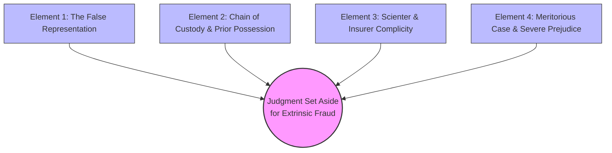
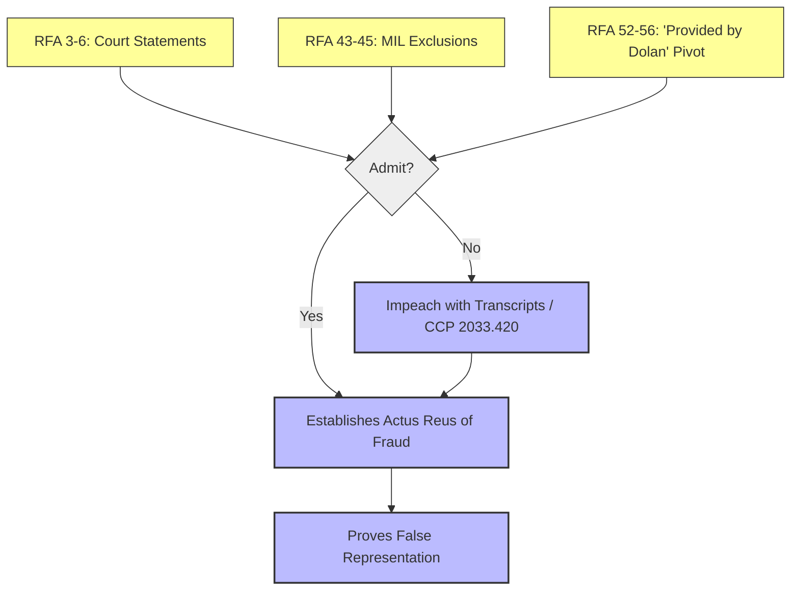
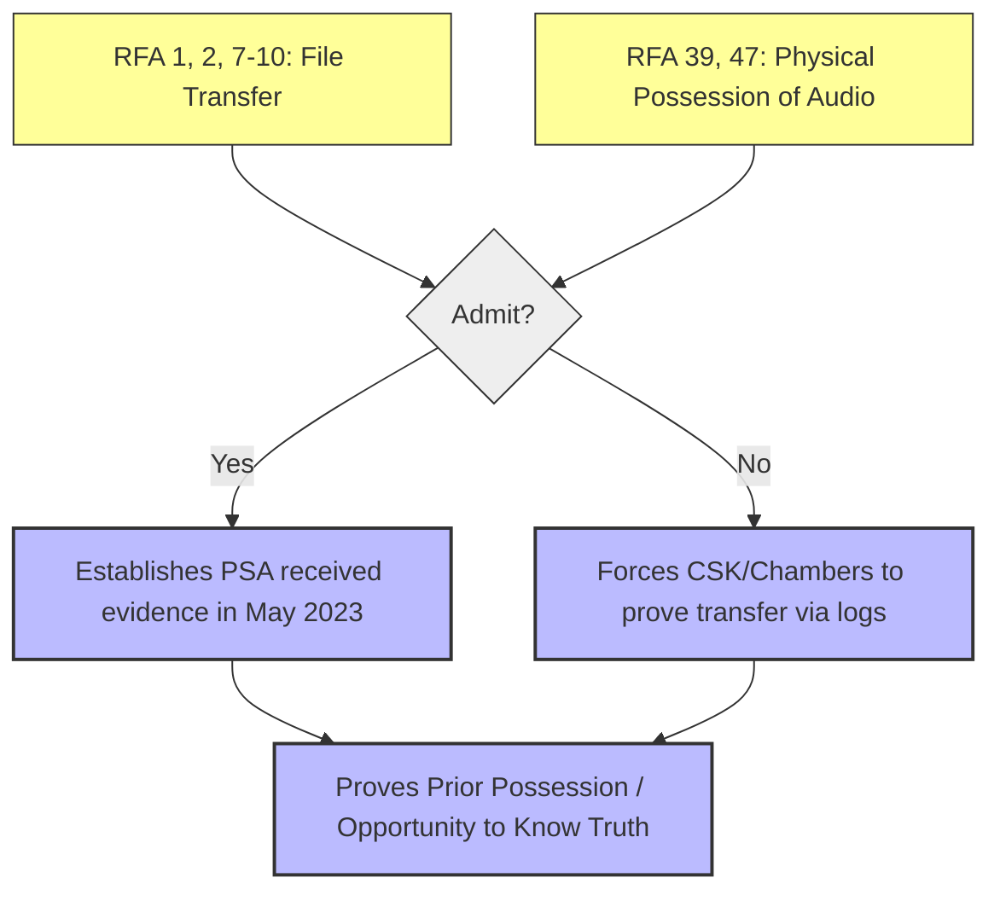
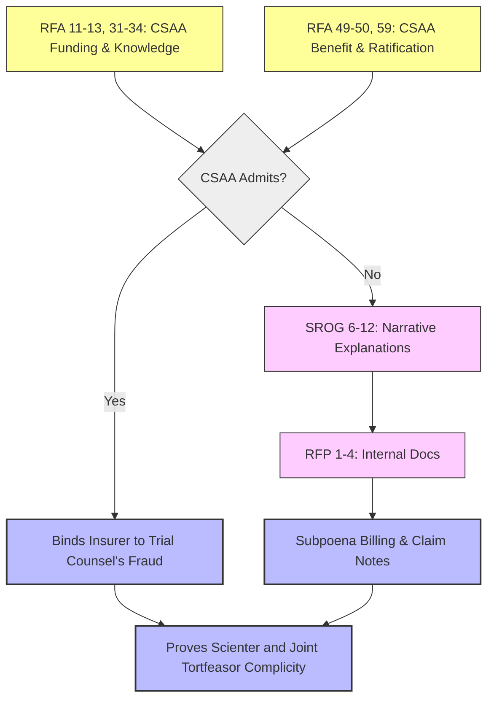
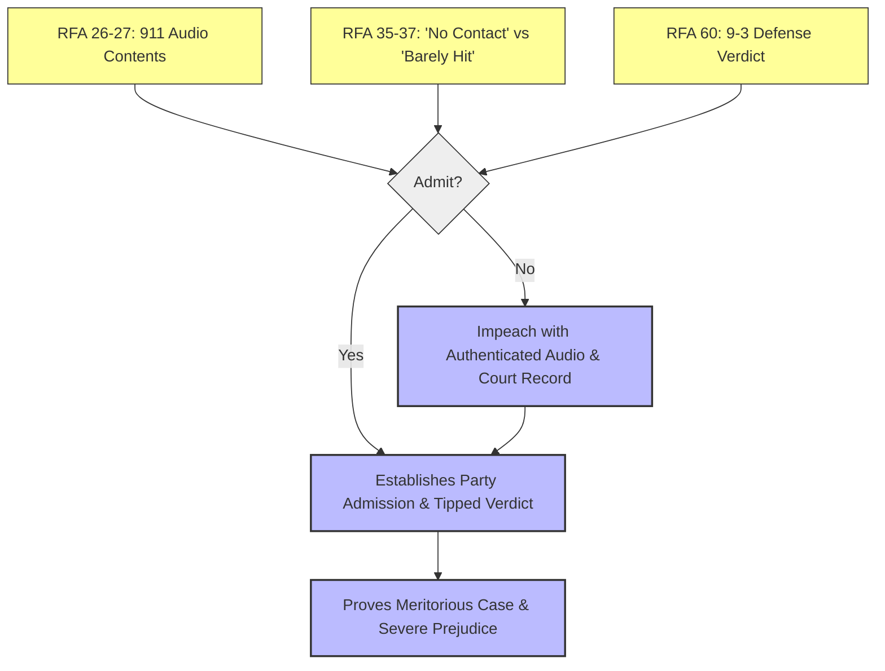

# Logic Diagrams and Conditions: Case No. 631801
## Independent Action in Equity to Set Aside Judgment for Extrinsic Fraud

The following Mermaid diagrams illustrate the logical flow from the discovery requests to the required elements for the cause of action.

### 1. Overall Cause of Action Map

This initial flowchart outlines the macro-level requirements to successfully prosecute the Independent Action in Equity to Set Aside Judgment for Extrinsic Fraud. To achieve the ultimate outcome—setting aside the fraudulently procured judgment—Plaintiff must satisfy four distinct legal elements. Each element functions as an independent logical dependency, and all four must converge to sustain the cause of action. 

**Node E1 (The False Representation):** This node represents the *actus reus* of the fraud. It requires proving that defense counsel made affirmative misrepresentations to the trial court (specifically, claiming the 911 audio and body-worn camera footage were of "unknown provenance" and "not produced in discovery"). The path from this node asserts that the court was actively misled by officers of the court, a core requirement for extrinsic fraud.

**Node E2 (Chain of Custody & Prior Possession):** This node establishes the factual predicate that makes the representation in Node E1 demonstrably false. It requires proving that the defense team (either current or prior counsel) actually possessed the discovery materials long before claiming ignorance of their origin. The path from this node asserts that the defense had the *opportunity to know the truth*, effectively neutralizing any defense of innocent mistake.

**Node E3 (Scienter & Insurer Complicity):** This node elevates the conduct from mere negligence to intentional, actionable fraud. It focuses on the state of mind (scienter) of the defense counsel and the complicity of the insurer (CSAA) funding the defense. The path from this node asserts that the misrepresentations were made knowingly or recklessly, and that the insurer ratified this conduct, thereby expanding liability to joint tortfeasors.

**Node E4 (Meritorious Case & Severe Prejudice):** Equity will only set aside a judgment if the concealed evidence would likely have changed the outcome. This node represents the highly prejudicial nature of the concealed evidence (the insured's admission on the 911 call that he "barely hit" the plaintiff). The path from this node asserts that the fraudulent concealment severely prejudiced the Plaintiff, satisfying the equitable requirement that a meritorious case was thwarted.

**Outcome O1 (Judgment Set Aside):** This is the terminal node representing the successful equitable relief. The diagram illustrates that all four elemental paths (E1 through E4) must successfully connect to this outcome to prevail.

### 2. Element 1: The False Representation & Reversal

This diagram drills down into the specific discovery requests used to prove Element 1: the affirmative misrepresentations made to the court and the subsequent contradictory pivot. The logic is designed as a trap: the defendants are confronted with verbatim quotes from the court record and forced to either admit the statements or deny them in the face of certified transcripts.

**Nodes R3, R43, R52 (The Inputs):** These nodes represent the specific Requests for Admission targeted at the false statements. R3 focuses on the February 18, 2025 hearing where counsel stated the evidence was "news to me." R43 focuses on the January 17, 2025 Motions in Limine asserting the evidence was "not produced." R52 focuses on the April 16, 2025 hearing where counsel abruptly pivoted, admitting the evidence was "provided by Dolan." These RFAs are dependent on the official court reporter's transcripts.

**Node L1 (The Logical Condition - Admit?):** This is the decision point where the defense must respond. Because the RFAs quote the court record, a denial is legally perilous.

**Node C1 (Yes Path -> Establishes Actus Reus):** If the defense admits the RFAs, the logical path proceeds to C1. This outcome immediately establishes the *actus reus* (the guilty act). By admitting they made these statements, and by admitting the contradictory statement ("provided by Dolan"), the defense concedes on the record that they made mutually exclusive representations to the judge. This fulfills the requirement of proving a false representation.

**Node D1 (No Path -> Impeach with Transcripts):** If the defense chooses to deny the RFAs, the logical path proceeds to D1. A denial here asserts that the court reporter's transcripts are incorrect. The implication is immediate impeachment. Plaintiff can use the certified transcripts to file a motion for cost-of-proof sanctions under CCP § 2033.420. Furthermore, a denial under these circumstances demonstrates continuing bad faith and intent to obscure the record, which ultimately loops back (D1 --> C1) to prove the false representation anyway, albeit through a more punitive route.

**Outcome OUT (Proves False Representation):** Regardless of whether the defense admits or denies, the structure of these RFAs ensures that the ultimate path leads to proving the first element of extrinsic fraud. The trap is closed: they either confess to the statements, or they lie about the court record and are impeached.

### 3. Element 2: Chain of Custody & Opportunity to Know

This diagram maps the strategy for proving Element 2: that the defense team had actual physical possession of the concealed evidence for nearly two years prior to claiming it was of "unknown provenance." This element is critical for destroying any defense based on "inadvertence" or "innocent mistake." The logic pits current counsel (PSA) against former counsel (CSK).

**Nodes R1, R39 (The Inputs):** These nodes represent the RFAs directed at the physical transfer of the defense file. R1 asks for an admission that PSA received the file from former counsel Carbone Smith & Koyama on May 4, 2023. R39 pushes further, asking for an admission that the physical file contained the 911 audio. These RFAs depend on the transmittal indices and discovery logs from the 2022 period.

**Node L1 (The Logical Condition - Admit?):** The critical junction where PSA must respond regarding what they received.

**Node C1 (Yes Path -> Establishes Receipt in May 2023):** If PSA admits they received the file containing the audio in May 2023, the logical path flows to C1. This is a fatal admission. It establishes that PSA held the evidence for over 20 months. When combined with Element 1 (the "news to me" statement in February 2025), it proves that the representation to the court was a knowing falsehood, satisfying the "opportunity to know the truth" requirement.

**Node D1 (No Path -> Forces Conflict Between Defense Firms):** If PSA denies receiving the audio in the transfer, the path routes to D1. This creates a highly advantageous strategic conflict. To maintain this denial, PSA is effectively accusing former counsel (CSK) of malpractice or withholding evidence. This forces CSK to defend themselves by producing their internal transfer logs and transmittal letters to prove they *did* send the audio. Plaintiff can sit back while the co-defendants litigate against each other to establish the chain of custody.

**Outcome OUT (Proves Prior Possession):** The logical architecture guarantees that the chain of custody will be established. If PSA admits it, the path is direct. If PSA denies it, the resulting document production from CSK will prove it. Either path successfully asserts that the defense had prior possession of the evidence, paving the way for proving extrinsic fraud.

### 4. Element 3: Scienter & Insurer Complicity

This flowchart outlines the complex process of proving Element 3: the state of mind (scienter) of the actors and the complicity of the insurer, CSAA. This is the most difficult element to prove because it requires piercing the veil of attorney-client privilege and the "independent contractor" shield that insurers typically use to distance themselves from trial counsel's misconduct.

**Nodes R11, R49 (The Inputs - RFAs):** These nodes represent the initial volley against CSAA. R11 focuses on CSAA's funding and control of the defense. R49 focuses on CSAA benefiting from the fraudulent verdict and ratifying the conduct by not intervening. These RFAs assert that CSAA was not a passive observer, but an active participant that benefited from the fraud.

**Node L1 (The Logical Condition - CSAA Admits?):** The decision point for CSAA.

**Node C1 (Yes Path -> Binds Insurer):** If CSAA admits to knowledge, control, or ratification of the false MILs, the path flows to C1. This is a massive victory, as it immediately binds the deep-pocket insurer to the intentional torts of its trial counsel, establishing joint and several liability for the extrinsic fraud.

**Node S1 (No Path -> SROG 6-12 Narrative Explanations):** Because CSAA is highly likely to deny knowledge or control, the "No" path triggers Node S1. The Special Interrogatories force CSAA to provide sworn, narrative explanations detailing *why* they deny knowledge, how they monitored the case, and what their internal reporting policies were.

**Node RFP (RFP 1-4 Internal Docs):** The narrative responses in S1 act as the dependency for the Requests for Production. Once CSAA provides their story, the RFPs demand the internal claim notes, billing records, and status reports to verify that story.

**Node C2 (Subpoena Billing & Claim Notes):** The production of these internal documents is the ultimate objective of this path. By securing the communications between CSAA and PSA, Plaintiff can look for evidence that CSAA was briefed on the 911 audio or the MILs. If CSAA asserts privilege, Plaintiff can use the evidence gathered in Elements 1 and 2 to invoke the crime-fraud exception to pierce the privilege.

**Outcome OUT (Proves Scienter & Complicity):** Whether through direct admission (C1) or the forced extraction of internal documents (C2), the path is designed to uncover the institutional intent behind the concealment, satisfying the scienter requirement for extrinsic fraud.

### 5. Element 4: Meritorious Case & Outcome Prejudice

This final diagram maps the logic for proving Element 4: that the concealed evidence was so critical that its exclusion fundamentally altered the outcome of the trial. Equity requires proof of severe prejudice; a judgment will not be set aside for harmless error. This path focuses on the devastating nature of the 911 audio.

**Nodes R26, R35, R60 (The Inputs):** These nodes represent RFAs targeted at the substance and impact of the evidence. R26 quotes the exact transcript of the 911 audio where Abdelhalim says "I just hit him... barely hitting anything." R35 contrasts this audio with his trial testimony where he claimed "no contact." R60 establishes the razor-thin margin of the defense victory (a 9-3 verdict).

**Node L1 (The Logical Condition - Admit?):** Abdelhalim and the defense team must decide whether to admit these facts.

**Node C1 (Yes Path -> Establishes Admission & Tipped Verdict):** If they admit the RFAs, the path flows to C1. This establishes two critical legal facts. First, it proves the audio contained a "party admission" (an exception to the hearsay rule), making it highly admissible and probative. Second, by admitting the contradiction ("barely hit" vs. "no contact") and the 9-3 verdict, it establishes that the jury was deprived of vital impeachment evidence in a case that was decided by the bare minimum majority. This proves the verdict was tipped by the fraud.

**Node D1 (No Path -> Impeach with Audio & Record):** If they deny the RFAs, they are denying objective reality. The path flows to D1, where Plaintiff simply uses the authenticated 911 audio file and the official court verdict forms to impeach the denials. Because Abdelhalim already authenticated his voice on the recording at trial ("Yes. That is my voice."), a denial here requires him to perjure himself again on the discovery responses.

**Outcome OUT (Proves Meritorious Case & Prejudice):** The logic here is inescapable because it relies on authenticated audio and the official court docket. The path inevitably proves that Plaintiff had a meritorious case (supported by the defendant's own admission) and suffered severe prejudice (a 9-3 loss) due to the fraudulent concealment, thereby satisfying the final element required to set aside the judgment.

