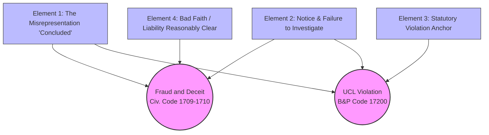
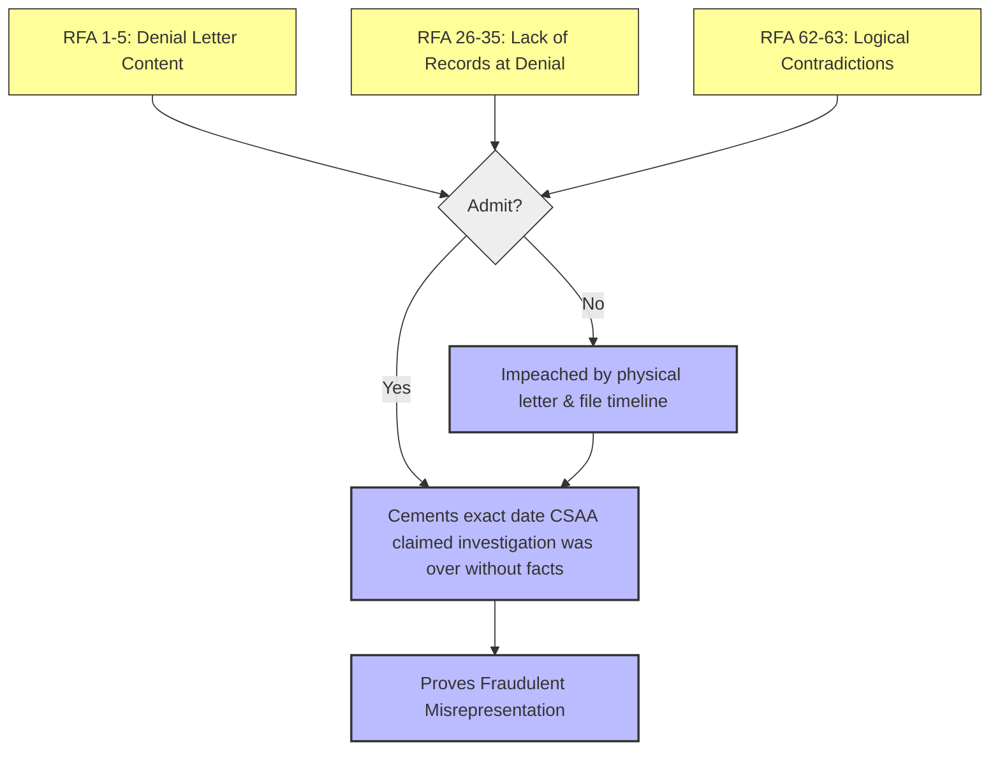
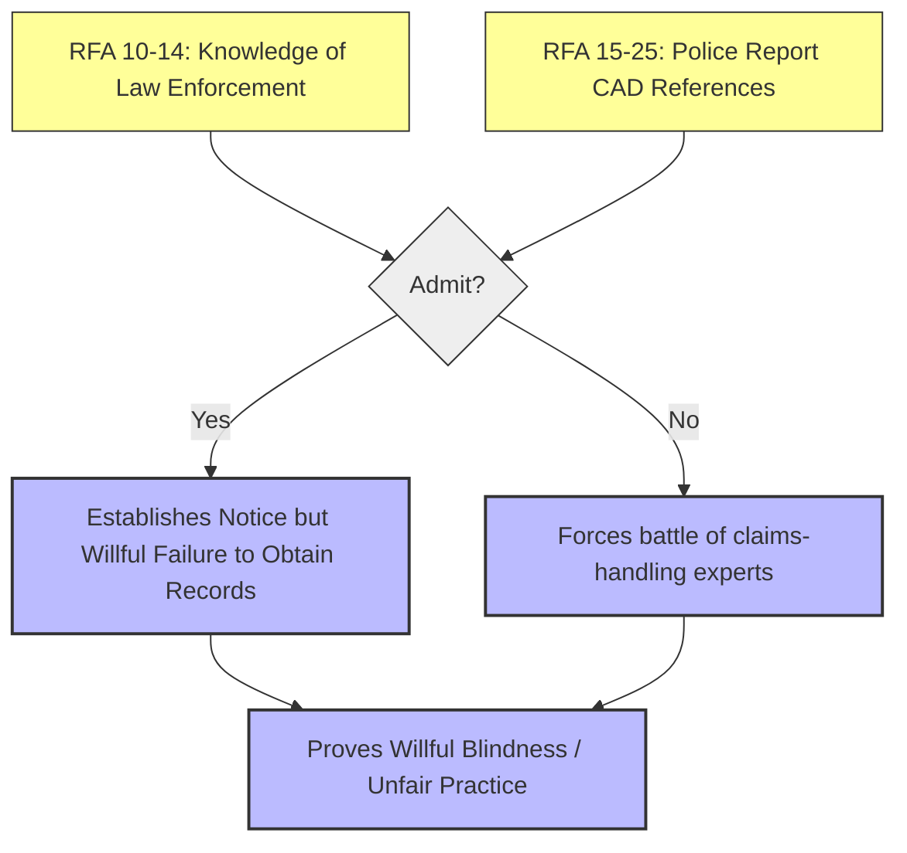
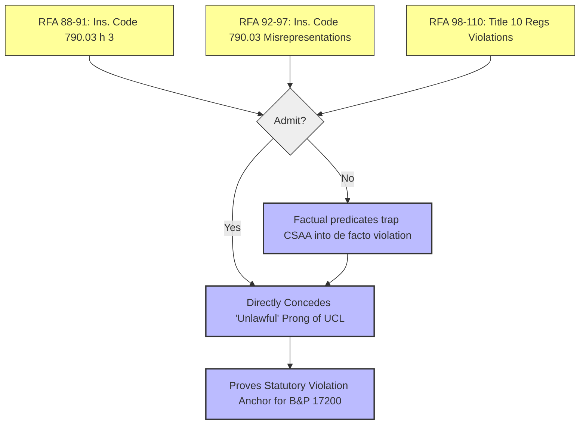
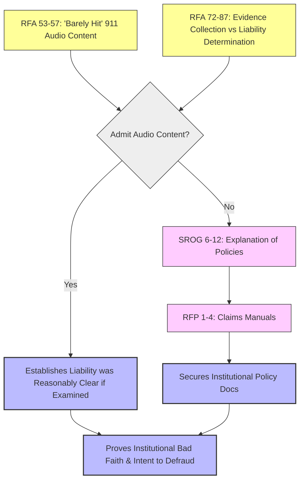

# Logic Diagrams and Conditions: Case No. 631802
## Fraud, Deceit, and Violation of UCL (Bus. & Prof. Code § 17200)

The following Mermaid diagrams illustrate the logical flow from the discovery requests to the required elements for the causes of action against CSAA.

### 1. Overall Cause of Action Map

This initial flowchart outlines the macro-level requirements to successfully prosecute the claims against CSAA for Fraud, Deceit, and Violations of the Unfair Competition Law (UCL). The core theory is that CSAA engaged in institutional bad faith by issuing a premature denial letter in 2021 without conducting a basic, standard-of-care investigation.

**Node E1 (The Misrepresentation 'Concluded'):** This node represents the foundational deceit. It requires proving that CSAA affirmatively represented to the Plaintiff that its investigation was "concluded" and liability was determined, when in fact, critical steps remained undone. This path supports both the Fraud claim (as an intentional misrepresentation) and the UCL claim (as an unfair/deceptive business practice).

**Node E2 (Notice & Failure to Investigate):** This node establishes the factual breach of duty. It requires proving that CSAA had notice that law enforcement was involved (e.g., via the police report) but willfully chose not to obtain the 911 audio or body-worn camera footage. This willful failure to investigate supports both the Fraud claim (proving reckless disregard for the truth) and the UCL claim (an unfair practice).

**Node E3 (Statutory Violation Anchor):** The UCL's "unlawful" prong requires an underlying violation of law. This node focuses on proving that CSAA's failure to investigate violated specific provisions of the California Insurance Code (§ 790.03) and the Fair Claims Settlement Practices Regulations (Title 10). The path from this node serves as the statutory anchor required to sustain the UCL cause of action.

**Node E4 (Bad Faith / Liability Reasonably Clear):** This node focuses on the materiality of the ignored evidence. It requires proving that the unobtained 911 audio contained the insured's admission of fault, meaning liability was actually "reasonably clear." This path supports the Fraud claim by demonstrating that the concealment of this fact caused actual damage and that the denial was issued in bad faith.

**Outcomes O1 & O2:** The diagram illustrates how these four elemental paths converge to support the two distinct causes of action: Fraud/Deceit (O1) and UCL Violation (O2).

### 2. Element 1: The Misrepresentation (Investigation 'Concluded')

This diagram drills down into the discovery requests designed to trap CSAA regarding the specific language used in the February 25, 2021 denial letter. The logic forces CSAA to either stand by the plain meaning of the letter or attempt to redefine common words to escape liability.

**Nodes R1, R26, R62 (The Inputs):** These nodes represent RFAs that establish the timeline. R1 asks for an admission regarding the denial letter's existence and content (specifically the word "concluded"). R26 establishes the negative factual predicate: that on the exact date the letter was issued, CSAA did *not* possess the 911 audio or bodycam footage. R62 highlights the logical contradiction between claiming an investigation is "concluded" while lacking foundational evidence.

**Node L1 (The Logical Condition - Admit?):** The decision point for CSAA regarding the timeline and the letter's contents.

**Node C1 (Yes Path -> Cements Misrepresentation):** If CSAA admits the RFAs, the logical path proceeds to C1. By admitting the letter said "concluded" and simultaneously admitting they lacked the 911 audio, CSAA confesses to issuing a determination without the facts. This establishes the misrepresentation element of the Fraud claim, as asserting an investigation is complete when it is objectively deficient is a deceptive act.

**Node D1 (No Path -> Impeached by Physical Letter):** If CSAA denies the RFAs, they are denying the text of their own letter or the timestamps in their own claims file. The path flows to D1, where Plaintiff can impeach the denial using the physical denial letter and the metadata from the claims file. This forces CSAA into a corner where they must argue that "concluded" meant something other than its plain English definition (e.g., "concluded based on what we felt like looking at").

**Outcome OUT (Proves Fraudulent Misrepresentation):** The structure ensures that whether CSAA admits the timeline or attempts to deny the document, the path successfully asserts that a misrepresentation was made, fulfilling Element 1.

### 3. Element 2: Notice of External Evidence & Failure to Investigate

This flowchart outlines the strategy for proving Element 2: that CSAA was on notice that critical evidence existed but willfully chose to ignore it. This is essential for elevating the claim from mere negligence to an unfair business practice or reckless fraud.

**Nodes R10, R15 (The Inputs):** These RFAs focus on the information CSAA *did* possess. R10 asks CSAA to admit they knew law enforcement responded to the accident. R15 points to the specific police report in CSAA's possession, which explicitly references a CAD (Computer Aided Dispatch) number. These inputs establish that CSAA had the "breadcrumbs" leading to the 911 audio.

**Node L1 (The Logical Condition - Admit?):** CSAA must respond to what they knew based on the police report they possessed.

**Node C1 (Yes Path -> Establishes Willful Failure):** If CSAA admits they knew law enforcement responded and saw the CAD number, the path flows to C1. Because they already admitted (in Element 1) that they didn't pull the records, admitting they *knew* about them establishes a willful failure to obtain records. It proves they closed their eyes to available evidence.

**Node D1 (No Path -> Forces Battle of Experts):** If CSAA denies that the police report put them on notice to pull 911 records, the path flows to D1. This denial asserts that their claims-handling standard does not require pulling 911 tapes unless explicitly instructed to do so. This forces a "battle of the experts," where Plaintiff can introduce claims-handling experts to testify that standard industry practice *always* requires pulling CAD/911 records when a police report references them.

**Outcome OUT (Proves Willful Blindness / Unfair Practice):** The logical path successfully asserts that CSAA's failure to investigate was not an oversight, but a willful choice or a systemic failure of their investigative standards. This fulfills the "unfair" prong of the UCL claim and demonstrates reckless disregard for the truth.

### 4. Element 3: Statutory Violation Anchor (UCL Unlawful Prong)

This diagram maps the highly technical path required to prove the "unlawful" prong of the UCL claim. The UCL borrows violations of other laws and treats them as actionable unfair competition. Here, the strategy maps the factual failures identified in earlier elements directly to the California Insurance Code and administrative regulations.

**Nodes R88, R92, R98 (The Inputs):** These RFAs are structured as legal syllogisms. R88 asks for an admission regarding the duty to promptly investigate under Ins. Code § 790.03(h)(3). R92 targets the prohibition against misrepresenting pertinent facts under (h)(1). R98 focuses on the Title 10 regulations requiring a "thorough, fair and objective investigation." The RFAs then ask CSAA to apply their factual admissions (failing to pull the 911 tape) to these statutes.

**Node L1 (The Logical Condition - Admit?):** CSAA must respond to the application of law to fact.

**Node C1 (Yes Path -> Concedes Unlawful Prong):** If CSAA admits these RFAs, the path flows to C1. This is the equivalent of a legal surrender. By admitting that their factual conduct violated § 790.03 or Title 10, they directly concede the "unlawful" prong of the UCL claim, establishing liability as a matter of law.

**Node D1 (No Path -> Factual Predicates Trap):** It is highly likely CSAA will object to these RFAs as calling for legal conclusions and deny them. The path then flows to D1. However, because CSAA was forced to admit the *factual predicates* (that they didn't pull the tape, that they said the investigation was concluded) in Elements 1 and 2, their denial of the *legal conclusion* is irrelevant. The court can apply the law to the admitted facts to find a de facto violation.

**Outcome OUT (Proves Statutory Violation Anchor):** The logic here ensures that the factual admissions from the earlier diagrams are legally anchored to specific statutory duties. This path asserts that the conduct was unlawful, fulfilling the necessary prerequisite for the Business & Professions Code § 17200 claim.

### 5. Element 4: Bad Faith & Liability Reasonably Clear

This final flowchart maps the strategy for proving Element 4: the materiality of the concealed evidence and the institutional intent behind the bad faith. It demonstrates that if CSAA had simply done its job, liability would have been obvious, and the ensuing years of litigation would have been unnecessary.

**Nodes R53, R72 (The Inputs - RFAs):** R53 focuses on the devastating content of the 911 audio (the insured admitting he "barely hit" the plaintiff). R72 focuses on the conflict between CSAA's duty to collect evidence and its premature liability determination. These RFAs assert that the ignored evidence was highly material.

**Node L1 (The Logical Condition - Admit Audio Content?):** CSAA must address the contents of the audio and its impact on liability.

**Node C1 (Yes Path -> Establishes Liability Reasonably Clear):** If CSAA admits the contents of the audio and admits that such an admission is relevant to liability, the path flows to C1. This establishes that liability was, in fact, "reasonably clear" under Ins. Code § 790.03(h)(5). By failing to effectuate a settlement when liability was clear, CSAA's bad faith is proven.

**Nodes S1, RFP (No Path -> Explanations and Manuals):** If CSAA attempts to minimize the audio or denies that their policies were deficient, the path triggers SROG 6-12 (Node S1). These interrogatories force CSAA to explain their internal policies regarding law enforcement records. This explanation then acts as the dependency for RFP 1-4 (Node RFP), which demands the production of CSAA's internal claims manuals and training materials.

**Node C2 (Secures Institutional Policy Docs):** The production of the claims manuals allows Plaintiff to prove institutional bad faith. By comparing CSAA's written policies against their actual conduct (ignoring the 911 audio), Plaintiff can assert that CSAA operates a system designed to issue rapid, premature denials rather than conducting objective investigations.

**Outcome OUT (Proves Institutional Bad Faith & Intent):** Whether through direct admission of the audio's materiality (C1) or the extraction of internal policy documents showing systemic failures (C2), this path asserts that CSAA's conduct was driven by an institutional intent to defraud or engage in unfair business practices.

