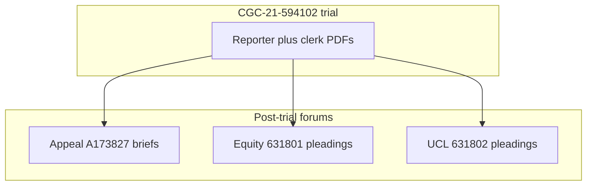
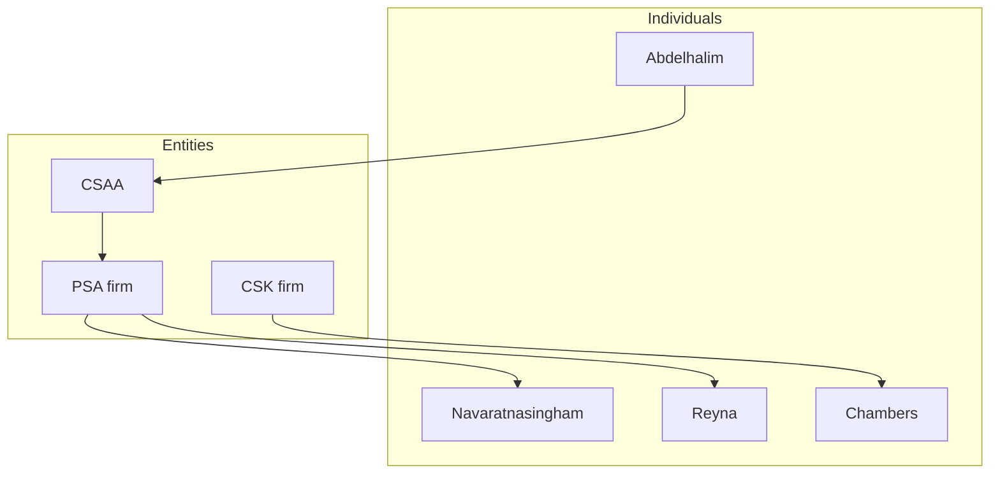

# Rosario v. Abdelhalim — forensic case record (homepage)

**Plaintiff:** Franciscus Dylan Rosario  
**Forums:** San Francisco Superior Court; California Court of Appeal, First District, Division Three  
**Case numbers:** CGC-21-594102 (underlying trial); **A173827** (appeal); **CGC-25-631801** (equity / extrinsic fraud); **CGC-25-631802** (denial-letter / UCL and April 2026 motion practice)  
**Last site refresh:** April 19, 2026 — added narrative spine, defendant pages, timelines, **FINAL-COURT** PDFs under `03-CASE-CGC-25-631802/final-court-apr2026/`, and this homepage.

> *"BOOM! I just hit him. HIT HIM. There was barely anything."* — transcript and audio context: [evidence.md](evidence.md) · [Trial Day 8 reporter PDF](05-TRANSCRIPTS/REPORTER-TRANSCRIPTS/Trial-Day-08-April-17-2025.pdf)

> *"Sure. They were provided by Dolan. He has had them for whatever, sure."* — [Trial Day 7 reporter PDF](05-TRANSCRIPTS/REPORTER-TRANSCRIPTS/Trial-Day-07-April-16-2025.pdf)

This page is a **reading path** through **court PDFs** and **transcripts** stored in this folder. It avoids outcome predictions; it **links** primary sources.

**Legacy navigation hub (tables and quick links):** [README.LEGACY.md](README.LEGACY.md)  
**Logical backbone (≈2,400 words + diagram):** [SPINE.md](SPINE.md)  
**Every Markdown file (book outline):** [BOOK-OUTLINE.md](BOOK-OUTLINE.md)

---

## One-page chronology (links are the footnotes)

On **February 4, 2021**, a pedestrian–vehicle incident occurred at **Tehama and 5th Street**, San Francisco. Audio and transcript excerpts are on [evidence.md](evidence.md). Depositions followed through **2024** ([deposition PDFs](05-TRANSCRIPTS/DEPOSITIONS/)). A **February 18, 2025** hearing register is in [All-Hearing-Transcripts-Rosario-AAA.pdf](05-TRANSCRIPTS/HEARINGS/All-Hearing-Transcripts-Rosario-AAA.pdf).

Trial proceeded in **April 2025**. **Day 7** and **Day 8** reporter PDFs are [April 16](05-TRANSCRIPTS/REPORTER-TRANSCRIPTS/Trial-Day-07-April-16-2025.pdf) and [April 17](05-TRANSCRIPTS/REPORTER-TRANSCRIPTS/Trial-Day-08-April-17-2025.pdf). **Day 11** is [April 23](05-TRANSCRIPTS/REPORTER-TRANSCRIPTS/Trial-Day-11-April-23-2025.pdf). The clerk’s register for underlying motions and orders is [Clerk’s transcript PDF](05-TRANSCRIPTS/CLERKS-TRANSCRIPT/CGC-21-594102-A173827-Clerks-Transcript-Full.pdf).

Post-trial, plaintiff filed **631801** (equity) and **631802** (UCL). Indexes: [631801](02-CASE-CGC-25-631801/INDEX.md) · [631802](03-CASE-CGC-25-631802/INDEX.md). The **appeal** brief set is [A173827 index](01-APPEAL/INDEX.md).

**April 2026 (631802):** defense **demurrer** and **Anti-SLAPP** PDFs; plaintiff **801** consolidated opposition; **FINAL-COURT** exhibit-integrated packets — [final-court-apr2026](03-CASE-CGC-25-631802/final-court-apr2026/README.md). Hearing date **May 13, 2026** (per 631802 index) and **631801 CMC May 27, 2026** — verify on the court portal.

---

## Four proceedings — vertical map (≤4 nodes wide)

| Proceeding | Index | Narrative | Timeline |
|--------------|-------|-----------|----------|
| Trial | [05-TRANSCRIPTS/INDEX.md](05-TRANSCRIPTS/INDEX.md) | [narrative/01-UNDERLYING-CGC-21-594102.md](narrative/01-UNDERLYING-CGC-21-594102.md) | [timelines/trial-CGC-21-594102.md](timelines/trial-CGC-21-594102.md) |
| Appeal | [01-APPEAL/INDEX.md](01-APPEAL/INDEX.md) | [narrative/02-APPEAL-A173827.md](narrative/02-APPEAL-A173827.md) | [timelines/appeal-A173827.md](timelines/appeal-A173827.md) |
| Equity | [02-CASE-CGC-25-631801/INDEX.md](02-CASE-CGC-25-631801/INDEX.md) | [narrative/03-EQUITY-CGC-25-631801.md](narrative/03-EQUITY-CGC-25-631801.md) | [timelines/equity-CGC-25-631801.md](timelines/equity-CGC-25-631801.md) |
| UCL | [03-CASE-CGC-25-631802/INDEX.md](03-CASE-CGC-25-631802/INDEX.md) | [narrative/04-UCL-CGC-25-631802.md](narrative/04-UCL-CGC-25-631802.md) | [timelines/ucl-CGC-25-631802.md](timelines/ucl-CGC-25-631802.md) |

---

## Defendants — one paragraph each (allegations = pleadings; speech = transcripts)

| Who | Summary | Detail page |
|-----|---------|-------------|
| **Subhi Abdelhalim** | Driver; trial and deposition registers contain his statements. Equity SAC names him as a defendant. | [defendants/Subhi-Abdelhalim.md](defendants/Subhi-Abdelhalim.md) |
| **CSAA Insurance Exchange** | Insurer; FAC and denial-letter memorandum in **631802**; equity SAC in **631801**; investigation exhibit PDF. | [defendants/CSAA-Insurance-Exchange.md](defendants/CSAA-Insurance-Exchange.md) |
| **Carbone, Smith & Koyama** | Original defense firm; succession allegations in equity papers; bar complaint PDF in repo. | [defendants/Carbone-Smith-Koyama.md](defendants/Carbone-Smith-Koyama.md) |
| **Michael R. Chambers** | Original counsel named in equity caption; bar complaint PDF in repo. | [defendants/Michael-R-Chambers.md](defendants/Michael-R-Chambers.md) |
| **Phillips, Spallas & Angstadt LLP** | Successor firm; equity defendant; firm bar complaint PDF in repo. | [defendants/Phillips-Spallas-Angstadt.md](defendants/Phillips-Spallas-Angstadt.md) |
| **Priya D. Navaratnasingham** | Trial counsel; Day 7 transcript; focused equity memorandum; bar complaint PDF. | [defendants/Priya-Navaratnasingham.md](defendants/Priya-Navaratnasingham.md) |
| **Alberto Reyna** | Trial counsel; Day 7 transcript; equity papers; bar complaint PDF. | [defendants/Alberto-Reyna.md](defendants/Alberto-Reyna.md) |

### Vertical diagram — defendants to forums (≤4 wide)

---

## Causes of action → first PDF (not legal conclusions)

| Claim family (short label) | Forum | Operative entry PDF |
|----------------------------|-------|----------------------|
| Negligence / liability / damages | CGC-21-594102 | Clerk’s + reporter PDFs ([transcripts hub](05-TRANSCRIPTS/INDEX.md)) |
| Appellate error catalog | A173827 | [Opening brief PDF](01-APPEAL/01-Appellants-Opening-Brief.pdf) |
| Extrinsic fraud / fraud on court (as pled) | CGC-25-631801 | [SAC PDF](02-CASE-CGC-25-631801/01-Second-Amended-Complaint.pdf) |
| Denial-letter / UCL (as pled) | CGC-25-631802 | [FAC PDF](03-CASE-CGC-25-631802/01-First-Amended-Complaint.pdf) |

**Element → evidence tree:** [evidence-tree/INDEX.md](evidence-tree/INDEX.md)

---

## Evidence and media (audio / video / images)

| Need | Link |
|------|------|
| Markdown evidence page | [evidence.md](evidence.md) |
| Embedded players | [evidence.html](evidence.html) |
| Trial exhibits | [04-EXHIBITS/INDEX.md](04-EXHIBITS/INDEX.md) |

---

## April 2026 631802 motion practice (quick ingress)

| Bucket | Where |
|--------|--------|
| Defense Anti-SLAPP | [defense-anti-slapp-clerk](03-CASE-CGC-25-631802/defense-anti-slapp-clerk/README.md) |
| Demurrer volley | [demurrer-volley-apr2026](03-CASE-CGC-25-631802/demurrer-volley-apr2026/README.md) |
| Plaintiff 801 consolidated opposition | [plaintiff-opposition-consolidated-apr2026](03-CASE-CGC-25-631802/plaintiff-opposition-consolidated-apr2026/README.md) |
| FINAL-COURT packets with exhibits | [final-court-apr2026](03-CASE-CGC-25-631802/final-court-apr2026/README.md) |
| Anti-SLAPP analysis annex | [08-LEGAL-ANALYSIS/anti-slapp-rebuttal/INDEX.md](08-LEGAL-ANALYSIS/anti-slapp-rebuttal/INDEX.md) |
| Demurrer analysis annex | [08-LEGAL-ANALYSIS/demurrer-rebuttal/INDEX.md](08-LEGAL-ANALYSIS/demurrer-rebuttal/INDEX.md) |

---

## Plaintiff’s filed arguments (“why we think we should prevail”)

These arguments live **inside plaintiff PDFs**, not in this sentence. Entry points:

- **Appeal:** [01-Appellants-Opening-Brief.pdf](01-APPEAL/01-Appellants-Opening-Brief.pdf)
- **Equity:** [03-Memorandum-Fraud-on-Court.pdf](02-CASE-CGC-25-631801/03-Memorandum-Fraud-on-Court.pdf), [11-Motion-Extrinsic-Fraud-Navaratnasingham-Admission.pdf](02-CASE-CGC-25-631801/11-Motion-Extrinsic-Fraud-Navaratnasingham-Admission.pdf)
- **631802:** [03-Memorandum-Denial-Letter-Fraud.pdf](03-CASE-CGC-25-631802/03-Memorandum-Denial-Letter-Fraud.pdf), [D801-01-OPPOSITION-TO-DEMURRER-MPA.pdf](03-CASE-CGC-25-631802/plaintiff-opposition-consolidated-apr2026/D801-01-OPPOSITION-TO-DEMURRER-MPA.pdf), [D801-02-OPPOSITION-TO-ANTI-SLAPP-MPA.pdf](03-CASE-CGC-25-631802/plaintiff-opposition-consolidated-apr2026/D801-02-OPPOSITION-TO-ANTI-SLAPP-MPA.pdf)

---

## Complaints and accountability PDFs

[06-EVIDENCE/INDEX.md](06-EVIDENCE/INDEX.md) — bar complaints, judicial complaint, investigation exhibit duplicate.

---

## Novel (literary) track — not a filing

[NOVEL/README.md](NOVEL/README.md) · [reader.html](NOVEL/reader.html)

---

## Court lookup (external)

- San Francisco Superior Court [Case Information](https://sf.courts.ca.gov/online-services/case-information)  
- Court of Appeal [case search](https://appellatecases.courtinfo.ca.gov/search.cfm?dist=3)

---

## Book outline — read every Markdown page here

**[BOOK-OUTLINE.md](BOOK-OUTLINE.md)** — grouped list of all `.md` files under `GITHUB-PAGE/`.

---

## GitHub Pages note

Static Markdown + PDF. Typical Pages setting: deploy **`main`** from **root** (or move site to `docs/` if you reconfigure).

---

## Disclaimer

This repository publishes **public** PDFs for transparency. It is **not** legal advice. Allegations in complaints are unproven until adjudicated.

---

## Reference

- [ROSARIO.md](ROSARIO.md) — long-form case index  
- [Support the legal fund (SpotFund)](https://www.spotfund.com/story/88e93d31-3915-409e-b4ac-e29a5d1fd6d6)

---

*(c) 2025–2026 Franciscus Dylan Rosario. All rights reserved.*
