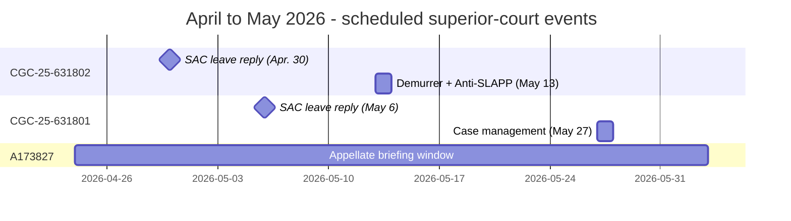
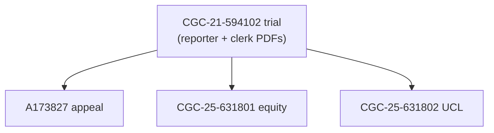
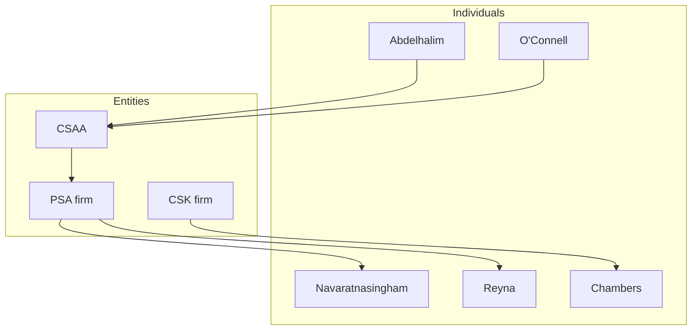

# Rosario v. Abdelhalim et al.: forensic case record

> Open public record. All documents are California court filings. Nothing here is legal advice; allegations in complaints are unproven until adjudicated.

**Plaintiff:** Franciscus Dylan Rosario (in pro per)
**Forums:** San Francisco Superior Court · California Court of Appeal, First Appellate District, Division Three
**Cases:** CGC-21-594102 (underlying trial) · A173827 (appeal) · CGC-25-631801 (equity / extrinsic fraud) · CGC-25-631802 (UCL / denial-letter fraud)
**Verdict:** 9 to 3 defense, April 23, 2025 (the bare minimum civil majority).
**Last refresh:** April 24, 2026 (see [What's new](#whats-new)).

> *"BOOM! I just hit him. HIT HIM. There was barely anything."*
> Defendant Subhi Abdelhalim, 911 call, February 4, 2021. Authenticated under oath at trial: *"Yes. That is my voice."* See [Trial Day 8 reporter PDF](05-TRANSCRIPTS/REPORTER-TRANSCRIPTS/Trial-Day-08-April-17-2025.pdf) and [evidence.md](evidence.md).

> *"Sure. They were provided by Dolan. He has had them for whatever, sure."*
> Defense counsel Priya D. Navaratnasingham, [Trial Day 7, April 16, 2025](05-TRANSCRIPTS/REPORTER-TRANSCRIPTS/Trial-Day-07-April-16-2025.pdf). This sentence is irreconcilable with prior sworn statements that the same materials were "not produced during discovery" and of "unknown provenance."

---

## Start here

Pick the entry that matches why you opened this site.

| Audience | Entry page | Best for |
|----------|------------|----------|
| **California attorneys** | **[FOR-ATTORNEYS.md](FOR-ATTORNEYS.md)** | Intake brief, damages map, calendar, contact information |
| **Journalists / writers** | **[JOURNALIST-NARRATIVE-THREE-CASES.md](JOURNALIST-NARRATIVE-THREE-CASES.md)** | Plain-English newsroom narrative across all three post-trial cases |
| **Researchers / public** | This page (continue reading) | Neutral map of every primary PDF, with no outcome predictions |

**Deeper attorney reading:** [CASE-DOSSIER.md](CASE-DOSSIER.md) (30-minute deep read) · [HEARINGS-CALENDAR.md](HEARINGS-CALENDAR.md) · [RISK-AND-ECONOMICS.md](RISK-AND-ECONOMICS.md).

**Big-picture analytical writing already on this site:** [CROSS-CASE-NARRATIVE-LEGAL-THEORY-AND-LEVERAGE.md](CROSS-CASE-NARRATIVE-LEGAL-THEORY-AND-LEVERAGE.md) · [CROSS-CASE-LOGIC-TREE-AND-CSAA-WORST-CASE.md](CROSS-CASE-LOGIC-TREE-AND-CSAA-WORST-CASE.md) · [CONTRADICTION-LETTER.md](CONTRADICTION-LETTER.md) · [SPINE.md](SPINE.md) · [BOOK-OUTLINE.md](BOOK-OUTLINE.md) (every Markdown file on the site).

---

## What's new

**April 24, 2026 refresh.**

- New attorney-facing entry layer at the top: [FOR-ATTORNEYS.md](FOR-ATTORNEYS.md), [CASE-DOSSIER.md](CASE-DOSSIER.md), [HEARINGS-CALENDAR.md](HEARINGS-CALENDAR.md), [RISK-AND-ECONOMICS.md](RISK-AND-ECONOMICS.md), [JOURNALIST-NARRATIVE-THREE-CASES.md](JOURNALIST-NARRATIVE-THREE-CASES.md).
- Full `risk-surface/` mirror with per-case and per-party dollar tables; canonical narrative at [RISK.SURFACE.md](RISK.SURFACE.md).
- April 22 to 24, 2026 motion-practice PDFs mirrored: SAC-leave defense oppositions, plaintiff replies, Anti-SLAPP / OST supplement, bench cards, lodgment, clerk packets, citation-validation memos.
- Index updates: [01-APPEAL/INDEX.md](01-APPEAL/INDEX.md) (remand and post-vacatur materials) and [08-LEGAL-ANALYSIS/INDEX.md](08-LEGAL-ANALYSIS/INDEX.md) (risk surface, discrepancy, April 2026 practice mirrors).

**April 19, 2026 refresh.** Added [SPINE.md](SPINE.md), [defendants/INDEX.md](defendants/INDEX.md), per-forum [narrative/](narrative/) and [timelines/](timelines/), and the **FINAL-COURT** exhibit-integrated bundles under [03-CASE-CGC-25-631802/final-court-apr2026/](03-CASE-CGC-25-631802/final-court-apr2026/README.md).

**Earlier (March / early April 2026).** CSAA Anti-SLAPP clerk PDFs; the April 2026 demurrer volley (defense and plaintiff sides); the consolidated 801-draft opposition build under [03-CASE-CGC-25-631802/plaintiff-opposition-consolidated-apr2026/](03-CASE-CGC-25-631802/plaintiff-opposition-consolidated-apr2026/README.md); appellate PDF refreshes.

---

## Hearings on calendar



| Date | Case | Event | Department |
|------|------|--------|------------|
| Apr. 30, 2026 | CGC-25-631802 | SAC leave reply hearing | (verify on portal) |
| May 6, 2026 | CGC-25-631801 | SAC leave reply hearing | Dept. 301 |
| May 13, 2026, 9:00 a.m. | CGC-25-631802 | Demurrer + Special Motion to Strike | Dept. 302 |
| May 27, 2026, 10:30 a.m. | CGC-25-631801 | Case management conference | Dept. 610 |
| Ongoing | A173827 | Appellate briefing | First Appellate District |

Confirm dates and departments on the court portal. Full table with PDF links: [HEARINGS-CALENDAR.md](HEARINGS-CALENDAR.md).

---

## Recent filings (last 14 days, mirrored here)

| Filing | 631801 (equity) | 631802 (UCL) |
|--------|-----------------|--------------|
| Defense opposition to SAC leave (Apr. 23) | [PDFs + TOC](02-CASE-CGC-25-631801/apr-2026-sac-leave/defense-opposition-apr23/README.md) | [PDFs + TOC](03-CASE-CGC-25-631802/apr-2026-sac-leave/defense-opposition-apr23/README.md) |
| Plaintiff reply (Apr. 24, court-ready) | [Reply for May 6 setting](02-CASE-CGC-25-631801/apr-2026-sac-leave/plaintiff-reply-apr24/README.md) | [Reply for Apr. 30 setting](03-CASE-CGC-25-631802/apr-2026-sac-leave/plaintiff-reply-apr24/README.md) |
| Anti-SLAPP / OST supplement (Apr. 24) | [801 court PDFs + Flatley check](02-CASE-CGC-25-631801/anti-slapp-supplemental-apr24/README.md) | [802 court PDFs + Flatley check](03-CASE-CGC-25-631802/anti-slapp-supplemental-apr24/README.md) |
| Bench cards (Apr. 24) | [May 6 card](08-LEGAL-ANALYSIS/bench-cards/BENCH-CARD-MAY06-801-THREE-AUTHORITIES.pdf) | [Apr. 30 card](08-LEGAL-ANALYSIS/bench-cards/BENCH-CARD-APR30-802-THREE-AUTHORITIES.pdf) |
| Motion to strike (Apr. 22 source mirror) | [801 folder](02-CASE-CGC-25-631801/motion-strike-apr2026/README.md) | [802 folder](03-CASE-CGC-25-631802/motion-strike-apr2026/README.md) |
| Clerk packets (Apr. 24) | [README + PDF](02-CASE-CGC-25-631801/clerk-packets-apr24/README.md) | [README + PDF](03-CASE-CGC-25-631802/clerk-packets-apr24/README.md) |
| Citation validation memos | [Apr. 23 to 24 hub](08-LEGAL-ANALYSIS/citation-validation/README.md) | (same hub) |

---

## The four proceedings, at a glance



| # | Proceeding | Case no. | Forum | Theory in one line |
|---|------------|----------|-------|--------------------|
| 1 | Underlying trial | CGC-21-594102 | SF Superior, Dept. 504 (Hon. Garrett L. Wong) | Pedestrian-vehicle negligence; 9 to 3 defense verdict |
| 2 | Appeal | A173827 | First Appellate District, Div. 3 | Instructional error, evidentiary error, juror misconduct, structural / cumulative error |
| 3 | Equity action | CGC-25-631801 | SF Superior | Independent action in equity to vacate judgment for extrinsic fraud, attorney deceit (B&P 6128(a)), conspiracy, ratification |
| 4 | UCL / fraud | CGC-25-631802 | SF Superior | Pre-litigation false denial letter; B&P 17200; bad faith; *Prentice* fee shift |

| Proceeding | Case index | Narrative | Timeline |
|------------|------------|-----------|----------|
| Trial | [05-TRANSCRIPTS/INDEX.md](05-TRANSCRIPTS/INDEX.md) | [narrative/01](narrative/01-UNDERLYING-CGC-21-594102.md) | [timelines/trial](timelines/trial-CGC-21-594102.md) |
| Appeal | [01-APPEAL/INDEX.md](01-APPEAL/INDEX.md) | [narrative/02](narrative/02-APPEAL-A173827.md) | [timelines/appeal](timelines/appeal-A173827.md) |
| Equity | [02-CASE-CGC-25-631801/INDEX.md](02-CASE-CGC-25-631801/INDEX.md) | [narrative/03](narrative/03-EQUITY-CGC-25-631801.md) | [timelines/equity](timelines/equity-CGC-25-631801.md) |
| UCL | [03-CASE-CGC-25-631802/INDEX.md](03-CASE-CGC-25-631802/INDEX.md) | [narrative/04](narrative/04-UCL-CGC-25-631802.md) | [timelines/ucl](timelines/ucl-CGC-25-631802.md) |

---

## The case in plain English

On **February 4, 2021**, plaintiff was struck by a turning vehicle in a San Francisco crosswalk at **Tehama and Fifth Streets** and admitted to the intensive care unit at San Francisco General. Three weeks later, the driver's insurer (CSAA) issued a **denial letter** declaring its investigation "concluded" after "careful review," before the carrier had pulled the **911 audio**, **body-worn camera footage**, or **CAD record** referenced on the police report it already held. The 21-day denial is the documentary anchor of [CGC-25-631802](03-CASE-CGC-25-631802/INDEX.md). See [evidence.md](evidence.md) for the audio and CAD mirrors and [04-EXHIBITS/EXHIBIT-001-CSAA-Investigation-Report.pdf](04-EXHIBITS/EXHIBIT-001-CSAA-Investigation-Report.pdf) for the carrier's own report.

Four years later, in the trial of *Rosario v. Abdelhalim* (CGC-21-594102), the same 911 call surfaced. The driver authenticated his own voice on the recording: *"Yes. That is my voice."* ([Trial Day 8](05-TRANSCRIPTS/REPORTER-TRANSCRIPTS/Trial-Day-08-April-17-2025.pdf)). On **April 16, 2025** (Trial Day 7), defense counsel said on the record: *"Sure. They were provided by Dolan. He has had them for whatever, sure."* That sentence is irreconcilable with the defense's earlier representations to the trial court, on which the court relied to deny continuances and exclude or defer evidence, that the same materials were "not produced" and of "unknown provenance." On **April 23, 2025** the jury returned a 9 to 3 defense verdict, the bare minimum civil majority.

Out of that record, plaintiff filed three independent post-trial proceedings on a shared factual spine: an **appeal** of the trial court's instructional and evidentiary handling ([A173827](01-APPEAL/INDEX.md)), an **equity action** to vacate the judgment for extrinsic fraud ([CGC-25-631801](02-CASE-CGC-25-631801/INDEX.md)), and a **fraud / UCL action** against CSAA on the denial-letter timing and the broader deny-delay-defend pattern ([CGC-25-631802](03-CASE-CGC-25-631802/INDEX.md)). Each proceeding has its own decision-maker, standard of review, and remedy lane. Long-form treatments: [CROSS-CASE-NARRATIVE-LEGAL-THEORY-AND-LEVERAGE.md](CROSS-CASE-NARRATIVE-LEGAL-THEORY-AND-LEVERAGE.md) and [CROSS-CASE-LOGIC-TREE-AND-CSAA-WORST-CASE.md](CROSS-CASE-LOGIC-TREE-AND-CSAA-WORST-CASE.md).

> **Reading method.** Keep the forums separate. Use **631802** PDFs for insurer-facing theories, **631801** PDFs for fraud-on-the-court theories, **A173827** PDFs for instructional and evidentiary error catalogues, and **594102** reporter transcripts for sworn speech and clerk's orders. When April 2026 consolidated opposition PDFs cite trial pages, treat the **reporter PDF** as the authority for quoted lines.

---

## Academic legal analysis (per-forum orientation)

This section orients a reader who wants a **neutral map** from incident through four forums. It tracks **primary PDFs and transcripts** in this repository. It does not forecast outcomes; it states where **pleadings allege** facts and where **trial and agency records** supply contemporaneous material. Where this page summarizes doctrine, treat the summary as **orientation only** and verify holdings in the linked briefs and reporters.

**Incident and record foundation.** On February 4, 2021, a pedestrian-vehicle encounter at Tehama and Fifth in San Francisco anchors the later civil dockets. For 911 audio, CAD, and body-worn camera mirrors, start at [evidence.md](evidence.md). For the driver's trial-day authentication of a recording excerpt, compare the same evidence page with the [Day 8 reporter volume](05-TRANSCRIPTS/REPORTER-TRANSCRIPTS/Trial-Day-08-April-17-2025.pdf) for April 17, 2025. Read together, those sources support a disciplined question: what did emergency and field channels capture near the time of impact, and how did trial testimony treat those items.

**Underlying trial (CGC-21-594102).** The superior-court file presents negligence, liability, and damages themes as conventional personal-injury issues. The [clerk's transcript](05-TRANSCRIPTS/CLERKS-TRANSCRIPT/CGC-21-594102-A173827-Clerks-Transcript-Full.pdf) compiles orders, motion rulings, and instruction-related materials that later briefs cite as procedural history. Reporter volumes for mid-trial days include [Day 7 (Apr. 16)](05-TRANSCRIPTS/REPORTER-TRANSCRIPTS/Trial-Day-07-April-16-2025.pdf), [Day 8 (Apr. 17)](05-TRANSCRIPTS/REPORTER-TRANSCRIPTS/Trial-Day-08-April-17-2025.pdf), and [Day 11 (Apr. 23)](05-TRANSCRIPTS/REPORTER-TRANSCRIPTS/Trial-Day-11-April-23-2025.pdf). Deposition PDFs and indices are at [05-TRANSCRIPTS/INDEX.md](05-TRANSCRIPTS/INDEX.md). The trial layer remains the factual substrate for both direct review and collateral papers filed after judgment.

**Appeal (A173827).** The [appellant's opening brief](01-APPEAL/01-Appellants-Opening-Brief.pdf) catalogs issues that fall into familiar California buckets: instructional questions (often reviewed de novo), evidentiary rulings (typically reviewed for abuse of discretion), juror misconduct and Evidence Code section 1150 process, and structural or cumulative error arguments that depend on interlocking rulings. The appeal index groups briefs and exhibits at [01-APPEAL/INDEX.md](01-APPEAL/INDEX.md). Treat each heading in the brief as a hypothesis about reversible error, then walk the cited pages in the reporter PDFs and clerk's transcript rather than inferring facts from this homepage alone.

**Equity and extrinsic fraud (CGC-25-631801).** Plaintiff's [Second Amended Complaint](02-CASE-CGC-25-631801/01-Second-Amended-Complaint.pdf) and related memoranda articulate fraud on the court, extrinsic fraud, civil conspiracy, aiding and abetting, and professional-conduct strands tied to California's Rules of Professional Conduct and Business and Professions Code frameworks, always as **claims in a pleading** rather than as adjudicated facts. See also [03-Memorandum-Fraud-on-Court.pdf](02-CASE-CGC-25-631801/03-Memorandum-Fraud-on-Court.pdf) and the [Navaratnasingham admission motion](02-CASE-CGC-25-631801/11-Motion-Extrinsic-Fraud-Navaratnasingham-Admission.pdf). Plaintiff-authored analytical annex (non-filing commentary): [FATAL-PROOF-NAVARATNASINGHAM-DOLAN-ADMISSION-EXTRINSIC-FRAUD.md](08-LEGAL-ANALYSIS/FATAL-PROOF-NAVARATNASINGHAM-DOLAN-ADMISSION-EXTRINSIC-FRAUD.md). Defendant-by-defendant pages: [defendants/INDEX.md](defendants/INDEX.md).

**UCL and denial-letter work (CGC-25-631802).** The Unfair Competition Law (Business and Professions Code section 17200) appears in the FAC and supporting memoranda through unfair, unlawful, and fraudulent prongs, including theories about fraudulent omission tied to insurer communications. The [CSAA Investigation Report exhibit](04-EXHIBITS/EXHIBIT-001-CSAA-Investigation-Report.pdf) is a fixed anchor for what the file claims about file completeness; the [denial-letter memorandum](03-CASE-CGC-25-631802/03-Memorandum-Denial-Letter-Fraud.pdf) states the document-based theory. April 2026 motion practice for demurrer and Anti-SLAPP is organized in hubs: [demurrer-volley-apr2026](03-CASE-CGC-25-631802/demurrer-volley-apr2026/README.md) · [defense-anti-slapp-clerk](03-CASE-CGC-25-631802/defense-anti-slapp-clerk/README.md) · [plaintiff-opposition-consolidated-apr2026](03-CASE-CGC-25-631802/plaintiff-opposition-consolidated-apr2026/README.md) · [final-court-apr2026](03-CASE-CGC-25-631802/final-court-apr2026/README.md). Declaration-level rebuttal track on Tyler J. O'Connell: [tyler-oconnell-declaration-rebuttal.md](08-LEGAL-ANALYSIS/anti-slapp-rebuttal/tyler-oconnell-declaration-rebuttal.md).

---

## Causes of action: entry PDF for each claim family

| Claim family | Forum | Operative entry PDF |
|--------------|-------|---------------------|
| Negligence, liability, damages | CGC-21-594102 | Clerk's and reporter PDFs ([transcripts hub](05-TRANSCRIPTS/INDEX.md)) |
| Appellate error catalog (instructional, evidentiary, structural) | A173827 | [Opening brief PDF](01-APPEAL/01-Appellants-Opening-Brief.pdf) |
| Extrinsic fraud / fraud on the court (as pled) | CGC-25-631801 | [SAC PDF](02-CASE-CGC-25-631801/01-Second-Amended-Complaint.pdf) · [Fraud-on-court memo](02-CASE-CGC-25-631801/03-Memorandum-Fraud-on-Court.pdf) |
| Attorney deceit (B&P 6128(a)) (as pled) | CGC-25-631801 | [SAC PDF](02-CASE-CGC-25-631801/01-Second-Amended-Complaint.pdf) (Count 6) |
| Denial-letter fraud, UCL (B&P 17200), bad faith (as pled) | CGC-25-631802 | [FAC PDF](03-CASE-CGC-25-631802/01-First-Amended-Complaint.pdf) · [Denial-letter memo](03-CASE-CGC-25-631802/03-Memorandum-Denial-Letter-Fraud.pdf) |

**Element to evidence tree:** [evidence-tree/INDEX.md](evidence-tree/INDEX.md).

---

## Defendants

Allegations live in the pleadings; speech lives in the transcripts. The pages below cross-link to both.

| # | Defendant | Role | Detail page |
|---|-----------|------|-------------|
| 1 | **Subhi Abdelhalim** | Driver; trial and deposition registers contain his statements; equity SAC names him as a defendant | [Subhi-Abdelhalim.md](defendants/Subhi-Abdelhalim.md) |
| 2 | **CSAA Insurance Exchange** | Liability insurer; funded and directed defense; subject of denial-letter / UCL theory in 631802 | [CSAA-Insurance-Exchange.md](defendants/CSAA-Insurance-Exchange.md) |
| 3 | **Carbone, Smith & Koyama** | Original defense firm; succession allegations in equity papers | [Carbone-Smith-Koyama.md](defendants/Carbone-Smith-Koyama.md) |
| 4 | **Michael R. Chambers** | Original defense counsel | [Michael-R-Chambers.md](defendants/Michael-R-Chambers.md) |
| 5 | **Phillips, Spallas & Angstadt LLP** | Successor defense firm; equity defendant | [Phillips-Spallas-Angstadt.md](defendants/Phillips-Spallas-Angstadt.md) |
| 6 | **Priya D. Navaratnasingham** | Trial counsel (PSA); Day 7 transcript; focused equity memorandum | [Priya-Navaratnasingham.md](defendants/Priya-Navaratnasingham.md) |
| 7 | **Alberto Reyna** | Trial counsel (PSA); Day 7 transcript; equity papers | [Alberto-Reyna.md](defendants/Alberto-Reyna.md) |
| 8 | **Tyler J. O'Connell** | Defense counsel (Porter Scott) for CSAA; Anti-SLAPP declaration | [Tyler-J-OConnell.md](defendants/Tyler-J-OConnell.md) |



Full defendants directory: [defendants/INDEX.md](defendants/INDEX.md).

---

## Evidence and media

The central evidentiary record. The 911 call captures the driver's admission; body-worn camera records the eyewitness; the police report omitted both.

| Resource | Link |
|----------|------|
| Evidence page (Markdown) | [evidence.md](evidence.md) |
| Evidence page (embedded video / audio) | [evidence.html](evidence.html) |
| Trial exhibits index | [04-EXHIBITS/INDEX.md](04-EXHIBITS/INDEX.md) |

### Key evidence summary

| Evidence | What it shows | Status at trial |
|----------|---------------|-----------------|
| **911 call (Abdelhalim)** | Driver admits: *"BOOM! I just hit him. HIT HIM."* Authenticated under oath: *"Yes. That is my voice."* (Day 8 reporter) | Defense told the court the recording was "news to me" and of "unknown provenance" |
| **911 call (passerby)** | Witness reports hit-and-run: "no van ... nobody helping him" | Same suppression posture |
| **Body-worn camera footage** | Eyewitness Dustin Rosemond: *"The man in the van hit the guy"* (Day 10 reporter, p. 39) | On Day 7 the defense conceded these were "provided by Dolan" |
| **CAD dispatch logs** | Contemporaneous emergency-dispatch corroboration | Part of the same production the defense denied receiving |
| **Supplemental police report** | Corroborates plaintiff's account | Excluded at trial based on defense representations |

### Audio and video links

| Resource | Link |
|----------|------|
| Abdelhalim 911 call (driver admits striking pedestrian) | [Listen (WAV)](https://3454993913-files.gitbook.io/~/files/v0/b/gitbook-x-prod.appspot.com/o/spaces%2FtIVN0Y2w6yXTopfO7VxT%2Fuploads%2Fvf0g6EWZWpZrQUTaNr0Q%2FABDELHALIM-911.wav?alt=media&token=62380da4-05c3-49eb-96f8-68251d336d0f) |
| Passerby 911 call (hit-and-run report) | [Listen (WAV)](https://3454993913-files.gitbook.io/~/files/v0/b/gitbook-x-prod.appspot.com/o/spaces%2FtIVN0Y2w6yXTopfO7VxT%2Fuploads%2Fe5wRmkO0sugks94khtDB%2FHIT-RUN-911.wav?alt=media&token=6d37a6be-fbc2-4d4b-a98e-d2e68494c2fe) |
| Officer Thompson interviews eyewitness | [YouTube](https://www.youtube.com/watch?v=G4en-DhfESE&t=61s) |
| Montage: Abdelhalim narrative vs. record | [YouTube](https://youtu.be/q-uzqQIk-8I?t=518) |
| Police body-cam footage | [YouTube](https://youtu.be/Zy-DDUR687Y) |

---

## April 2026 motion practice (full ingress)

| Bucket | 631801 (equity) | 631802 (UCL) |
|--------|-----------------|--------------|
| Case index | [02-CASE-CGC-25-631801/INDEX.md](02-CASE-CGC-25-631801/INDEX.md) | [03-CASE-CGC-25-631802/INDEX.md](03-CASE-CGC-25-631802/INDEX.md) |
| Defense Anti-SLAPP (clerk PDFs) | (caption is 802; bench applies to both) | [defense-anti-slapp-clerk](03-CASE-CGC-25-631802/defense-anti-slapp-clerk/README.md) |
| Demurrer volley | (same) | [demurrer-volley-apr2026](03-CASE-CGC-25-631802/demurrer-volley-apr2026/README.md) |
| Plaintiff consolidated opposition (801 draft build) | (same) | [plaintiff-opposition-consolidated-apr2026](03-CASE-CGC-25-631802/plaintiff-opposition-consolidated-apr2026/README.md) |
| FINAL-COURT exhibit-integrated packets | (same) | [final-court-apr2026](03-CASE-CGC-25-631802/final-court-apr2026/README.md) |
| SAC leave: defense (Apr. 23) | [Opposition + TOC](02-CASE-CGC-25-631801/apr-2026-sac-leave/defense-opposition-apr23/README.md) | [Opposition + TOC](03-CASE-CGC-25-631802/apr-2026-sac-leave/defense-opposition-apr23/README.md) |
| SAC leave: plaintiff reply (Apr. 24) | [Reply (May 6 setting)](02-CASE-CGC-25-631801/apr-2026-sac-leave/plaintiff-reply-apr24/README.md) | [Reply (Apr. 30 setting)](03-CASE-CGC-25-631802/apr-2026-sac-leave/plaintiff-reply-apr24/README.md) |
| Anti-SLAPP / OST supplement (Apr. 24) | [801 court PDFs](02-CASE-CGC-25-631801/anti-slapp-supplemental-apr24/README.md) | [802 court PDFs](03-CASE-CGC-25-631802/anti-slapp-supplemental-apr24/README.md) |
| Motion to strike (Apr. 22 source mirror) | [801 folder](02-CASE-CGC-25-631801/motion-strike-apr2026/README.md) | [802 folder](03-CASE-CGC-25-631802/motion-strike-apr2026/README.md) |
| Bench cards (Apr. 24) | [BENCH-CARD-MAY06-801](08-LEGAL-ANALYSIS/bench-cards/BENCH-CARD-MAY06-801-THREE-AUTHORITIES.pdf) | [BENCH-CARD-APR30-802](08-LEGAL-ANALYSIS/bench-cards/BENCH-CARD-APR30-802-THREE-AUTHORITIES.pdf) |
| Anti-SLAPP analysis | (cross-applies) | [anti-slapp-rebuttal](08-LEGAL-ANALYSIS/anti-slapp-rebuttal/INDEX.md) |
| Demurrer analysis | (cross-applies) | [demurrer-rebuttal](08-LEGAL-ANALYSIS/demurrer-rebuttal/INDEX.md) |
| Filing-hierarchy note (defense posture) | [filing-hierarchy](08-LEGAL-ANALYSIS/filing-hierarchy/FILING-HIERARCHY-RULES-BY-DEFENSE-POSTURE.md) | (same) |
| Side-by-side / discovery mirrors | [side-by-side](08-LEGAL-ANALYSIS/side-by-side/) · [discovery-and-logic](08-LEGAL-ANALYSIS/discovery-and-logic/) | (same) |

---

## Court filings by case

### 1. Appeal: A173827

**Forum:** California Court of Appeal, First Appellate District, Division Three
**Theory:** Instructional error (de novo), evidentiary error, juror misconduct, structural / cumulative error.
[Full index](01-APPEAL/INDEX.md).

| # | Document | PDF |
|---|----------|-----|
| 1 | Appellant's Opening Brief | [PDF](01-APPEAL/01-Appellants-Opening-Brief.pdf) |
| 2 | Cover Letter | [PDF](01-APPEAL/02-Cover-Letter.pdf) |
| 3 | Proof of Electronic Service | [PDF](01-APPEAL/03-Proof-of-Electronic-Service.pdf) |
| 4 | Response to Court Letter and Request to Augment | [PDF](01-APPEAL/04-Response-to-Court-and-Request-to-Augment.pdf) |
| 5 | Appellant's Supplemental Memorandum | [PDF](01-APPEAL/05-Appellants-Supplemental-Memorandum.pdf) |
| 6 | Motion to Augment Record | [PDF](01-APPEAL/06-Motion-to-Augment-Record.pdf) |
| 7 | Appeal Exhibits (combined) | [PDF](01-APPEAL/07-Appeal-Exhibits.pdf) |

### 2. Equity action: CGC-25-631801

**Forum:** San Francisco Superior Court
**Theory:** Independent action in equity to set aside judgment for extrinsic fraud on the court.
**CMC:** May 27, 2026 at 10:30 a.m., Dept. 610.
[Full index](02-CASE-CGC-25-631801/INDEX.md).

| # | Document | PDF |
|---|----------|-----|
| 1 | Second Amended Complaint | [PDF](02-CASE-CGC-25-631801/01-Second-Amended-Complaint.pdf) |
| 2 | Notice of Related Cases | [PDF](02-CASE-CGC-25-631801/02-Notice-of-Related-Cases.pdf) |
| 3 | Memorandum: Fraud on the Court | [PDF](02-CASE-CGC-25-631801/03-Memorandum-Fraud-on-Court.pdf) |
| 4 | Demand: Judicial Summary of Facts | [PDF](02-CASE-CGC-25-631801/05-Demand-Judicial-Summary-of-Facts.pdf) |
| 5 | Requests for Admission | [PDF](02-CASE-CGC-25-631801/06-Requests-for-Admission.pdf) |
| 6 | Ex Parte: Document Preservation | [PDF](02-CASE-CGC-25-631801/07-Ex-Parte-Document-Preservation.pdf) |
| 7 | Request for Judicial Notice | [PDF](02-CASE-CGC-25-631801/08-Request-for-Judicial-Notice.pdf) |
| 8 | Exhibits: Court Filing Set | [PDF](02-CASE-CGC-25-631801/09-Exhibits-631801-Court.pdf) |
| 9 | Exhibits: Memorandum and Supplemental | [PDF](02-CASE-CGC-25-631801/10-Exhibits-Memorandum-Supplemental.pdf) |
| 10 | Memorandum: Navaratnasingham Admission (Fatal Proof) | [PDF](02-CASE-CGC-25-631801/11-Motion-Extrinsic-Fraud-Navaratnasingham-Admission.pdf) |

**Linked analysis:** [Court Reliance on False Representations](08-LEGAL-ANALYSIS/COURT-RELIANCE-FRAUD-ON-COURT.md) · [Fatal Proof: Navaratnasingham "Dolan" Admission](08-LEGAL-ANALYSIS/FATAL-PROOF-NAVARATNASINGHAM-DOLAN-ADMISSION-EXTRINSIC-FRAUD.md).

### 3. UCL / denial-letter fraud: CGC-25-631802

**Forum:** San Francisco Superior Court
**Theory:** CSAA's pre-litigation false denial letter (21 days post-collision); bad faith; Unfair Competition Law.
[Full index](03-CASE-CGC-25-631802/INDEX.md).

| # | Document | PDF |
|---|----------|-----|
| 1 | First Amended Complaint | [PDF](03-CASE-CGC-25-631802/01-First-Amended-Complaint.pdf) |
| 2 | Notice of Related Cases | [PDF](03-CASE-CGC-25-631802/02-Notice-of-Related-Cases.pdf) |
| 3 | Memorandum: Denial Letter Fraud | [PDF](03-CASE-CGC-25-631802/03-Memorandum-Denial-Letter-Fraud.pdf) |
| 4 | Demand: Judicial Summary of Facts | [PDF](03-CASE-CGC-25-631802/05-Demand-Judicial-Summary-of-Facts.pdf) |
| 5 | Requests for Admission | [PDF](03-CASE-CGC-25-631802/06-Requests-for-Admission.pdf) |
| 6 | Ex Parte: Document Preservation | [PDF](03-CASE-CGC-25-631802/07-Ex-Parte-Document-Preservation.pdf) |
| 7 | Exhibits: Memorandum and Supplemental | [PDF](03-CASE-CGC-25-631802/08-Exhibits-Memorandum-Supplemental.pdf) |

**April 2026 within the same case:** Anti-SLAPP, demurrer volley, plaintiff consolidated opposition (801 draft build), and FINAL-COURT exhibit-integrated packets. See [the table above](#april-2026-motion-practice-full-ingress).

### 4. Underlying trial: CGC-21-594102

**Forum:** San Francisco Superior Court, Dept. 504 (Hon. Garrett L. Wong)
**Verdict:** 9 to 3 defense, April 23, 2025.

Plaintiff Franciscus Dylan Rosario was struck by a vehicle driven by defendant Subhi Abdelhalim in a San Francisco crosswalk on February 4, 2021. The driver called 911 and admitted striking the pedestrian. The jury returned a 9 to 3 defense verdict, the bare minimum civil majority, after the defense made representations to the court that caused the exclusion and delay of critical evidence. On April 16, 2025 (Trial Day 7), defense counsel stated: *"Sure. They were provided by Dolan. He has had them for whatever, sure."* That admission is irreconcilable with prior sworn representations that the same materials were "not produced during discovery" and of "unknown provenance."

---

## Transcripts and exhibits

### Reporter transcripts (trial)

| Day | Date | Key events | PDF |
|-----|------|-----------|-----|
| Day 7 | April 16, 2025 | Navaratnasingham "Dolan" admission; Reyna denials; supplemental report exclusion | [PDF](05-TRANSCRIPTS/REPORTER-TRANSCRIPTS/Trial-Day-07-April-16-2025.pdf) |
| Day 8 | April 17, 2025 | Abdelhalim authenticates 911: *"Yes. That is my voice."* | [PDF](05-TRANSCRIPTS/REPORTER-TRANSCRIPTS/Trial-Day-08-April-17-2025.pdf) |
| Day 10 | April 22, 2025 | Eyewitness, body-worn camera authentication | [PDF](05-TRANSCRIPTS/REPORTER-TRANSCRIPTS/Trial-Day-10-April-22-2025.pdf) |
| Day 11 | April 23, 2025 | Verdict | [PDF](05-TRANSCRIPTS/REPORTER-TRANSCRIPTS/Trial-Day-11-April-23-2025.pdf) |

### Hearings

| Document | Key events | PDF |
|----------|-----------|-----|
| All hearing transcripts | Feb. 18, 2025: Jessup testimony, "news to me," continuance denial | [PDF](05-TRANSCRIPTS/HEARINGS/All-Hearing-Transcripts-Rosario-AAA.pdf) |

### Depositions

| Witness | Date | PDF |
|---------|------|-----|
| Franciscus Dylan Rosario (plaintiff) | Aug. 18, 2022 | [PDF](05-TRANSCRIPTS/DEPOSITIONS/01-Franciscus-Rosario-Deposition-2022-08-18.pdf) |
| Victoria Rosario | May 3, 2024 | [PDF](05-TRANSCRIPTS/DEPOSITIONS/02-Victoria-Rosario-Deposition-2024-05-03.pdf) |
| Officer David Fernandez | Mar. 10, 2023 | [PDF](05-TRANSCRIPTS/DEPOSITIONS/03-Officer-David-Fernandez-Deposition-2023-03-10.pdf) |
| Nicholas Raffin (PMK, CSAA) | Mar. 10, 2023 | [PDF](05-TRANSCRIPTS/DEPOSITIONS/04-Nicholas-Raffin-PMK-Deposition-2023-03-10.pdf) |
| Subhi Abdelhalim (defendant) | Sep. 30, 2022 | [PDF](05-TRANSCRIPTS/DEPOSITIONS/05-Subhi-Abdelhalim-Deposition-2022-09-30.pdf) |

### Clerk's transcript

| Document | PDF |
|----------|-----|
| Full clerk's transcript (~1,900 pages) | [PDF](05-TRANSCRIPTS/CLERKS-TRANSCRIPT/CGC-21-594102-A173827-Clerks-Transcript-Full.pdf) |

### Key trial exhibits

[Full exhibits index](04-EXHIBITS/INDEX.md).

| Exhibit | Description | PDF |
|---------|-------------|-----|
| EXHIBIT-001 | CSAA Investigation Report | [PDF](04-EXHIBITS/EXHIBIT-001-CSAA-Investigation-Report.pdf) |
| Compex Subpoena | Feb. 1, 2024: Reyna requests "9-1-1 CALL" and "BODY-WORN CAMERAS" by name | [PDF](04-EXHIBITS/2024-02-01-Compex-Subpoena.pdf) |
| Trial Day 7 (exhibit form) | Apr. 16, 2025 | [PDF](04-EXHIBITS/EXHIBIT-Trial-Day7-April16-2025.pdf) |
| Trial Day 8 (exhibit form) | Apr. 17, 2025 | [PDF](04-EXHIBITS/EXHIBIT-Trial-Day8-April17-2025.pdf) |

---

## Legal analysis hub

[Full legal analysis index](08-LEGAL-ANALYSIS/INDEX.md). Each document cites specific transcript pages and court filings.

| Document | Focus |
|----------|-------|
| [Court Reliance on False Representations](08-LEGAL-ANALYSIS/COURT-RELIANCE-FRAUD-ON-COURT.md) | Five instances of institutional reliance on defense statements; equity framework; damages |
| [Fatal Proof: Navaratnasingham "Dolan" Admission](08-LEGAL-ANALYSIS/FATAL-PROOF-NAVARATNASINGHAM-DOLAN-ADMISSION-EXTRINSIC-FRAUD.md) | Every contradicting statement cataloged; why the Trial Day 7 admission destroys the defense position |
| [Discrepancy integrated analysis](08-LEGAL-ANALYSIS/DISCREPANCY-INTEGRATED-ANALYSIS.md) | Standalone integrated discrepancy with court-reliance import |
| [Journal article: three-front litigation architecture](08-LEGAL-ANALYSIS/JOURNAL-ARTICLE-ADVANCED-LITIGATION-STRATEGY-2026.md) | Multi-front strategic design (academic) |
| [Anti-SLAPP rebuttal hub (631802)](08-LEGAL-ANALYSIS/anti-slapp-rebuttal/INDEX.md) | Authority-by-authority response to CSAA; O'Connell declaration focus page |
| [Demurrer rebuttal hub (631802)](08-LEGAL-ANALYSIS/demurrer-rebuttal/INDEX.md) | April 2026 demurrer volley narrative; ground-by-ground review |
| [Risk surface](RISK.SURFACE.md) and [`risk-surface/`](risk-surface/) mirror | Per-case and per-party damages model |

---

## Complaints and accountability

[Full evidence / complaints index](06-EVIDENCE/INDEX.md).

| Document | PDF |
|----------|-----|
| Judicial complaint: Judge Garrett Wong (2026) | [PDF](06-EVIDENCE/Judicial-Complaint-Judge-Garrett-Wong-2026.pdf) |
| Bar complaint: Priya D. Navaratnasingham | [PDF](06-EVIDENCE/Bar-Complaint-Priya-Navaratnasingham.pdf) |
| Bar complaint: Alberto Reyna | [PDF](06-EVIDENCE/Bar-Complaint-Alberto-Reyna.pdf) |
| Bar complaint: Phillips, Spallas & Angstadt LLP | [PDF](06-EVIDENCE/Bar-Complaint-Phillips-Spallas-Angstadt.pdf) |
| Bar complaint: Michael R. Chambers | [PDF](06-EVIDENCE/Bar-Complaint-Michael-R-Chambers.pdf) |
| Bar complaint: Carbone, Smith & Koyama | [PDF](06-EVIDENCE/Bar-Complaint-Carbone-Smith-Koyama.pdf) |

Consolidated pleadings (memoranda, demands, RFAs, CSAA service masters): [pleadings/README.md](pleadings/README.md). Support filings (certificates, notices, strategy): [07-SUPPORT-FILINGS/INDEX.md](07-SUPPORT-FILINGS/INDEX.md).

---

## The novel: *Rosario v. Goliath*

> *"I barely hit him." Four words on a 911 call. The driver's confession. Twenty-one days later, an insurer denied without ever hearing it. Four years later, defense counsel told the court it was "news to me." The transcript captured both the lie and the confession.*

The story of how one brain-injured plaintiff, proceeding alone against a multi-billion-dollar insurer and its retained law firms, built from the defense's own record an architecture of accountability that turns every defense posture into a concession. **Literary track only**, not a filing.

| Format | Link |
|--------|------|
| Read online (no download) | [reader.html](NOVEL/reader.html) |
| PDF | [Rosario.Thriller.pdf](NOVEL/Rosario.Thriller.pdf) |
| EPUB (Kindle, e-readers, phones) | [Rosario.Thriller.kindle.epub](NOVEL/Rosario.Thriller.kindle.epub) |
| Markdown | [Rosario.Thriller.md](NOVEL/Rosario.Thriller.md) |
| Chapter index | [NOVEL/README.md](NOVEL/README.md) |

---

## Repository structure

```
.
├── README.md                         (this file: main navigation)
├── README.LEGACY.md                  (older index, kept for diffs)
├── FOR-ATTORNEYS.md                  (intake cover for California counsel)
├── CASE-DOSSIER.md                   (30-minute deep read)
├── HEARINGS-CALENDAR.md              (calendar with PDF links)
├── RISK-AND-ECONOMICS.md             (single canonical figures table)
├── RISK.SURFACE.md  +  risk-surface/ (full damages model + per-case files)
├── JOURNALIST-NARRATIVE-THREE-CASES.md
├── CROSS-CASE-NARRATIVE-LEGAL-THEORY-AND-LEVERAGE.md
├── CROSS-CASE-LOGIC-TREE-AND-CSAA-WORST-CASE.md
├── CONTRADICTION-LETTER.md
├── SPINE.md  +  BOOK-OUTLINE.md
├── evidence.md  +  evidence.html
├── ROSARIO.md                        (long-form case overview)
├── 01-APPEAL/                        (A173827 briefs and exhibits)
├── 02-CASE-CGC-25-631801/            (equity action: extrinsic fraud)
├── 03-CASE-CGC-25-631802/            (UCL / denial-letter fraud)
├── 04-EXHIBITS/                      (trial exhibits, CSAA report, subpoenas)
├── 05-TRANSCRIPTS/                   (reporter, depositions, hearings, clerk)
├── 06-EVIDENCE/                      (bar complaints, judicial complaint)
├── 07-SUPPORT-FILINGS/               (certificates, notices, strategy)
├── 08-LEGAL-ANALYSIS/                (analysis hub, bench cards, citation validation)
├── defendants/                       (per-defendant summary pages)
├── evidence-tree/                    (element to source map)
├── narrative/  +  timelines/         (per-forum narrative + chronologies)
├── pleadings/                        (consolidated pleadings)
└── NOVEL/                            (literary track)
```

---

## Court lookup (external)

- San Francisco Superior Court: [Case Information](https://sf.courts.ca.gov/online-services/case-information) (search portal; no stable deep links).
- California Court of Appeal, First District: [Appellate case search](https://appellatecases.courtinfo.ca.gov/search.cfm?dist=3).

| Case | Court |
|------|-------|
| CGC-21-594102 | San Francisco Superior Court |
| A173827 | California Court of Appeal, 1st Dist., Div. 3 |
| CGC-25-631801 | San Francisco Superior Court |
| CGC-25-631802 | San Francisco Superior Court |

---

## GitHub Pages note

Static Markdown and PDF. Typical Pages setting: deploy `main` from root, or move the site to `docs/` if you reconfigure.

---

## Disclaimer

This repository publishes **public** PDFs for transparency. It is **not** legal advice. Allegations in complaints are unproven until adjudicated. Inquiries from licensed California attorneys are welcome via [FOR-ATTORNEYS.md](FOR-ATTORNEYS.md); reading or contacting the plaintiff does not create an attorney-client relationship.

---

## References

- [ROSARIO.md](ROSARIO.md): long-form case overview and document index.
- [evidence.md](evidence.md) and [evidence.html](evidence.html): 911 audio, body-worn camera, images.
- [08-LEGAL-ANALYSIS/INDEX.md](08-LEGAL-ANALYSIS/INDEX.md): legal analysis index.
- [NOVEL/README.md](NOVEL/README.md): literary track.
- [README.LEGACY.md](README.LEGACY.md): legacy navigation index (kept for diff history).
- [Support the legal fund (SpotFund)](https://www.spotfund.com/story/88e93d31-3915-409e-b4ac-e29a5d1fd6d6).

---

*This record is published for public transparency. All documents are California court filings and public records. Nothing in this repository constitutes legal advice.*

(c) 2025 to 2026 Franciscus Dylan Rosario. All rights reserved.
