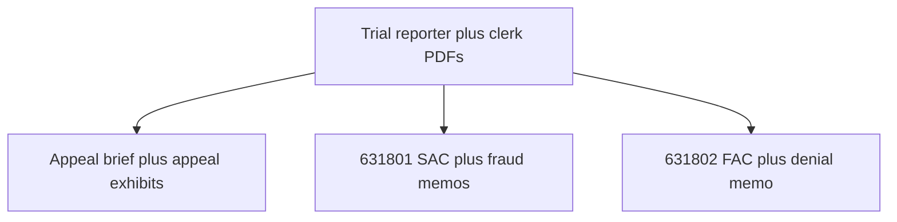

# Evidence tree — causes of action to sources

This page maps **claim families** (as pled or argued in linked PDFs) to **primary sources** in this repository. It states **where to read**, not **who will win**.

---

## A. Underlying negligence / liability (CGC-21-594102)

| Element (generic negligence pattern) | Primary sources |
|----------------------------------------|-----------------|
| Duty / breach | Trial transcripts; jury instructions in clerk’s transcript | [Trial days](../05-TRANSCRIPTS/REPORTER-TRANSCRIPTS/), [clerk’s transcript](../05-TRANSCRIPTS/CLERKS-TRANSCRIPT/CGC-21-594102-A173827-Clerks-Transcript-Full.pdf) |
| Causation | Expert testimony days; jury questions referenced in [01-APPEAL/INDEX.md](../01-APPEAL/INDEX.md) | Reporter PDFs |
| Damages | Medical and economic modules in trial volumes | Reporter PDFs |

---

## B. Appellate error categories (A173827)

| Issue cluster | Primary sources |
|---------------|-----------------|
| Instructional | Opening brief; clerk’s instruction conference | [01-Appellants-Opening-Brief.pdf](../01-APPEAL/01-Appellants-Opening-Brief.pdf) |
| Evidentiary (911 / video / experts) | Opening brief; reporter volumes; MIL orders in clerk’s transcript | [07-Appeal-Exhibits.pdf](../01-APPEAL/07-Appeal-Exhibits.pdf) |
| Juror misconduct process | Opening brief; trial/hearing transcripts | same |

---

## C. Extrinsic fraud / fraud on the court (CGC-25-631801 — as pled)

| Alleged element (high-level) | Primary sources |
|------------------------------|-----------------|
| Knowledge / access | SAC; fraud memorandum; depositions; investigation exhibit | [01-Second-Amended-Complaint.pdf](../02-CASE-CGC-25-631801/01-Second-Amended-Complaint.pdf), [03-Memorandum-Fraud-on-Court.pdf](../02-CASE-CGC-25-631801/03-Memorandum-Fraud-on-Court.pdf) |
| Representations | Hearing + trial transcripts; MIL text in clerk’s transcript | [All-Hearing-Transcripts-Rosario-AAA.pdf](../05-TRANSCRIPTS/HEARINGS/All-Hearing-Transcripts-Rosario-AAA.pdf), [Trial-Day-07](../05-TRANSCRIPTS/REPORTER-TRANSCRIPTS/Trial-Day-07-April-16-2025.pdf) |
| Reliance / impact on presentation | Equity memoranda; clerk’s orders | [03-Memorandum-Fraud-on-Court.pdf](../02-CASE-CGC-25-631801/03-Memorandum-Fraud-on-Court.pdf), clerk’s transcript |
| “Admission” memorandum line | Focus PDF | [11-Motion-Extrinsic-Fraud-Navaratnasingham-Admission.pdf](../02-CASE-CGC-25-631801/11-Motion-Extrinsic-Fraud-Navaratnasingham-Admission.pdf) |

---

## D. Denial-letter / UCL (CGC-25-631802 — as pled)

| Topic | Primary sources |
|-------|-----------------|
| Representations in denial letter | FAC; denial-letter memorandum | [01-First-Amended-Complaint.pdf](../03-CASE-CGC-25-631802/01-First-Amended-Complaint.pdf), [03-Memorandum-Denial-Letter-Fraud.pdf](../03-CASE-CGC-25-631802/03-Memorandum-Denial-Letter-Fraud.pdf) |
| Investigation completeness | CSAA investigation exhibit; PMK deposition | [EXHIBIT-001](../04-EXHIBITS/EXHIBIT-001-CSAA-Investigation-Report.pdf), [Raffin deposition](../05-TRANSCRIPTS/DEPOSITIONS/04-Nicholas-Raffin-PMK-Deposition-2023-03-10.pdf) |
| April 2026 defenses | Demurrer + Anti-SLAPP PDFs | [631802 index](../03-CASE-CGC-25-631802/INDEX.md) |
| Plaintiff responses | 801 consolidated + FINAL-COURT | [consolidated README](../03-CASE-CGC-25-631802/plaintiff-opposition-consolidated-apr2026/README.md), [final-court README](../03-CASE-CGC-25-631802/final-court-apr2026/README.md) |

---

## E. Audio / video / CAD (cross-cutting)

| Item | Link |
|------|------|
| 911 audio + excerpts | [evidence.md](../evidence.md) |
| Embedded players | [evidence.html](../evidence.html) |

---

## F. Regulatory complaints (non-court)

| Item | Link |
|------|------|
| Bar and judicial complaint PDFs | [../06-EVIDENCE/INDEX.md](../06-EVIDENCE/INDEX.md) |

---

## Vertical diagram — claim sources

[← Homepage](../README.md) · [← SPINE](../SPINE.md)
