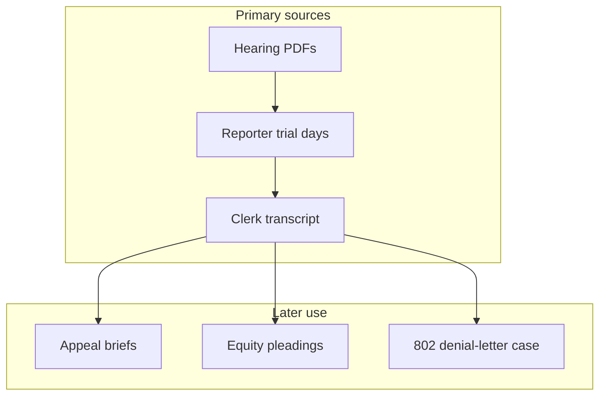

# Underlying trial — CGC-21-594102 (Rosario v. Abdelhalim et al.)

**Forum:** Superior Court of California, County of San Francisco.  
**Plaintiff:** Franciscus Dylan Rosario.  
**Subject:** Civil action arising from a February 4, 2021 pedestrian–vehicle incident at Tehama and 5th Street, San Francisco.

This narrative is **record-first**. It points to **PDFs in this repository** and to the evidence landing pages for audio and video mirrors.

---

## 1. Chronological spine (facts anchored to sources)

**2021-02-04 — Incident date.** The date appears on [evidence.md](../evidence.md) and in multiple later pleadings. Emergency audio exists in the linked WAV files on that page.

**2021-02-25 — Twenty-one days after incident.** The **631802** case index describes a CSAA denial letter dated on this twenty-one-day relationship to the collision. The letter itself is discussed in [03-Memorandum-Denial-Letter-Fraud.pdf](../03-CASE-CGC-25-631802/03-Memorandum-Denial-Letter-Fraud.pdf) and the FAC PDF linked below in the cross-case footnote.

**2022–2024 — Depositions.** Sworn pretrial discovery PDFs:

| Witness | PDF |
|---------|-----|
| Franciscus Dylan Rosario | [01-Franciscus-Rosario-Deposition-2022-08-18.pdf](../05-TRANSCRIPTS/DEPOSITIONS/01-Franciscus-Rosario-Deposition-2022-08-18.pdf) |
| Victoria Rosario | [02-Victoria-Rosario-Deposition-2024-05-03.pdf](../05-TRANSCRIPTS/DEPOSITIONS/02-Victoria-Rosario-Deposition-2024-05-03.pdf) |
| Officer David Fernandez | [03-Officer-David-Fernandez-Deposition-2023-03-10.pdf](../05-TRANSCRIPTS/DEPOSITIONS/03-Officer-David-Fernandez-Deposition-2023-03-10.pdf) |
| Nicholas Raffin (PMK — CSAA) | [04-Nicholas-Raffin-PMK-Deposition-2023-03-10.pdf](../05-TRANSCRIPTS/DEPOSITIONS/04-Nicholas-Raffin-PMK-Deposition-2023-03-10.pdf) |
| Subhi Abdelhalim | [05-Subhi-Abdelhalim-Deposition-2022-09-30.pdf](../05-TRANSCRIPTS/DEPOSITIONS/05-Subhi-Abdelhalim-Deposition-2022-09-30.pdf) |

**2024-02-01 — Subpoena on file.** [2024-02-01-Compex-Subpoena.pdf](../04-EXHIBITS/2024-02-01-Compex-Subpoena.pdf) (exhibit folder).

**2025-01-17 — MIL tranche.** The **631801** index references MIL No. 17 language about production and provenance; the underlying clerk’s transcript PDF contains the filed MIL text and orders.

**2025-02-18 — Hearing.** [All-Hearing-Transcripts-Rosario-AAA.pdf](../05-TRANSCRIPTS/HEARINGS/All-Hearing-Transcripts-Rosario-AAA.pdf).

**2025-04-16 — Trial Day 7.** [Trial-Day-07-April-16-2025.pdf](../05-TRANSCRIPTS/REPORTER-TRANSCRIPTS/Trial-Day-07-April-16-2025.pdf); exhibit PDF [EXHIBIT-Trial-Day7-April16-2025.pdf](../04-EXHIBITS/EXHIBIT-Trial-Day7-April16-2025.pdf).

**2025-04-17 — Trial Day 8.** [Trial-Day-08-April-17-2025.pdf](../05-TRANSCRIPTS/REPORTER-TRANSCRIPTS/Trial-Day-08-April-17-2025.pdf); exhibit PDF [EXHIBIT-Trial-Day8-April17-2025.pdf](../04-EXHIBITS/EXHIBIT-Trial-Day8-April17-2025.pdf).

**2025-04-22 — Trial Day 10.** [Trial-Day-10-April-22-2025.pdf](../05-TRANSCRIPTS/REPORTER-TRANSCRIPTS/Trial-Day-10-April-22-2025.pdf); exhibit PDF [EXHIBIT-Trial-Day10-April22-2025.pdf](../04-EXHIBITS/EXHIBIT-Trial-Day10-April22-2025.pdf).

**2025-04-23 — Trial Day 11 (verdict).** [Trial-Day-11-April-23-2025.pdf](../05-TRANSCRIPTS/REPORTER-TRANSCRIPTS/Trial-Day-11-April-23-2025.pdf); exhibit PDF [EXHIBIT-Trial-Day11-April23-2025.pdf](../04-EXHIBITS/EXHIBIT-Trial-Day11-April23-2025.pdf).

**Post-trial.** Clerk’s transcript PDF: [CGC-21-594102-A173827-Clerks-Transcript-Full.pdf](../05-TRANSCRIPTS/CLERKS-TRANSCRIPT/CGC-21-594102-A173827-Clerks-Transcript-Full.pdf) (motions, orders, verdict-related entries as filed).

---

## 2. Evidence used at trial (repository mirrors)

| Kind | Entry point |
|------|-------------|
| 911 audio and transcript excerpts | [evidence.md](../evidence.md), [evidence.html](../evidence.html) |
| Body camera / YouTube mirrors | same |
| CSAA investigation report | [EXHIBIT-001-CSAA-Investigation-Report.pdf](../04-EXHIBITS/EXHIBIT-001-CSAA-Investigation-Report.pdf) |
| Trial exhibit PDFs by day | [04-EXHIBITS/INDEX.md](../04-EXHIBITS/INDEX.md) |

---

## 3. Pleading tree — underlying case (clerk’s record PDF)

The **trial court’s** motion papers live primarily in the **clerk’s transcript** PDF above. This repository’s **GITHUB-PAGE** slice does not duplicate every underlying-trial PDF as standalone files; the **full clerk’s transcript** is the consolidated index for motions and orders.

| Order / motion class | Where to read it |
|----------------------|------------------|
| Motions in limine | Clerk’s transcript volumes referenced in appeal index “911 call exclusion” row ([01-APPEAL/INDEX.md](../01-APPEAL/INDEX.md)) |
| Trial-day orders | Same clerk’s PDF; cross-check reporter PDF for the same calendar date |
| Post-trial motions (JNOV, mistrial, etc.) | Appeal index cites CT volumes (example rows in [01-APPEAL/INDEX.md](../01-APPEAL/INDEX.md)) |

**Why defense files MILs (neutral).** Defense papers of this class typically seek to **limit** topics or documents the jury will see.

**Why plaintiff opposes (neutral).** Plaintiff papers of this class typically seek to **admit** topics or documents plaintiff views as probative.

**What the record shows.** The **reporter** and **clerk** PDFs together show **what was said in open court** and **what orders were entered**. No substitute summary is authoritative over those two PDF streams.

---

## 4. Plaintiff’s filed positions after trial (other case numbers)

Plaintiff’s **theories about the fairness of the trial** are pled in **631801** and argued in **A173827**. This underlying narrative **links** there rather than restating counts:

- Equity SAC and fraud memorandum: [02-CASE-CGC-25-631801/INDEX.md](../02-CASE-CGC-25-631801/INDEX.md)
- Opening brief: [01-APPEAL/INDEX.md](../01-APPEAL/INDEX.md)

---

## 5. Defense entities on the trial caption

See defendant table in [02-CASE-CGC-25-631801/INDEX.md](../02-CASE-CGC-25-631801/INDEX.md) (Abdelhalim, CSAA, PSA, Navaratnasingham, Reyna, Chambers, CSK). Person-specific act lists are in [../defendants/](../defendants/INDEX.md).

---

## 6. Plaintiff’s filed position (trial-level negligence case — as described in appellate papers)

The **opening brief** groups errors; each bullet below is a **label** used in [01-APPEAL/INDEX.md](../01-APPEAL/INDEX.md), not a ruling:

- Instructional error (de novo review claimed).
- Evidentiary error (abuse of discretion claimed).
- Juror misconduct and § 1150 process.
- Structural / cumulative error.

**Source:** [01-Appellants-Opening-Brief.pdf](../01-APPEAL/01-Appellants-Opening-Brief.pdf).

---

## 6A. Reporter volumes as the day-by-day account

The reporter’s transcripts for **Days 7–11** are the public text of **who spoke**, **what exhibits were marked**, and **what rulings the court announced** from the bench during those trial days. Each PDF is named by calendar date in [../05-TRANSCRIPTS/REPORTER-TRANSCRIPTS/](../05-TRANSCRIPTS/REPORTER-TRANSCRIPTS/). When the equity index quotes a **Trial Day 7** line about “Dolan,” that quote is a **pointer** into the Day 7 PDF, not a substitute for reading the surrounding pages where objections, foundations, and limiting instructions may appear.

Trial Day **8** is the day the legacy homepage cites for **911 authentication** language (“Yes. That is my voice.” in their cite format). The Day 8 PDF should be read **together with** the exhibit PDF for the same day because exhibit binders sometimes contain **redacted** or **partial** clips that differ from what a jury heard live.

Trial Days **10** and **11** contain **later fact testimony**, **argument**, and **verdict** events. Day **11** is also where **jury questions** sometimes appear on the paper record the appeal index references (see “Jury question re causation” row in [../01-APPEAL/INDEX.md](../01-APPEAL/INDEX.md)).

---

## 6B. Hearings as a separate register from trial days

The single combined hearing PDF [All-Hearing-Transcripts-Rosario-AAA.pdf](../05-TRANSCRIPTS/HEARINGS/All-Hearing-Transcripts-Rosario-AAA.pdf) is the register for **February 18, 2025** and related hearing dates as compiled for this repository. Hearings often contain **foundational disputes** about discovery, **continuance requests**, and **evidentiary preview** arguments that later reappear at trial. The **631801** equity papers rely on hearing pages for statements about **receipt** and **provenance** of audio/video materials; those allegations must be checked against the **hearing PDF pages** cited inside the equity memoranda PDFs.

---

## 6C. Clerk’s transcript as the order register

The clerk’s transcript PDF is long because it includes **file-stamped** motions, **proposed orders**, **signed orders**, **trial minutes**, and **post-trial** filings. The appeal index’s “Key Record Citations” table points to **CT volume and page** examples for discrete events (911 continuance, mistrial motion, JNOV, trial minutes). Those pointers are the fastest way to jump from **a narrative claim** to **the image of the filed page** if your review style is top-down.

When a narrative in **631801** says the court **relied** on a representation, the supporting filing typically **pins** that claim to a clerk’s transcript page showing an **order** or a **minute order** near the same date as a hearing or trial day. This underlying narrative does not duplicate those page numbers because they can change between **partial** and **full** transcript releases; use the **equity memorandum** as the cite carrier.

---

## 6D. Exhibits beyond trial-day PDFs

The exhibits folder also contains **record exhibits** with numeric filenames (examples listed in [../04-EXHIBITS/INDEX.md](../04-EXHIBITS/INDEX.md)) and **trial-day** exhibit PDFs. The **CSAA investigation report** exhibit is frequently used as a **business-record** anchor in the UCL case and as a **context** document in fraud-on-court theories because it shows **what the insurer knew or did** near the time of the claim. Whether it was **admissible** or **limited** at trial is a **separate** question answerable only from **trial transcripts** and **orders**.

---

## 6E. Third-party audio hosting and authenticity

The [evidence.md](../evidence.md) page includes **external** WAV links and YouTube mirrors. Those hosts are **convenience copies**. For **court** authenticity questions, the trial record’s **foundations**, **stipulations**, and **rulings** inside the reporter PDFs control. The appeal exhibits PDF may also contain **CD images** or **hash references** depending on the appellate filing set ([07-Appeal-Exhibits.pdf](../01-APPEAL/07-Appeal-Exhibits.pdf)).

---

## 6F. Police and EMS narrative strand

The evidence page and pleadings refer to **CAD** logs and **body-worn camera** footage. In this repository, **YouTube** mirrors are linked for video playback; the **trial** and **hearing** transcripts contain **officer names** and **time stamps** that help align a video clip with a transcript line. The **deposition** of Officer Fernandez is an additional pretrial register for **report writing** and **scene response** topics.

---

## 6G. Expert discovery strand (as framed on appeal)

The appeal index lists **CCP § 2034** and **expert disclosure** topics tied to **defense experts**. The clerk’s transcript contains **MIL** rulings about expert testimony. Reading this strand requires **parallel windows**: MIL text, expert disclosure PDFs (if present in your local full record), and the **trial days** where the expert testified. This GITHUB-PAGE slice includes **reporter** and **exhibit** PDFs sufficient to **start** that reading path; it may not include every **sealed** or **non-published** discovery image that exists on a litigation laptop.

---

## 6H. Verdict and vote split

The legacy homepage states a **9–3** defense verdict as a **fact about the jury poll**. That statistic is **not** a legal conclusion about **validity** of the verdict. Validity questions are raised in **post-trial motions** (clerk’s transcript) and on **appeal** (opening brief). This narrative keeps those layers **separate** so a reader does not confuse **what the jury did** with **what the Court of Appeal might do**.

---

## 6I. Relationship to insurance-letter theories without merging cases

Readers often merge **trial fraud theories** with **631802 denial-letter theories**. The trial record is relevant to **631802** only to the extent **631802** pleadings say so (for example, as **corroboration** of investigative completeness). The **FAC** and denial-letter memorandum PDFs explain that pleading boundary; follow those links rather than assuming every trial exhibit is duplicated in **631802**.

---

## 6J. Substitution-of-counsel and firm succession (paper trail)

The **631801** index references a **substitution of attorney** transaction ID and approximate months of file possession for successor counsel. The **image** of that substitution belongs in the **631801** exhibit PDFs or clerk’s record. This narrative mentions it only as a **cross-reference target** because it affects **continuity** arguments about who spoke for the defense at which hearing.

---

## 6K. How journalists should quote people

Quote **people** only from **transcripts** you have opened, or from **filings** that reproduce sworn text with citations. Do not quote this Markdown file’s paraphrases as if they were testimony.

---

## 6L. Pedestrian–vehicle codes and jury instructions (appellate framing)

The appeal index references **Vehicle Code** issues and **CACI** negligence instructions. The **operative** jury instructions and special verdict forms are in the **clerk’s transcript** images for the charge conference and **before** deliberations. When plaintiff’s appellate brief argues **misdirection**, the brief typically **contrasts** the instruction actually given with the instruction plaintiff says should have been given. This repository’s **opening brief PDF** is the correct place to read that **contrast**; this narrative does not reproduce CACI numbers because they may differ between **draft** and **final** sets in the clerk’s PDF.

---

## 6M. Crosswalk fact pattern (location-only)

The intersection **Tehama** and **5th** appears on [evidence.md](../evidence.md). **Liability** is disputed; this narrative states **location** because it is **non-controversial** on the record and orients readers who map audio timestamps to geography.

---

## 6N. Medical and damages presentation (high-level pointer)

Medical testimony and damages modules appear across **multiple trial days**. The reporter PDFs for Days **8–11** typically carry **treating** and **expert** medicine segments. The appeal brief’s **prejudice** discussion may cite **how much** the jury awarded on **non-economic** damages compared to **economic** damages if a special verdict form splits those lines. Pull the **special verdict** from the clerk’s transcript rather than from secondary summaries.

---

## 6O. Incident reconstruction exhibits

Photographs, diagrams, and **distance** exhibits are often moved into evidence through **foundational** witnesses. The **trial-day exhibit PDFs** in [../04-EXHIBITS/](../04-EXHIBITS/INDEX.md) are convenient bundles, but the **reporter** transcript shows **which** party offered **which** exhibit and **what objection** was stated. If a website shows a **pretty picture** without the **founder**, treat it as **illustration**, not **evidence**.

---

## 6P. Hit-and-run reporting strand (911 callers)

Two 911 audio channels are described on [evidence.md](../evidence.md): a **passerby** caller and the **driver** caller. The equity and appeal papers sometimes juxtapose them for **temporal** and **scene-description** reasons. Listen in **chronological** order if you are building a **minute-by-minute** map; then read the **police** body-camera PDFs or mirrors for **on-scene** statements.

---

## 6Q. What this narrative intentionally omits

It omits **graphic medical detail** because the public record PDFs already contain it where introduced. It omits **settlement negotiations** unless a **filed** document in this folder references them. It omits **social media** posts. It omits **witness addresses** and **sealed** discovery.

---

## 6R. Reading order for a single weekend

**Saturday morning:** Read [evidence.md](../evidence.md) and listen to both 911 WAV links while following the printed transcripts on that page. **Saturday afternoon:** Read the **February 18, 2025** hearing PDF through the sections where discovery and continuance are discussed. **Sunday morning:** Read **Trial Day 7** and **Day 8** reporter PDFs in full, pausing at sidebar markers. **Sunday afternoon:** Skim **Day 11** for verdict-related colloquy, then open the **clerk’s transcript** at the appeal index’s CT cites for the **orders** that match those trial days.

---

## 6S. Parallel criminal or traffic enforcement question

This repository is focused on **civil** PDFs indexed under `GITHUB-PAGE`. If a reader is looking for **criminal charging** decisions or **traffic citation** dispositions, those records may exist in **non-party** agencies and may **not** be duplicated here. The civil transcripts nonetheless contain **officer testimony** about **scene procedures** that may intersect with administrative records.

---

## 6T. Bench officer and department continuity

Department numbers for **trial** and later **CMC** dates appear in case indexes for **631801** and **631802**. The **underlying** trial department appears on the legacy homepage line for **Dept. 504** and Judge **Garrett L. Wong**. Use those strings as **search keys** inside the clerk’s transcript PDF text layer if available.

---

## 6U. Glossary of motion abbreviations you will see in the clerk’s PDF

**MIL** — motion in limine. **MSC** — mandatory settlement conference (and similar court conferences). **MSJ** — motion for summary judgment (if filed in the underlying case; check clerk’s index). **JNOV** — judgment notwithstanding the verdict. **MIST** — mistrial motion shorthand in some internal notes (always verify the title on the filed PDF). **RFPD** — request for production of documents. **SRO** — stipulation and order (if used). These abbreviations appear in **minute orders** and **lawyer captions**. They are included here only to reduce friction for **first-time** readers of a California clerk’s PDF who may not recognize **internal** court abbreviations on the first pass.

---

## 7. Vertical diagram — trial record feeds

---

## 8. Timeline shortcut

[../timelines/trial-CGC-21-594102.md](../timelines/trial-CGC-21-594102.md)

---

## 9. Disclaimer

No legal advice. Read the PDFs.

[← Narrative hub](00-OVERVIEW.md) · [↑ SPINE](../SPINE.md) · [↑ Homepage](../README.md)
