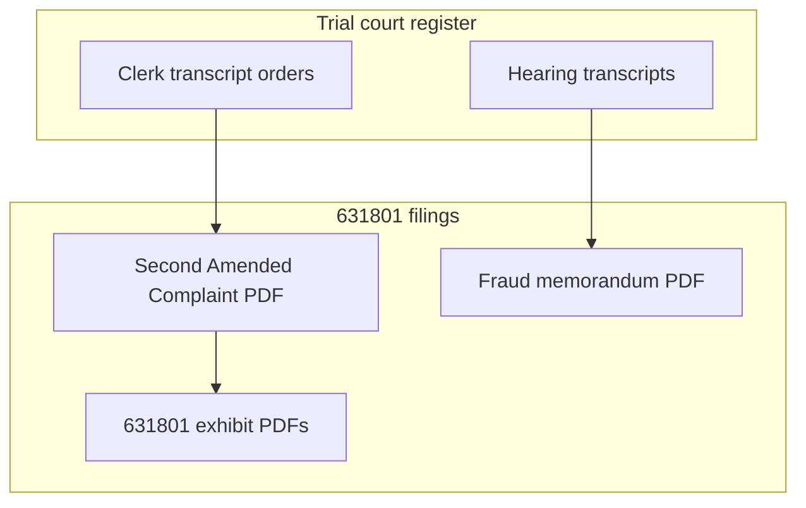

# Independent equity action — CGC-25-631801

**Forum:** Superior Court of California, County of San Francisco.  
**Plaintiff:** Franciscus Dylan Rosario.  
**Defendants:** Subhi Abdelhalim; CSAA Insurance Exchange; Phillips, Spallas & Angstadt LLP; Priya D. Navaratnasingham; Alberto Reyna; Michael R. Chambers; Carbone, Smith & Koyama — as listed in [../02-CASE-CGC-25-631801/INDEX.md](../02-CASE-CGC-25-631801/INDEX.md).

**Case management conference (as stated in index):** May 27, 2026, 10:30 a.m., Department 610 (verify on clerk’s site).

This narrative tracks **operative PDFs** in the `02-CASE-CGC-25-631801` folder and links to **trial and hearing transcripts** where those PDFs quote the record.

---

## 1. Pleading tree (numbered PDFs — earliest to latest)

| # | Instrument | PDF | Why plaintiff filed (neutral) | Why defense would respond (neutral) |
|---|------------|-----|------------------------------|-------------------------------------|
| 1 | Second Amended Complaint | [01-Second-Amended-Complaint.pdf](../02-CASE-CGC-25-631801/01-Second-Amended-Complaint.pdf) | States operative factual theories and relief. | Demurrer/motion to strike targets pleading sufficiency. |
| 2 | Notice of Related Cases | [02-Notice-of-Related-Cases.pdf](../02-CASE-CGC-25-631801/02-Notice-of-Related-Cases.pdf) | Court coordination procedure. | Formalities; rarely controversial. |
| 3 | Memorandum — Fraud on the Court | [03-Memorandum-Fraud-on-Court.pdf](../02-CASE-CGC-25-631801/03-Memorandum-Fraud-on-Court.pdf) | Legal framework memorandum supporting SAC theories. | Opposition would dispute materiality, reliance, or falsity. |
| 4 | Demand — Judicial Summary of Facts | [05-Demand-Judicial-Summary-of-Facts.pdf](../02-CASE-CGC-25-631801/05-Demand-Judicial-Summary-of-Facts.pdf) | Request for a judicially noticed or summarized fact record. | Opposition may contest what facts are appropriate for summary treatment. |
| 5 | Requests for Admission | [06-Requests-for-Admission.pdf](../02-CASE-CGC-25-631801/06-Requests-for-Admission.pdf) | Discovery pressure on discrete fact propositions. | Objections / responses as permitted by discovery rules. |
| 6 | Ex Parte — Document Preservation | [07-Ex-Parte-Document-Preservation.pdf](../02-CASE-CGC-25-631801/07-Ex-Parte-Document-Preservation.pdf) | Seeks preservation orders for evidence. | May oppose breadth or necessity. |
| 7 | Request for Judicial Notice | [08-Request-for-Judicial-Notice.pdf](../02-CASE-CGC-25-631801/08-Request-for-Judicial-Notice.pdf) | Asks court to take judicial notice of record documents. | Opposes scope or authenticity of some volumes. |
| 8 | Exhibits — Court Filing Set | [09-Exhibits-631801-Court.pdf](../02-CASE-CGC-25-631801/09-Exhibits-631801-Court.pdf) | Exhibit packet for court filing set. | Weight / admissibility arguments later. |
| 9 | Exhibits — Memorandum and Supplemental | [10-Exhibits-Memorandum-Supplemental.pdf](../02-CASE-CGC-25-631801/10-Exhibits-Memorandum-Supplemental.pdf) | Additional exhibits tied to memoranda. | Same. |
| 10 | Memorandum — Navaratnasingham “Dolan” Admission | [11-Motion-Extrinsic-Fraud-Navaratnasingham-Admission.pdf](../02-CASE-CGC-25-631801/11-Motion-Extrinsic-Fraud-Navaratnasingham-Admission.pdf) | Focused memorandum tying transcript lines to fraud theories. | Opposition would contest inferences and legal standards. |

**Index hub:** [../02-CASE-CGC-25-631801/INDEX.md](../02-CASE-CGC-25-631801/INDEX.md).

---

## 2. Three-part framework (as described in the case index)

The **631801** index lists: (1) knowledge/access, (2) representations, (3) court reliance. This narrative **does not** adjudicate those elements; it tells the reader **which PDF** articulates each part.

---

## 3. Primary transcript anchors (external to the case folder but in repo)

| Register | PDF |
|----------|-----|
| Trial Day 7 | [Trial-Day-07-April-16-2025.pdf](../05-TRANSCRIPTS/REPORTER-TRANSCRIPTS/Trial-Day-07-April-16-2025.pdf) |
| Trial Day 8 | [Trial-Day-08-April-17-2025.pdf](../05-TRANSCRIPTS/REPORTER-TRANSCRIPTS/Trial-Day-08-April-17-2025.pdf) |
| Hearings | [All-Hearing-Transcripts-Rosario-AAA.pdf](../05-TRANSCRIPTS/HEARINGS/All-Hearing-Transcripts-Rosario-AAA.pdf) |
| Clerk’s transcript | [CGC-21-594102-A173827-Clerks-Transcript-Full.pdf](../05-TRANSCRIPTS/CLERKS-TRANSCRIPT/CGC-21-594102-A173827-Clerks-Transcript-Full.pdf) |

---

## 4. Analytical annexes (not court orders)

| Annex | Link |
|-------|------|
| Court reliance discussion | [../08-LEGAL-ANALYSIS/COURT-RELIANCE-FRAUD-ON-COURT.md](../08-LEGAL-ANALYSIS/COURT-RELIANCE-FRAUD-ON-COURT.md) |
| Dolan admission catalog | [../08-LEGAL-ANALYSIS/FATAL-PROOF-NAVARATNASINGHAM-DOLAN-ADMISSION-EXTRINSIC-FRAUD.md](../08-LEGAL-ANALYSIS/FATAL-PROOF-NAVARATNASINGHAM-DOLAN-ADMISSION-EXTRINSIC-FRAUD.md) |

---

## 5. Relief sought (copied as a list from index)

The index lists **vacatur**, **retrial**, and **ancillary monetary relief** categories. Read the **SAC** PDF for exact prayer language.

---

## 6. Vertical diagram — equity inputs

---

## 7. Plaintiff’s filed positions (where to read them)

| Topic | PDF |
|-------|-----|
| Operative facts and counts | [01-Second-Amended-Complaint.pdf](../02-CASE-CGC-25-631801/01-Second-Amended-Complaint.pdf) |
| Fraud-on-court legal structure | [03-Memorandum-Fraud-on-Court.pdf](../02-CASE-CGC-25-631801/03-Memorandum-Fraud-on-Court.pdf) |
| Transcript-line focus | [11-Motion-Extrinsic-Fraud-Navaratnasingham-Admission.pdf](../02-CASE-CGC-25-631801/11-Motion-Extrinsic-Fraud-Navaratnasingham-Admission.pdf) |

---

## 8. Defense positions

Responsive pleadings may exist on the **SF Superior Court** docket even if not mirrored here yet. Search **CGC-25-631801** on the court portal linked from [../README.LEGACY.md](../README.LEGACY.md).

---

## 9. Extended practice notes — equitable vacatur (non-adjudicative)

California law treats **extrinsic fraud** as a **narrow** category compared to intrinsic attacks on jury verdicts. The **631801** papers cite authorities listed in the case index (*Kulchar*, *Kieturakis*, *Weaver*, CCP § 187). Read those **cases** in a reporter or database; do not treat this Markdown file as case law.

---

## 10. Preservation ex parte — why it exists

Preservation motions seek orders that **counterparties** retain **categories** of documents (messages, load files, metadata) that might otherwise be **deleted** under routine retention policies. Opposition sometimes argues **overbreadth** or **lack of imminent loss**.

---

## 11. RFAs — strategic role

Requests for Admission force **admit/deny** responses on **atomic** facts. Objections may assert **vagueness** or **privilege**. The **equity** RFAs likely overlap with **631802** RFAs; read both sets before assuming uniqueness.

---

## 12. RJN — judicial notice limits

Evidentiary judicial notice is **limited** by the Evidence Code. The RJN PDF should be read for **what** the plaintiff asks the court to notice and **for what purpose** (adjudicative vs background).

---

## 13. Exhibit volume strategy

Two exhibit PDFs exist: **court filing set** and **memorandum supplemental**. When a cite says “Exhibit A,” verify **which** volume contains **Exhibit A** to avoid **cross-volume** mis-cites.

---

## 14. Multi-defendant caption management

Seven defendants increase **service** and **answer** complexity. The **proofs of service** (if any in a later upload) will show **who** was served **how**. This folder’s current index focuses on **plaintiff** starter PDFs.

---

## 15. Related-case notice function

The related-case notice helps the **assignment** judge see **631802**, **CGC-21-594102**, and **A173827** together for **coordination**. It does not **merge** cases.

---

## 16. Timeline shortcut

[../timelines/equity-CGC-25-631801.md](../timelines/equity-CGC-25-631801.md)

---

## 17. Pleading amendments path

The presence of a **Second Amended Complaint** implies an earlier **complaint** and **first amended complaint** in the **clerk’s** register for **631801** that may **not** be duplicated as standalone PDFs in this folder. Researchers needing **complete** amendment lineage should pull the **docket register** images from the superior court.

---

## 18. Demurrer and anti-SLAPP cross-influence (usually none here)

**631801** is a separate case number from **631802**. Anti-SLAPP motions common in **631802** may **not** appear in **631801** unless a defendant later files one; check the **docket** rather than assuming parity.

---

## 19. Discovery stay questions

Some courts **stay** discovery pending demurrer rulings. If a discovery stay order exists, it will be in the **631801** clerk’s register PDFs **not** mirrored here yet.

---

## 20. Insurance funding theories

Where the SAC alleges **insurer control** of defense strategy, read **CSAA**’s discovery and **PMK** deposition in the underlying record for **corporate-structure** facts, then return to the **SAC** paragraphs that **characterize** those facts legally.

---

## 21. Firm succession and substitution papers

The **631801** index references **substitution of attorney** metadata. The **image** of the substitution should be in the **631801** exhibit PDFs or the **underlying** clerk’s record; use **search** for “Substitution” inside those PDFs.

---

## 22. Equity jurisdiction vs law division

San Francisco assigns departments by **case type**. Confirm whether **631801** is treated as **unlimited civil** ordinary assignment or a **complex** track on the **clerical** face sheet.

---

## 23. Burden and standard of proof (as pled)

The **SAC** will articulate **who** bears burdens on **fraud**-type claims. Do not import **criminal** “beyond reasonable doubt” language; civil fraud uses **clear and convincing** evidence for **punitive** components where pled, and **preponderance** for other elements depending on claim—read the **SAC** itself.

---

## 24. Ancillary monetary relief caps

The index lists **categories** of monetary relief tied to **fraud period** theories. The **SAC** prayer controls **amounts** requested and **damage** theories.

---

## 25. Parallel bar complaints

Bar complaints for individual attorneys and firms appear in [../06-EVIDENCE/](../06-EVIDENCE/INDEX.md). They are **not** dispositive of civil claims.

---

## 26. Equity witnesses (future)

When **declarations** are filed with later motions, they will appear as new PDFs; extend the pleading tree when that happens.

---

## 27. Document control and Bates numbers

Large PDFs may contain **Bates** stamps in the footer. Cite **Bates** when communicating with opposing counsel to avoid **ambiguous** references.

---

## 28. Meet-and-confer obligations

Later discovery motions may require **meet-and-confer** letters. Those may live only in **email** unless filed; check **docket** for lodged letters.

---

## 29. E-discovery vendors

If **load files** are produced, they may be **separate** from PDF exhibits. Preservation motions sometimes discuss **load file** formats.

---

## 29A. Collateral estoppel and issue preclusion (dictionary)

If defendants later argue **issue preclusion** from the **underlying** judgment, the **SAC** or opposition papers will respond under California **primary rights** / **mutuality** doctrines. Wait for those **filed** pages rather than guessing here.

---

## 29B. Lis pendens and real property (if ever raised)

Some fraud cases touch **real property** interests; **lis pendens** special rules may appear. None are referenced in the current **631801** index snapshot in this folder.

---

## 29C. Third-party practice

If **CSAA** or a law firm brings **third-party** claims, new parties would appear on the **register**. None are indexed in the starter PDF list.

---

## 29D. Mediation confidentiality

Statements made in **mediation** are generally **confidential** under **Evidentiary** privileges. The **trial** and **equity** papers should avoid importing mediation statements unless a **statutory exception** applies; verify any such paragraph carefully.

---

## 29E. Translation needs

If any **911** or **body-camera** transcript is translated from another language, check **certificates of translation** in the exhibit PDFs.

---

## 29F. Corporate disclosure requirements

If **CSAA** is a **foreign** insurer or reciprocal exchange with special **disclosure** rules, those forms may be on the **register** as **attachments** to answers.

---

## 29G. Fee-shifting theories

If any **contractual** fee clause is pled, read the **insurance policy** excerpts in the exhibit PDFs for **text** rather than relying on summaries.

---

## 29H. Expert retention in equity phase

Later **equity** proceedings may involve **forensic** experts on **metadata** or **phone logs**. If expert **declarations** appear later, add them to the pleading tree.

---

## 29I. Coordination with appeal mandate

If the **Court of Appeal** issues a **reversal** or **remand**, the **equity** case may need **abatement** or **stay** motions. Those would be **new** PDFs on the **631801** docket.

---

## 29J. Public transparency goals

This repository publishes **PDFs** for transparency. It does not guarantee **completeness** against the **official** court image system.

---

## 29K. Equity scheduling orders

After the **CMC**, the court may issue a **scheduling order** setting **cutoffs** for **motions** and **expert** designations. Mirror those orders into this folder when available.

---

## 29L. TRO / preliminary injunction (if any)

If plaintiff ever seeks **immediate** injunctive relief against **document destruction**, watch for **TRO** papers with **bond** requirements.

---

## 29M. Sanctions motions risk

Aggressive fraud cases sometimes generate **sanctions** motions under **CCP § 128.7** or **discovery** sanctions codes. If filed, they will appear as **cross** motions on the **register**.

---

## 29N. Deposition transcripts as exhibits

When depositions are **attached** as exhibits to **631801** motions, pagination will be **deposition** page numbers, not **trial** reporter pages.

---

## 29O. Authentication of audio clips in equity

Equity **declarations** may attach **MP3** or **WAV** with **hash** values. Compare those **hashes** to **trial** exhibit hashes if **continuity** is a research question.

---

## 30. Disclaimer

No legal advice.

[← Narrative hub](00-OVERVIEW.md) · [↑ SPINE](../SPINE.md) · [↑ Homepage](../README.md)
