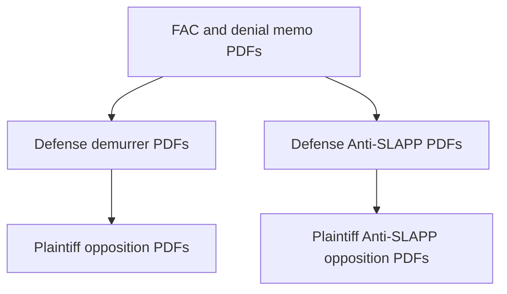

# UCL / denial-letter action — CGC-25-631802

**Forum:** Superior Court of California, County of San Francisco.  
**Plaintiff:** Franciscus Dylan Rosario.  
**Defendant (captioned in starter index):** CSAA Insurance Exchange.

**April 2026 motion practice:** Demurrer volley, Anti-SLAPP, leave / proposed SAC, consolidated opposition builds — see [../03-CASE-CGC-25-631802/INDEX.md](../03-CASE-CGC-25-631802/INDEX.md).

---

## 1. Starter pleading tree (numbered PDFs)

| # | Instrument | PDF | Why plaintiff filed | Why defense responds |
|---|------------|-----|---------------------|----------------------|
| 1 | First Amended Complaint | [01-First-Amended-Complaint.pdf](../03-CASE-CGC-25-631802/01-First-Amended-Complaint.pdf) | Operative UCL / fraud theories vs CSAA. | Demurrer challenges legal sufficiency. |
| 2 | Notice of Related Cases | [02-Notice-of-Related-Cases.pdf](../03-CASE-CGC-25-631802/02-Notice-of-Related-Cases.pdf) | Coordination notice. | Formal. |
| 3 | Memorandum — Denial Letter Fraud | [03-Memorandum-Denial-Letter-Fraud.pdf](../03-CASE-CGC-25-631802/03-Memorandum-Denial-Letter-Fraud.pdf) | Legal support for denial-letter theory. | Opposition disputes facts and law. |
| 4 | Demand — Judicial Summary of Facts | [05-Demand-Judicial-Summary-of-Facts.pdf](../03-CASE-CGC-25-631802/05-Demand-Judicial-Summary-of-Facts.pdf) | Fact-summary procedure request. | Opposition. |
| 5 | Requests for Admission | [06-Requests-for-Admission.pdf](../03-CASE-CGC-25-631802/06-Requests-for-Admission.pdf) | Discovery on atomic facts. | Responses/objections. |
| 6 | Ex Parte — Document Preservation | [07-Ex-Parte-Document-Preservation.pdf](../03-CASE-CGC-25-631802/07-Ex-Parte-Document-Preservation.pdf) | Preservation of claim file materials. | Opposition to breadth. |
| 7 | Exhibits — Memorandum and Supplemental | [08-Exhibits-Memorandum-Supplemental.pdf](../03-CASE-CGC-25-631802/08-Exhibits-Memorandum-Supplemental.pdf) | Exhibit packet. | Weight arguments. |

---

## 2. April 2026 demurrer volley

**Hub:** [../03-CASE-CGC-25-631802/demurrer-volley-apr2026/README.md](../03-CASE-CGC-25-631802/demurrer-volley-apr2026/README.md).

**Defense PDFs** (Apr. 13, 2026): notice, MPA, declaration exhibits, RJN, meet-and-confer, proposed order — filenames listed in the main **631802** index table.

**Plaintiff six-instrument opposition** (Apr. 16, 2026): same README folder under `plaintiff-opposition/`.

**Why defense filed demurrer:** to test whether the FAC states a claim as a matter of law on each ground pleaded.

**Why plaintiff opposed:** to defend facial sufficiency and preserve record for hearing.

---

## 3. Consolidated opposition (801 draft build)

**Hub:** [../03-CASE-CGC-25-631802/plaintiff-opposition-consolidated-apr2026/README.md](../03-CASE-CGC-25-631802/plaintiff-opposition-consolidated-apr2026/README.md).

Core instruments include demurrer opposition MPA, Anti-SLAPP opposition MPA, combined objections, declaration/RJN, fraud/estoppel brief, bench binder.

---

## 4. FINAL-COURT exhibit-integrated packets (Apr. 19, 2026)

**Hub:** [../03-CASE-CGC-25-631802/final-court-apr2026/README.md](../03-CASE-CGC-25-631802/final-court-apr2026/README.md).

| PDF | Role |
|-----|------|
| [PLAINTIFF-OPPOSITIONS-FULL-PACKET-WITH-EXHIBITS.pdf](../03-CASE-CGC-25-631802/final-court-apr2026/PLAINTIFF-OPPOSITIONS-FULL-PACKET-WITH-EXHIBITS.pdf) | Full opposition stack with exhibits |
| [SAC-FULL-PACKET-WITH-EXHIBITS.pdf](../03-CASE-CGC-25-631802/final-court-apr2026/SAC-FULL-PACKET-WITH-EXHIBITS.pdf) | Leave / proposed SAC with exhibits |

---

## 5. Anti-SLAPP (defense clerk PDFs)

**Hub:** [../03-CASE-CGC-25-631802/defense-anti-slapp-clerk/README.md](../03-CASE-CGC-25-631802/defense-anti-slapp-clerk/README.md).

**Why CSAA filed:** to seek strike under CCP § 425.16 and shift fees if successful.

**Why plaintiff opposed:** to show protected conduct is not the gravamen and to satisfy the second step with admissible evidence.

**Plaintiff analysis annex:** [../08-LEGAL-ANALYSIS/anti-slapp-rebuttal/INDEX.md](../08-LEGAL-ANALYSIS/anti-slapp-rebuttal/INDEX.md).

---

## 6. Leave / proposed SAC (Apr. 2026)

**Consolidated packet:** [802-OUT-CONSOLIDATED-FULL-PACKET.pdf](../03-CASE-CGC-25-631802/apr-2026-sac-leave/802-OUT-CONSOLIDATED-FULL-PACKET.pdf) (see [631802 index](../03-CASE-CGC-25-631802/INDEX.md)).

**Why plaintiff filed:** to place operative pleading amendments alongside motion practice.

**Why defense opposes:** futility, prejudice, and pleading-defect arguments typical in opposition papers.

---

## 7. Vertical diagram — 631802 motion stack

---

## 8. Hearing dates (from index — verify on clerk site)

- Combined demurrer / special motion to strike: **May 13, 2026, 9:00 a.m., Dept. 302** (per **631802** index).

---

## 9. Plaintiff’s filed positions — where to read them

| Topic | PDF |
|-------|-----|
| Denial-letter theory | [03-Memorandum-Denial-Letter-Fraud.pdf](../03-CASE-CGC-25-631802/03-Memorandum-Denial-Letter-Fraud.pdf) |
| Demurrer opposition (801 rebuild) | [D801-01-OPPOSITION-TO-DEMURRER-MPA.pdf](../03-CASE-CGC-25-631802/plaintiff-opposition-consolidated-apr2026/D801-01-OPPOSITION-TO-DEMURRER-MPA.pdf) |
| Anti-SLAPP opposition (801 rebuild) | [D801-02-OPPOSITION-TO-ANTI-SLAPP-MPA.pdf](../03-CASE-CGC-25-631802/plaintiff-opposition-consolidated-apr2026/D801-02-OPPOSITION-TO-ANTI-SLAPP-MPA.pdf) |
| Full packets with exhibits | [final-court-apr2026/](../03-CASE-CGC-25-631802/final-court-apr2026/README.md) |

---

## 10. Defense positions — where to read them

| Topic | PDF |
|-------|-----|
| Demurrer | [demurrer-volley defense folder](../03-CASE-CGC-25-631802/demurrer-volley-apr2026/README.md) |
| Anti-SLAPP | [defense-anti-slapp-clerk/](../03-CASE-CGC-25-631802/defense-anti-slapp-clerk/README.md) |

---

## 11. Insurance Code and UCL references

The **631802** index lists **Ins. Code § 790.03** and **Bus. & Prof. Code § 17200** as anchors. Read the **FAC** for how plaintiff **maps** facts to those statutes.

---

## 12. CSAA investigation report exhibit

[../04-EXHIBITS/EXHIBIT-001-CSAA-Investigation-Report.pdf](../04-EXHIBITS/EXHIBIT-001-CSAA-Investigation-Report.pdf) — used across **802** and **trial** discussions.

---

## 13. Timeline shortcut

[../timelines/ucl-CGC-25-631802.md](../timelines/ucl-CGC-25-631802.md)

---

## 14. Master consolidated packet (801 draft)

For a **single-download** review of many instruments stitched together, see [MASTER-CONSOLIDATED-FULL-PACKET.pdf](../03-CASE-CGC-25-631802/plaintiff-opposition-consolidated-apr2026/MASTER-CONSOLIDATED-FULL-PACKET.pdf). File size may be large; prefer **Wi-Fi**.

---

## 15. Earlier 803-series opposition (April 2026)

The **631802** index lists an **803** consolidated build under `plaintiff-opposition-apr2026/`. Treat it as an **earlier** package retained for **diff** comparisons against the **801** rebuild.

---

## 16. Tyler O’Connell declaration (Anti-SLAPP defense)

Defense Anti-SLAPP materials include a **declaration** PDF named in the clerk table (see defense README). Plaintiff’s analytical hub includes a **focus** page for that declaration per [../08-LEGAL-ANALYSIS/anti-slapp-rebuttal/INDEX.md](../08-LEGAL-ANALYSIS/anti-slapp-rebuttal/INDEX.md).

---

## 17. Demurrer rebuttal hub (analytical annex)

[../08-LEGAL-ANALYSIS/demurrer-rebuttal/INDEX.md](../08-LEGAL-ANALYSIS/demurrer-rebuttal/INDEX.md) — plaintiff-authored ground-by-ground review.

---

## 18. Meet-and-confer (CCP § 430.41)

Defense demurrer packet includes a **meet-and-confer** statement. Plaintiff opposition may attach **email** threads as exhibits showing **conference** attempts; verify in the **declaration** exhibits to demurrer opposition PDFs.

---

## 19. Proposed order practice

Both sides filed **proposed orders** (sustain vs overrule). Judges may **adopt neither** verbatim.

---

## 20. Fee motion risk (Anti-SLAPP)

If CSAA prevails on Anti-SLAPP step one and plaintiff fails step two, **fee-shifting** is a statutory risk. Plaintiff’s papers discuss **fee** exposure in their **legal** sections; read those sections in the opposition MPA.

---

## 21. SAC futility doctrine

Defense demurrer materials may argue **leave to amend** would be **futile** because no amendment could cure defects. Plaintiff’s **proposed SAC** PDFs exist to counter that narrative; compare **FAC** vs **proposed SAC** side-by-side.

---

## 22. Park / Baral framing (as referenced on legacy README)

The legacy homepage mentions *Park* step one and *Baral* step two **themes** in plaintiff’s Anti-SLAPP strategy. Those **case names** appear inside plaintiff’s **opposition** memoranda; this narrative does not restate the tests — read the **PDF** pages where plaintiff cites them.

---

## 23. Consumer standing (UCL)

UCL **standing** rules evolve by decisional law. Verify plaintiff’s **injury-in-fact** allegations in the **FAC** for the **standing** paragraph headings.

---

## 24. Class action posture

If the **FAC** is **individual** only, class theories may be absent. Confirm on the **caption** page.

---

## 25. Discovery stay interaction with Anti-SLAPP

Some courts **stay** merits discovery during Anti-SLAPP pendency. Check **minute orders** on the **631802** register.

---

## 26. Consolidated pleadings folder (cross-case)

[../pleadings/README.md](../pleadings/README.md) duplicates some memoranda for **801** and **802** together; useful for service masters.

---

## 27. Evidence.md cross-link for 911 timing

Denial-letter theories often rely on **timeline** comparisons between **collision** and **public-records** acquisition of 911 audio. See [../evidence.md](../evidence.md) for acquisition **links** and transcript excerpts.

---

## 28. Download naming discipline

When you save PDFs locally, keep the **original** filename so your **cites** match others’ cites in email threads.

---

## 28A. Exhibit appendix pagination

The **801** build splits **SAC exhibit appendix** into a large PDF named in the consolidated README (`SAC-06-EXHIBIT-APPENDIX.pdf`). When a memorandum cites **Appendix page 400**, confirm whether that means **appendix-only** pagination or **global** pagination inside a **combined** PDF.

---

## 28B. Lodged vs filed bench binders

Some courts require **lodged** binders that are **not** evidence until **admitted**. Read **headers** on [D801-06-BENCH-BINDER-HEARING-PACKET.pdf](../03-CASE-CGC-25-631802/plaintiff-opposition-consolidated-apr2026/D801-06-BENCH-BINDER-HEARING-PACKET.pdf) for how plaintiff labeled **lodged** materials.

---

## 28C. RFJN objects in opposition

Plaintiff combined **objections** to defense RJN appear as a standalone instrument in the **801** table (`D801-03-COMBINED-EVIDENTIARY-OBJECTIONS.pdf` and related splits). Read those objections before assuming defense judicial notice requests were **unopposed**.

---

## 28D. O’Connell declaration topics (defense)

Defense Anti-SLAPP **declaration** materials typically describe **investigation** steps CSAA says it took. Plaintiff’s rebuttal hub walks **paragraph-by-paragraph** with record cites; use that hub as a **reading guide**, not a court order.

---

## 28E. Special motion to strike vs demurrer sequencing

The **631802** index states a **combined** hearing for demurrer and special motion to strike. That scheduling choice affects **oral argument** time splits and **simultaneous** rulings; bring both **binders** to any in-person hearing.

---

## 28F. Electronic service contacts

Proofs of service list **e-filing** emails for counsel teams. Use those addresses only for **professional** correspondence consistent with **ethical** rules.

---

## 28G. Pro hac vice and local counsel

If **out-of-state** counsel appears, **pro hac** applications may exist on the **register**. They are not in the starter **631802** PDF list.

---

## 28H. Translation of denial letter

If the denial letter is **English** but claim notes are **multilingual**, check whether **translations** are attached in the exhibit appendix.

---

## 28I. Regulatory complaints to CDI

Insurance marketplace complaints may be filed with the **California Department of Insurance** outside this folder. The **631802** FAC may or may not reference regulatory **complaints**; read the **FAC** text.

---

## 28J. Bankruptcy or insolvency flags

If any party enters **bankruptcy**, **automatic stay** issues may appear. None are noted in this static index snapshot.

---

## 28K. Appellate writ strategy (rare)

If a party seeks a **writ** instead of ordinary trial review for a particular order, watch for **writ** petitions on the **Court of Appeal** docket separate from **A173827** unless consolidated.

---

## 28L. Local rule 2.100 compliance (example category)

San Francisco local rules change over time. Verify **margin**, **font**, and **line-number** requirements against the **court’s** current local rules PDF when filing new papers **pro se** or **as counsel**.

---

## 28M. E-filing vendor errors

If a filing **bounces** for **technical** reasons, the **public** index may show a **gap** in numbering; check **clerk** notes for **rejected** uploads.

---

## 28N. Redacted policy numbers

Insurance **policy numbers** may be **redacted** in public PDFs. Use **internal** Bates or **claim number** references instead when discussing the case publicly.

---

## 28O. Parallel FOIA to SFPD

If plaintiff obtained **911** via **public records** rather than discovery, that **path** may be described in **declarations**. Compare dates to the **denial letter** date in the **FAC**.

---

## 29. Disclaimer

No legal advice.

[← Narrative hub](00-OVERVIEW.md) · [↑ SPINE](../SPINE.md) · [↑ Homepage](../README.md)
