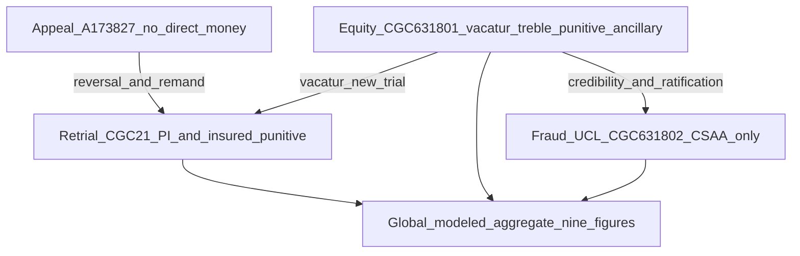

> **CONFIDENTIAL SETTLEMENT COMMUNICATION**  
> **FOR SETTLEMENT AND MEDIATION PURPOSES ONLY**  
> **EVIDENCE CODE SECTION 1154**

This formal settlement communication synthesizes the multi-track litigation risk into a unified global narrative. It is intended to bridge the gap between isolated defense strategies and the reality of cascading, interdependent liabilities across four distinct proceedings. Magnitudes are stated in **neighborhood** terms only—figures from **five through nine**, bands such as **hundreds of thousands** through **tens of millions**, and **conservative / median / worst-case** columns—without attaching a traditional line-item dollar demand to each theory. This document is tendered solely for settlement and mediation within the meaning of California Evidence Code section 1154. It is not an admission of liability, fault, or damages. It does not waive any objection, privilege, or remedy.

---

| **DATE** | **April 19, 2026** |
| **VIA** | **Electronic service / certified mail** |
| **TO** | Authorized representatives of **CSAA Insurance Exchange**; defense counsel for **Subhi Abdelhalim**; counsel for **PSA** (**Navaratnasingham** and **Reyna**); and counsel for **CSK** (**Chambers**). |
| **FROM** | **Franciscus Dylan Rosario**, Plaintiff in Pro Per |
| **RE** | Global settlement posture — **A-173827**; **CGC-25-631801**; **CGC-25-631802**; and **CGC-21-594102** — magnitude bands only (no enumerated dollar demand). |
| **PAGES** | **[including schedules and risk matrices]** |

---

Dear Counsel:

## I. Executive prologue — the unified field of risk

This narrative serves as a formal calibration of defense-side risk across the **appeal**, the **equity action**, the **fraud and unfair-competition action**, and the **derivative retrial** exposure that follows a successful challenge to the underlying judgment. The objective is to present a **single, coherent picture** of modeled financial and equitable risk so that stakeholders can pursue **informed, global** negotiations rather than piecemeal discussions of isolated dockets.

A fundamental strategic vulnerability in compartmentalized defense posturing is the temptation to treat these proceedings as **independent silos**. They are not. They behave, for risk purposes, as a **unified field**. A reversal on appeal resets the negligence case under a different evidentiary and instructional posture. A vacatur in the equity action attacks the **integrity** of the judgment that currently insulates past outcomes and reframes what a new finder of fact may hear about credibility, authentication, and provenance. The fraud and unfair-competition action against the carrier targets **institutional** conduct and **economic** harms—including **consequential** litigation burden—that are pleaded as analytically **distinct** from the **collision** personal-injury verdict channel, while still interacting with it through indemnity, ratification, and collateral-estoppel dynamics.

From the defense perspective, these matters cannot be “won” in isolation without affecting the others. A carrier victory on a demurrer in one case does not erase the **record** that may feed a retrial jury. An appellate loss for the insured does not erase the **equity** theories that proceed on a separate primary-rights analysis. A narrow settlement on one docket without **global** releases leaves **residual** exposure that can **snap back** once any other front collapses. That interdependence is why this letter speaks in **global magnitude neighborhoods** and why it asks for decision-makers who can bind **all** material stakeholders.

## II. Privilege, non-waiver, and modeling disclaimer

This communication is **not** legal, tax, insurance-coverage, or regulatory advice to any recipient. It is an **exposure narrative** derived from the same architecture summarized in my consolidated risk memorandum. Facts are stated as I understand them for negotiation purposes unless identified as matters of public record. Where a recipient requires **enumerated** line-item modeling, that can be addressed under separate confidentiality protocols; this transmission is calibrated for **settlement dialogue** and **mediation framing** under Evidence Code section 1154.

## III. The plaintiff trajectory — beyond the collision

To assess exposure responsibly, defense stakeholders must look beyond a flattened “pedestrian versus vehicle” story. **Franciscus Dylan Rosario** was positioned at the apex of a **high-value** technology career path in the San Francisco market at the time of the incident: an **AI architect** and systems designer in a labor pool where compensation for comparable roles sits in the **high six-figure to seven-figure** annual range on ordinary market assumptions, with **upside** tied to the generative-AI cycle that accelerated immediately after the early-2020s inflection.

### A. Lost trajectory: startup and market-timing harm

The collision did more than cause physical injury; it destroyed the **temporal window** required to lead a high-growth venture in a hyper-competitive market. The loss is not merely “past wages.” It includes **lost trajectory** damages: the destruction of an active venture at the moment the relevant technology sector entered an unprecedented capital and compensation expansion. That story is **economic** in nature and is channeled—without double counting the same harm in two separate buckets—through **retrial** economics (lost earnings, lost enterprise value narrative, and non-economic harm amplified by dishonesty themes) and through **fraud-channel** economics in the carrier case (consequential harm from a litigation path that should not have existed on the alleged facts).

### B. Fraud-delta and the four-year litigation burden

Beyond the physical collision, the plaintiff has borne a **multi-year** litigation burden alleged to have been necessitated by dishonest claims handling and tribunal-facing conduct. The **fraud-delta** concept captures incremental physical and emotional harm, lost high-earning **procedural** opportunities, and the reconstructive cost of proving what should have been produced and acknowledged earlier. That narrative is designed to survive **duplication** objections: the **collision** harm remains principally in the **retrial** channel; the **institutional** and **procedural** harms occupy the **802** and **801** channels, respectively, as pleaded.

## IV. Architecture of recovery — four integrated tracks

The litigation is structured across **four** primary tracks, each addressing a different **primary right** and a different **defendant roster**. The following list is the master index; later schedules quantify **neighborhood** risk for each track.

1. **Court of Appeal (A-173827).** This is the appellate gate to a remanded negligence case. No direct money is awarded on appeal; the monetary engine is **derivative**—a new trial with different instructions and a different record posture. The **respondent** on appeal is the **insured**; the **carrier** and **panel counsel** are not appellate parties, yet **indemnity** and **control** dynamics tie their financial fate to the insured’s tort exposure.

2. **Equity action (CGC-25-631801).** This track names the **insured**, the **carrier**, and **counsel** defendants in one umbrella action. Primary levers include **vacatur** of the prior judgment and **declaratory** relief. The operative pleading also seeks **compensatory** damages for procedural injury and unfair verdict, **Civ. Code § 3294 punitives** and **Prentice fees** under Business and Professions Code section 6128, subdivision (a), against specified individuals, **punitive** damages under Civil Code section 3294 against specified defendants on specified counts, ancillary monetary items, and discovery sanctions structured within **per-order caps** pled to avoid an interlocutory appeal trap. General **collision** personal-injury damages remain principally reserved for **retrial**, consistent with the non-duplication architecture.

3. **Fraud and UCL action (CGC-25-631802).** Directed **solely** at **CSAA** (and Doe defendants, if any), this track addresses **institutional** conduct, **economic** fraud damages (including **Prentice**-style consequential litigation costs as pleaded), **punitive** exposure calibrated to a **multi-billion-dollar** carrier net-worth context, and **UCL** restitution and injunctive relief. **Insured** and **law-firm** defendants are **not** named here; that isolation is deliberate and affects how damages **rollup** across defendants.

4. **Retrial channel (CGC-21-594102).** This is the vehicle for **collision-based** bodily injury and classic **tort** economics **after** reversal or vacatur. It is also the natural venue for **insured** punitive exposure tied to personal conduct and wealth calibration.

### Interdependence mechanics (checklist for defense risk committees)

When you model these matters as a portfolio rather than as a single docket, the following mechanics recur. None of them is offered as a prediction of any particular ruling; they are **structural** reasons why **global** magnitude matters.

1. **Appellate posture and jury formation.** If the Court of Appeal remands, the next jury is not identical to the prior jury, and the **record** available for impeachment, credibility, and punitive storytelling may include **public** materials from the equity and fraud actions in ways that do not reduce cleanly to a single “harmless error” judgment.

2. **Vacatur as a switch, not a fine.** Equitable relief that sets aside a judgment does not merely “reopen” a case; it changes the **moral valence** of the dispute for many jurors and for many settlement committees, because the case is no longer “only” a negligence story.

3. **Carrier-only fraud action as institutional discovery.** Even when personal-injury damages remain formally in the retrial channel, the fraud and UCL action can expose **claims-handling** artifacts that affect how the carrier is perceived in **every** other forum where its name appears.

4. **Indemnity and control.** The carrier’s contractual and practical relationship to the defense of the insured means that **insured** retrial outcomes and **carrier** fraud outcomes are not financially independent in the real world, even when they are **legally** distinct for purposes of pleading duplication.

5. **Law-firm exposure as a settlement accelerant.** Individual and firm-level exposure under **section 6128(a)** and related theories can create **parallel** incentives for counsel to seek resolution paths that are not perfectly aligned with the carrier’s preferred sequencing—especially where professional-liability carriers and billing disputes enter the frame.

6. **UCL injunctive pressure as a non-dollar line item.** Some of the most expensive outcomes for an institutional defendant are not “verdicts” at all; they are **operational** changes, monitoring, and compliance costs that rarely appear in a single judgment line but dominate **global** settlement premiums.

7. **Cascade premium.** Issue overlap can increase the **speed** at which one loss converts into another (for example, findings that affect scienter, ratification, or managing-agent narratives). That is why a separate **eight-figure** “amplification” neighborhood appears in consolidated modeling.

8. **Partial settlements and snap-back.** A release that covers only one proceeding or only one defendant can leave **stranded** exposure that becomes **more expensive** later because the remaining defendants face worse issue preclusion and worse discovery posture.

### Figure 1 — Non-duplicative channels (Mermaid)



### Figure 2 — ASCII fallback

```text
  A-173827 (appeal) -----> retrial channel (CGC-21-594102)
         \                    ^
          \                   |
  CGC-25-631801 ------------>(vacatur opens retrial; feeds jury story)
       |
       +--------------------> CGC-25-631802 (carrier fraud/UCL; separate bucket)
       |
       v
  Global aggregate (nine-figure neighborhood + eight-figure cascade premium)
```

## V. Defendant-specific exposure clusters (narrative synthesis)

The following subsections summarize **who** carries **which** kind of risk. Detailed **per-proceeding** matrices appear in **Section VIII**.

### A. Subhi Abdelhalim (insured driver)

Abdelhalim bears the primary weight of the **underlying negligence** claim and **punitive** exposure tied to the collision narrative and personal-wealth calibration. He is **not** a defendant in **CGC-25-631802**, so carrier-scale fraud damages do not attach to him in that case. He **is** a defendant in **CGC-25-631801**, where ancillary monetary exposure sits in the **hundreds-of-thousands** neighborhood under conservative assumptions, but the dominant economic risk remains **retrial** exposure unlocked by appeal or vacatur. In aggregated **median** modeling, his **total** neighborhood sits in the **high eight figures** when retrial compensatory and punitive bands are combined responsibly with equity ancillaries.

### B. Law-firm cluster (PSA with Navaratnasingham and Reyna; CSK with Chambers)

This cluster faces **tribunal-facing** and **attorney-specific** theories in **CGC-25-631801**, including **section 6128(a)** § 3294 punitive and Prentice fee exposure for named individuals and **punitive** exposure under section 3294 on specified counts against specified defendants, as actually pleaded in the prayer for relief. Malpractice-insurance dynamics, contribution and indemnity themes, and professional-process risk sit **on top of** the monetized neighborhoods. Aggregated across PSA and Chambers/CSK lines, the **median** monetized neighborhood for the law-firm cluster is in the **high seven figures**, with a **worst-case** band approaching the **low eight figures** when malpractice and contribution assumptions move together in the same direction.

### C. CSAA Insurance Exchange (carrier)

CSAA is the **institutional** anchor. It is the sole defendant in **CGC-25-631802**, where **fraud compensatory** bands sit in the **high seven-figure to high eight-figure** neighborhood depending on scenario, **punitive** neighborhoods sit in the **nine figures** at carrier scale under the internal model’s central ratio assumptions, and **UCL** restitution occupies **seven- to eight-figure** neighborhoods while injunctive and compliance pressure is described qualitatively as **tens of millions** of operational exposure—not as a jury line item, but as a **settlement premium** driver. CSAA also appears in **CGC-25-631801** with ancillary and contribution-themed monetized rows in the **seven-figure** neighborhood under aggressive equity assumptions, and it faces **indemnity** exposure in the tort channel that is conceptually **linked** to the insured’s retrial outcome.

## VI. Global magnitude neighborhoods (“superior” aggregate framing)

For a **single global resolution** covering appeal disposition, **CGC-25-631801**, **CGC-25-631802**, and retrial-risk treatment as appropriate, the settlement-appropriate **aggregate** magnitude must reflect **coexistence** of outcomes: a severe retrial story, a severe carrier fraud story, and a monetized equity-side cluster can all live in one **global** model, plus a **cascade** premium for overlapping issues (estoppel, collateral estoppel, credibility compounding, and discovery leverage).

### Modeled global ballpark neighborhoods

| Posture | Global neighborhood (all defendants and fronts) |
|---------|--------------------------------------------------|
| Conservative | **High eight figures**, approaching the **nine-figure** threshold |
| Median | **Low- to mid-nine figures** |
| Upper / worst-case framing | **Mid- to high-nine figures** |

The **probability-weighted expected magnitude** for combined exposure—treating success assumptions as **dependent** rather than naively independent—sits in **nine figures**, centered in the **low- to mid-nine-figure** neighborhood, **before** any global settlement discount for time value, litigation expense, and breadth of mutual release.

## VII. Comparable doctrines and the punitive multiplier (standards, not verdict headlines)

The defense should calibrate risk against published California authority on **investigation integrity**, **withholding**, **multiple acts of misconduct**, **managing-agent** theories under Civil Code section 3294, and **constitutional ratio** review when compensatory damages are modest. *Major v. Western Home Insurance Co.* (Cal. Ct. App.) and *Amerigraphics, Inc. v. Mercury Casualty Co.* (Cal. Ct. App.) are useful **standards** for how courts discuss punitive frameworks in insurer-misconduct settings—not as guarantees of any particular verdict, but as reminders that **ratio** and **process** arguments cut both ways: they can **cap** outcomes in some postures, but they do not erase **nine-figure** institutional risk in others when compensatory neighborhoods move into **eight- and nine-figure** bands.

For the **tribunal** channel, equitable vacatur doctrines and **extrinsic-fraud** boundaries (including *Action Apartment Association v. City of Santa Monica*) frame why **CGC-25-631801** is not interchangeable with **CGC-25-631802**. Business and Professions Code section 6128, subdivision (a), supplies a **legislative** **punitive** and **fee** mechanism for **attorney deceit** theories pleaded against named individuals—separate from the **UCL** channel against the carrier alone.

**Additional note on ratio rhetoric.** Defense counsel frequently argue ratios and repugnancy in punitive briefing—and those arguments can succeed in particular postures. But ratio arguments are **not** a universal “off switch” when compensatory neighborhoods are themselves large, when the conduct story includes **multiple** institutional and tribunal-facing chapters, and when the defendant’s financial condition supports a **deterrence** story. That is why the internal model includes **low**, **mid**, and **high** **nine-figure** carrier neighborhoods rather than collapsing prematurely to a single optimistic number.

**Additional note on equity remedies versus tort remedies.** It is easy to misread an equity action as “non-economic” because vacatur sounds like a remedy without a price tag. In settlement economics, vacatur has a **price**: it reopens the tort channel, changes collateral consequences, and alters bargaining endpoints. That is why **ancillary** monetized neighborhoods and **downstream** retrial neighborhoods must appear together in any serious global model—even when the equity prayer does not seek to replicate collision damages in the same complaint.

## VIII. Per-defendant, per-proceeding risk matrices (ballpark only)

The tables below use three columns: **Conservative** (defense-favorable modeling assumptions), **Median** (central internal estimate), and **Worst-case** (aggressive plaintiff-side modeling assumptions). **“None”** means **no direct monetary** exposure in that proceeding under the pleaded structure (not a prediction that the proceeding “disappears”).

### Table 8-A — Subhi Abdelhalim

| Proceeding | Exposure species | Conservative | Median | Worst-case |
|------------|------------------|----------------|--------|------------|
| **A-173827** | Appellate monetary award | None | None | None |
| **CGC-21-594102** (retrial) | Compensatory (PI + economic trajectory) | High **seven figures** approaching **eight** | **Eight figures** | Upper **eight figures** |
| **CGC-21-594102** (retrial) | Punitive (wealth-calibrated) | Lower **seven figures** | Mid-to-upper **seven figures** | High **seven figures** |
| **CGC-25-631801** | Ancillary / equitable monetary slices | **Hundreds of thousands** | **Hundreds of thousands** | High **six figures** |
| **CGC-25-631802** | Not a defendant | None | None | None |
| **Row view — “total Abdelhalim story”** | *Narrative rollup (avoid double counting)* | High **seven** / borderline **eight** | High **eight figures** | Approaches **low nine** only if tort + ancillary upper tails coincide |

### Table 8-B — CSAA Insurance Exchange

| Proceeding | Exposure species | Conservative | Median | Worst-case |
|------------|------------------|----------------|--------|------------|
| **A-173827** | Party status | Not a respondent | Not a respondent | Not a respondent |
| **CGC-21-594102** | Indemnity / retrial funding exposure | Linked to insured retrial outcome (not a second PI verdict in 802) | Same | Same |
| **CGC-25-631801** | Ancillary + contribution-themed monetized rows | **High six figures** | **Low seven figures** | **Mid seven figures** |
| **CGC-25-631802** | Fraud compensatory bucket | High **seven figures** to low **eight** | **Eight figures** | Upper **eight figures** |
| **CGC-25-631802** | Punitive (carrier scale) | **Low nine figures** | **Mid nine figures** | **High nine figures** |
| **CGC-25-631802** | UCL restitution | **Seven figures** | Low **eight figures** | Mid **eight figures** |
| **CGC-25-631802** | Injunctive / compliance pressure (non-jury “price tag”) | **Tens of millions** qualitative | **Tens of millions** qualitative | **Tens of millions** qualitative |
| **Row view — “total CSAA story”** | *Narrative rollup* | **Low nine figures** | **High nine figures** (median model) | **High nine figures** plus uncapped institutional premium |

### Table 8-C — PSA; Navaratnasingham; Reyna (as pleaded)

| Proceeding | Exposure species | Conservative | Median | Worst-case |
|------------|------------------|----------------|--------|------------|
| **A-173827** | Party status | Not parties | Not parties | Not parties |
| **CGC-21-594102** | Party status | Not parties | Not parties | Not parties |
| **CGC-25-631801** | Fraud-on-the-court ancillary monetized band | **Low seven figures** | **Mid seven figures** | Upper **seven figures** |
| **CGC-25-631801** | Malpractice / contribution themes | **Low seven figures** | **Mid seven figures** | Upper **seven figures** |
| **CGC-25-631801** | Section 6128(a) punitives + fees (pleaded) | **Seven figures** | **Seven figures** | **Eight figures** (statutory multiplier sensitivity) |
| **CGC-25-631801** | Punitive (section 3294 on specified counts) | Upper **six figures** | **Seven figures** | Upper **seven figures** |
| **CGC-25-631802** | Not defendants | None | None | None |
| **Row view — “PSA cluster story”** | *Narrative rollup* | **Mid seven figures** | High **seven figures** | **Low eight figures** |

### Table 8-D — Chambers; Carbone Smith & Koyama (as pleaded)

| Proceeding | Exposure species | Conservative | Median | Worst-case |
|------------|------------------|----------------|--------|------------|
| **CGC-25-631801** | Chain-of-custody / handoff monetized band | **High six figures** | **Seven figures** | Upper **seven figures** |
| **CGC-25-631801** | Malpractice / coverage disputes | **High six figures** | **Seven figures** | Upper **seven figures** |
| **CGC-25-631801** | Section 6128(a) punitives + fees (pleaded, where applicable) | **Seven figures** | **Seven figures** | Upper **seven figures** |
| **CGC-25-631801** | Punitive (section 3294 on specified counts, where applicable) | **High six figures** | **Seven figures** | Upper **seven figures** |
| **All other proceedings** | Not defendants | None | None | None |
| **Row view — “Chambers/CSK cluster story”** | *Narrative rollup* | **Seven figures** | **Seven figures** | High **seven figures** verging **eight** |

### Table 8-E — Cross-proceeding amplification (not attributed to one defendant)

| Element | Conservative | Median | Worst-case |
|---------|----------------|--------|------------|
| Cascade premium (issue overlap, credibility compounding) | **Low eight figures** | **Mid eight figures** | **High eight figures** |

## IX. Per-proceeding “low to worst-case” schedule (aggregate track view)

These rows summarize **each proceeding** as its own container, independent of which defendant pays which invoice. They are useful for **mediation** framing when a stakeholder insists on “case-by-case” thinking.

### Schedule 9-A — Retrial channel (CGC-21-594102, post-remand / post-vacatur)

| Scenario | Compensatory neighborhood | Punitive neighborhood (insured) |
|----------|----------------------------|----------------------------------|
| Conservative | High **seven figures** approaching **eight** | Lower **seven figures** |
| Median | **Eight figures** | Mid-to-upper **seven figures** |
| Worst-case | Upper **eight figures** | High **seven figures** |

### Schedule 9-B — Equity action (CGC-25-631801)

| Scenario | Ancillary monetized | Law-firm monetized cluster (combined) | Insured ancillary |
|----------|---------------------|----------------------------------------|-------------------|
| Conservative | **Hundreds of thousands** | **Low seven figures** | **Hundreds of thousands** |
| Median | **High six figures** to low **seven** | **Mid seven figures** | **Hundreds of thousands** |
| Worst-case | Low **seven figures** | High **seven figures** verging low **eight** | High **six figures** |

### Schedule 9-C — Fraud / UCL (CGC-25-631802, CSAA only)

| Scenario | Fraud compensatory | Punitive (carrier scale) | UCL restitution | Compliance premium |
|----------|-------------------|--------------------------|-----------------|----------------------|
| Conservative | High **seven** to low **eight** | **Low nine figures** | **Seven figures** | **Tens of millions** qualitative |
| Median | **Eight figures** | **Mid nine figures** | Low **eight figures** | **Tens of millions** qualitative |
| Worst-case | Upper **eight figures** | **High nine figures** | Mid **eight figures** | **Tens of millions** qualitative |

### Schedule 9-D — Appeal (A-173827)

| Item | Conservative | Median | Worst-case |
|------|----------------|--------|------------|
| Direct monetary award | None | None | None |
| Consequence if appellant prevails | Remand for new trial | Remand for new trial | Remand for new trial |
| Derivative retrial economics | See Schedule 9-A | See Schedule 9-A | See Schedule 9-A |

## X. Worst-case cascade — “defense loses every front” narrative

The worst-case narrative is not a prediction; it is a **stress test** that rational risk committees run **before** deciding whether to litigate to verdict on multiple interlocking fronts. In a **cascading collapse** scenario—where the appeal is lost by the defense, the judgment is vacated for extrinsic fraud or equivalent equitable relief enters, and a major-metropolitan jury hears the combined collision and institutional-conduct narrative while the carrier faces **nine-figure** punitive modeling in **CGC-25-631802**—the **total risk surface** occupies the following neighborhood:

> **TOTAL ESTIMATED RISK (WORST-CASE STRESS TEST):**  
> **HIGH NINE FIGURES**  
> *(Representing the coexistence of upper-band retrial tort economics, upper-band institutional punitive modeling, statutory punitives and fee exposure for pleaded attorney theories, upper-band UCL restitution, and a separate eight-figure cascade premium—without treating the same collision harm as if it were recovered twice in two separate judgments.)*

Even if no single defendant pays the **entire** stress-test number in one check, **global settlement** mathematics must account for **who** writes the checks, **who** reimburses whom, and **what** releases must cover **unknown** claims and **future** enforcement risk.

## XI. Why global mediation is the rational exit

Piecemeal settlements frequently fail in multi-front litigation because they leave **residual** asymmetries: one defendant settles, another remains exposed, and the settling defendant’s payment becomes **evidence** in the remaining cases. A **global** mediation with neutrals and decision-makers who can bind **carrier, insured, and counsel stakeholders** reduces fracturing, aligns confidentiality, and permits **one** comprehensive release architecture.

**Practical mediation checklist (non-binding suggestions).**

- Exchange a **single** joint agenda identifying which releases must cover appeal, **CGC-25-631801**, **CGC-25-631802**, and retrial risk.  
- Confirm whether any participant requires **mediation confidentiality** agreements beyond Evidence Code section 1154.  
- Identify whether **insured** and **carrier** will attend with separate counsel rooms and whether **law-firm** carriers must be looped in for authority.  
- Pre-position **drafting** topics: mutual releases, dismissal with prejudice language, preservation of regulatory rights (if any), and **no** admissions clauses.  
- Agree in advance whether numeric discussions will remain **ballpark** in the joint session, with any line-item detail reserved for a **breakout** room.

Plaintiff invites **global** mediation and asks each addressee to confirm routing to persons with **actual authority** (claims committee, panel administrator, coordinating counsel, and insured decision-makers) and to propose **three** mutually available dates.

If any recipient prefers a **court-sponsored** or **private** mediation vendor list, Plaintiff will cooperate in selecting a neutral with complex multi-defendant experience, including matters touching insurance conduct, professional responsibility themes, and parallel civil actions.

## XII. Enclosures, certificate of service, and signature

### Enclosures (optional — check what you attach)

- [ ] Copy of this letter (all schedules and matrices)  
- [ ] Operative pleading table of contents or excerpt (if desired)  
- [ ] No attachment of internal line-item damages workbook unless separately agreed  

### Certificate of service

I certify that on **[date]**, I served a true and correct copy of the foregoing on each party or counsel listed below by **[method]**:

| Name / Firm | Address / Email | Method |
|-------------|-----------------|--------|
| **[complete]** | **[complete]** | **[complete]** |
| **[complete]** | **[complete]** | **[complete]** |

---

Respectfully submitted,

[Signature]

**Franciscus Dylan Rosario**  
Plaintiff in Pro Per  

**Mailing address:** **[complete]**  
**Email:** **[complete]**  
**Telephone:** **[complete]**  

---

## Appendix (counsel file copy — omit from defense service if preferred)

- Internal quantitative model (contains **specific** figures): `RISK.SURFACE.md` (repository root).  
- Shorter ballpark-only draft: `RISK-SURFACE/GLOBAL-DEFENSE-SETTLEMENT-RISK-LETTER-BALLPARK.md`.  
- CSAA-only enumerated demands (802-focused): `RISK-SURFACE/settlement-demand-CSAA/`.  
- Plaintiff-side “why not settle” strategic memo: `RISK-SURFACE/WHY-PLAINTIFF-SHOULD-NOT-SETTLE-STRATEGIC-MEMO.md`.

---

## Document metadata

| Field | Value |
|-------|-------|
| Created | 2026-07-10 |
| Last updated | 2026-04-24 |
| Last author | soltrinox |
| Version | `d40ae05` (rev 1) |
| Repository | GITHUB-PAGE |

*Auto-generated from git history. Re-run `scripts/audit_strategic_docs.py --apply` to refresh.*
