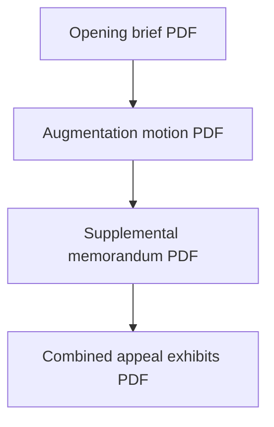

# Timeline — appeal A173827

| Item | PDF |
|------|-----|
| Opening brief | [01-Appellants-Opening-Brief.pdf](../01-APPEAL/01-Appellants-Opening-Brief.pdf) |
| Cover letter | [02-Cover-Letter.pdf](../01-APPEAL/02-Cover-Letter.pdf) |
| Proof of service | [03-Proof-of-Electronic-Service.pdf](../01-APPEAL/03-Proof-of-Electronic-Service.pdf) |
| Response / augment request | [04-Response-to-Court-and-Request-to-Augment.pdf](../01-APPEAL/04-Response-to-Court-and-Request-to-Augment.pdf) |
| Supplemental memorandum | [05-Appellants-Supplemental-Memorandum.pdf](../01-APPEAL/05-Appellants-Supplemental-Memorandum.pdf) |
| Motion to augment | [06-Motion-to-Augment-Record.pdf](../01-APPEAL/06-Motion-to-Augment-Record.pdf) |
| Appeal exhibits | [07-Appeal-Exhibits.pdf](../01-APPEAL/07-Appeal-Exhibits.pdf) |

**Index:** [../01-APPEAL/INDEX.md](../01-APPEAL/INDEX.md) (includes March 2026 refresh note).

## Vertical diagram

[← Homepage](../README.md) · [Narrative chapter](../narrative/02-APPEAL-A173827.md)
