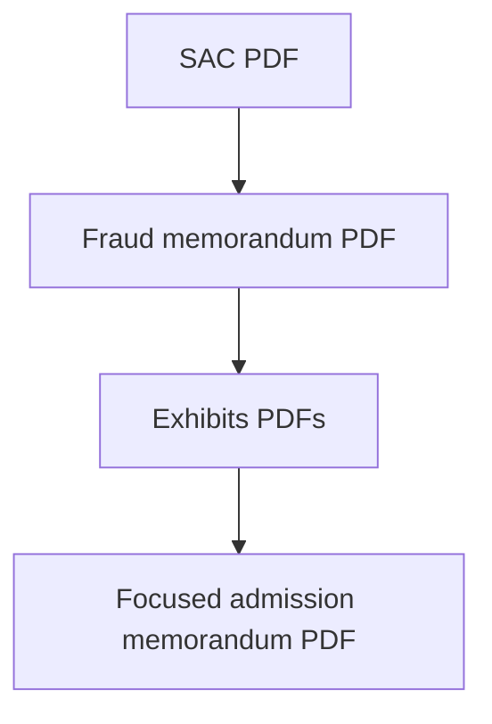

# Timeline — equity CGC-25-631801

| # | Filing | PDF |
|---|--------|-----|
| 1 | Second Amended Complaint | [01-Second-Amended-Complaint.pdf](../02-CASE-CGC-25-631801/01-Second-Amended-Complaint.pdf) |
| 2 | Notice of Related Cases | [02-Notice-of-Related-Cases.pdf](../02-CASE-CGC-25-631801/02-Notice-of-Related-Cases.pdf) |
| 3 | Memorandum — Fraud on the Court | [03-Memorandum-Fraud-on-Court.pdf](../02-CASE-CGC-25-631801/03-Memorandum-Fraud-on-Court.pdf) |
| 4 | Demand — Judicial Summary of Facts | [05-Demand-Judicial-Summary-of-Facts.pdf](../02-CASE-CGC-25-631801/05-Demand-Judicial-Summary-of-Facts.pdf) |
| 5 | Requests for Admission | [06-Requests-for-Admission.pdf](../02-CASE-CGC-25-631801/06-Requests-for-Admission.pdf) |
| 6 | Ex Parte — Document Preservation | [07-Ex-Parte-Document-Preservation.pdf](../02-CASE-CGC-25-631801/07-Ex-Parte-Document-Preservation.pdf) |
| 7 | Request for Judicial Notice | [08-Request-for-Judicial-Notice.pdf](../02-CASE-CGC-25-631801/08-Request-for-Judicial-Notice.pdf) |
| 8 | Exhibits — Court filing set | [09-Exhibits-631801-Court.pdf](../02-CASE-CGC-25-631801/09-Exhibits-631801-Court.pdf) |
| 9 | Exhibits — Memorandum supplemental | [10-Exhibits-Memorandum-Supplemental.pdf](../02-CASE-CGC-25-631801/10-Exhibits-Memorandum-Supplemental.pdf) |
| 10 | Memorandum — Navaratnasingham admission | [11-Motion-Extrinsic-Fraud-Navaratnasingham-Admission.pdf](../02-CASE-CGC-25-631801/11-Motion-Extrinsic-Fraud-Navaratnasingham-Admission.pdf) |

**CMC (per index):** May 27, 2026, 10:30 a.m., Department 610 — verify on the court portal.

## Vertical diagram

[← Homepage](../README.md) · [Narrative chapter](../narrative/03-EQUITY-CGC-25-631801.md)
