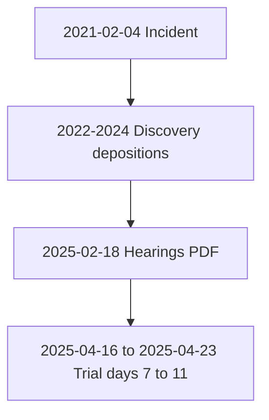

# Timeline — underlying trial CGC-21-594102

Linked events (read the PDFs; this page is an index).

| Date | Event | PDF |
|------|-------|-----|
| 2021-02-04 | Incident date (cross-case) | [evidence.md](../evidence.md) |
| 2022-08-18 | Plaintiff deposition | [01-Franciscus-Rosario-Deposition-2022-08-18.pdf](../05-TRANSCRIPTS/DEPOSITIONS/01-Franciscus-Rosario-Deposition-2022-08-18.pdf) |
| 2022-09-30 | Abdelhalim deposition | [05-Subhi-Abdelhalim-Deposition-2022-09-30.pdf](../05-TRANSCRIPTS/DEPOSITIONS/05-Subhi-Abdelhalim-Deposition-2022-09-30.pdf) |
| 2023-03-10 | Fernandez + Raffin depositions | [03-Officer-David-Fernandez-Deposition-2023-03-10.pdf](../05-TRANSCRIPTS/DEPOSITIONS/03-Officer-David-Fernandez-Deposition-2023-03-10.pdf), [04-Nicholas-Raffin-PMK-Deposition-2023-03-10.pdf](../05-TRANSCRIPTS/DEPOSITIONS/04-Nicholas-Raffin-PMK-Deposition-2023-03-10.pdf) |
| 2024-02-01 | Compex subpoena dated | [2024-02-01-Compex-Subpoena.pdf](../04-EXHIBITS/2024-02-01-Compex-Subpoena.pdf) |
| 2025-02-18 | Hearings volume (includes Feb 18) | [All-Hearing-Transcripts-Rosario-AAA.pdf](../05-TRANSCRIPTS/HEARINGS/All-Hearing-Transcripts-Rosario-AAA.pdf) |
| 2025-04-16 | Trial Day 7 | [Trial-Day-07-April-16-2025.pdf](../05-TRANSCRIPTS/REPORTER-TRANSCRIPTS/Trial-Day-07-April-16-2025.pdf) |
| 2025-04-17 | Trial Day 8 | [Trial-Day-08-April-17-2025.pdf](../05-TRANSCRIPTS/REPORTER-TRANSCRIPTS/Trial-Day-08-April-17-2025.pdf) |
| 2025-04-22 | Trial Day 10 | [Trial-Day-10-April-22-2025.pdf](../05-TRANSCRIPTS/REPORTER-TRANSCRIPTS/Trial-Day-10-April-22-2025.pdf) |
| 2025-04-23 | Trial Day 11 (verdict) | [Trial-Day-11-April-23-2025.pdf](../05-TRANSCRIPTS/REPORTER-TRANSCRIPTS/Trial-Day-11-April-23-2025.pdf) |

## Vertical diagram (max four nodes wide)

[← Homepage](../README.md) · [Narrative chapter](../narrative/01-UNDERLYING-CGC-21-594102.md)
