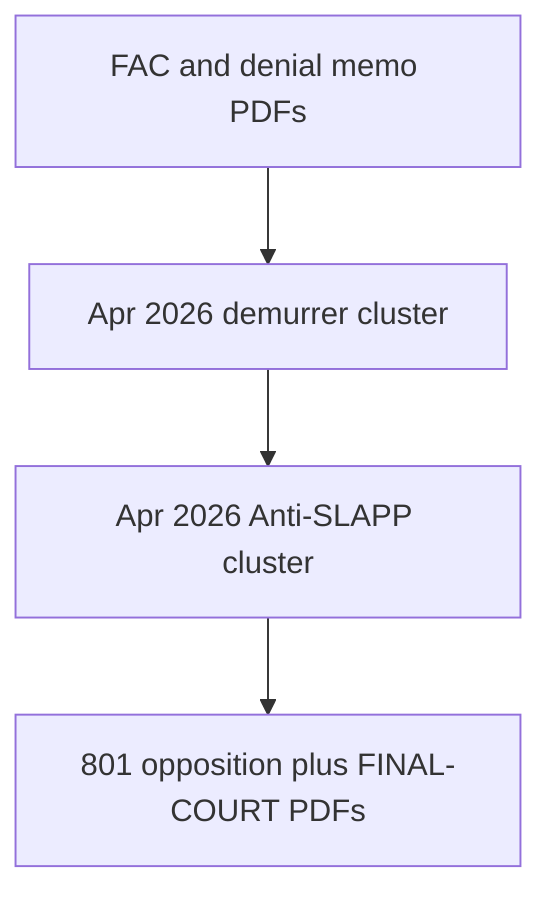

# Timeline — UCL / denial letter CGC-25-631802

## Starter filings (numbered PDFs)

| # | Filing | PDF |
|---|--------|-----|
| 1 | First Amended Complaint | [01-First-Amended-Complaint.pdf](../03-CASE-CGC-25-631802/01-First-Amended-Complaint.pdf) |
| 2 | Notice of Related Cases | [02-Notice-of-Related-Cases.pdf](../03-CASE-CGC-25-631802/02-Notice-of-Related-Cases.pdf) |
| 3 | Memorandum — Denial letter fraud | [03-Memorandum-Denial-Letter-Fraud.pdf](../03-CASE-CGC-25-631802/03-Memorandum-Denial-Letter-Fraud.pdf) |
| 4 | Demand — Judicial summary | [05-Demand-Judicial-Summary-of-Facts.pdf](../03-CASE-CGC-25-631802/05-Demand-Judicial-Summary-of-Facts.pdf) |
| 5 | RFAs | [06-Requests-for-Admission.pdf](../03-CASE-CGC-25-631802/06-Requests-for-Admission.pdf) |
| 6 | Ex parte preservation | [07-Ex-Parte-Document-Preservation.pdf](../03-CASE-CGC-25-631802/07-Ex-Parte-Document-Preservation.pdf) |
| 7 | Exhibits memorandum supplemental | [08-Exhibits-Memorandum-Supplemental.pdf](../03-CASE-CGC-25-631802/08-Exhibits-Memorandum-Supplemental.pdf) |

## April 2026 motion practice (hubs)

| Cluster | README |
|---------|--------|
| Demurrer volley | [../03-CASE-CGC-25-631802/demurrer-volley-apr2026/README.md](../03-CASE-CGC-25-631802/demurrer-volley-apr2026/README.md) |
| Defense Anti-SLAPP clerk PDFs | [../03-CASE-CGC-25-631802/defense-anti-slapp-clerk/README.md](../03-CASE-CGC-25-631802/defense-anti-slapp-clerk/README.md) |
| Plaintiff consolidated opposition (801) | [../03-CASE-CGC-25-631802/plaintiff-opposition-consolidated-apr2026/README.md](../03-CASE-CGC-25-631802/plaintiff-opposition-consolidated-apr2026/README.md) |
| Leave / SAC consolidated | [802-OUT-CONSOLIDATED-FULL-PACKET.pdf](../03-CASE-CGC-25-631802/apr-2026-sac-leave/802-OUT-CONSOLIDATED-FULL-PACKET.pdf) |
| FINAL-COURT packets (Apr 19 2026) | [../03-CASE-CGC-25-631802/final-court-apr2026/README.md](../03-CASE-CGC-25-631802/final-court-apr2026/README.md) |

**Hearing (per 631802 index):** May 13, 2026, 9:00 a.m., Department 302 — verify on the court portal.

## Vertical diagram

[← Homepage](../README.md) · [Narrative chapter](../narrative/04-UCL-CGC-25-631802.md)
